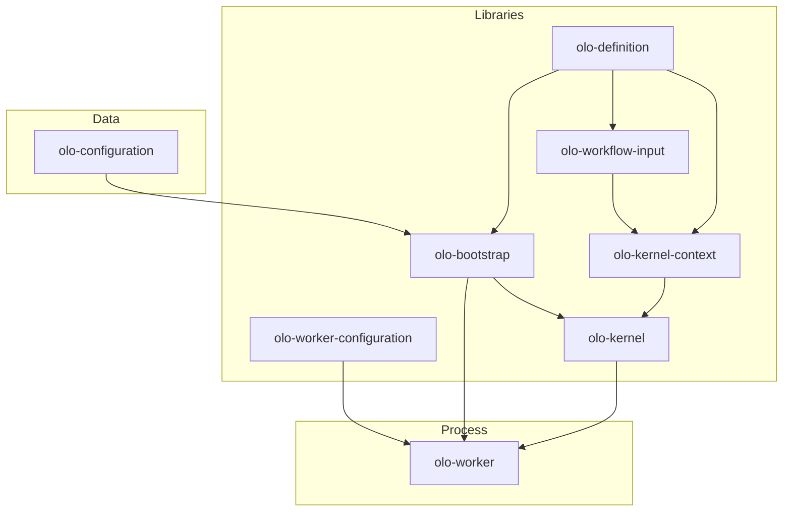

# olo-mono

Monorepo for **OLO** — declarative AI workflow orchestration. Workflow graphs, deployment settings, and runtime execution are split into separate modules so each layer can evolve independently.

**Architecture docs:** [docs/README.md](docs/README.md) — [system architecture](docs/ARCHITECTURE.md), [module reference](docs/MODULES.md).

## What this repo contains

OLO treats a workflow as a **portable artifact** (JSON/YAML graph definition), separate from:

- **Invocation payloads** — per-run input sent when a workflow is started
- **Worker deployment settings** — port, Temporal target, cache, scan folders
- **Preset workflows** — ready-made graphs under `olo-configuration/`
- **Runtime execution** — Temporal worker, kernel entry point, context building



## Directory summary

| Path | Type | Purpose |
|------|------|---------|
| [`olo-definition/`](olo-definition/) | Gradle project | Workflow graph POJOs, builders, JSON/YAML serializers, validation |
| [`olo-workflow-input/`](olo-workflow-input/) | Gradle project | `WorkflowInput` invocation payload (de)serialization at worker boundaries |
| [`olo-configuration/`](olo-configuration/) | Data only | Preset workflow definitions (`default/*.json`) — agent, planner, reviewer, etc. |
| [`olo-worker-configuration/`](olo-worker-configuration/) | Gradle project | Worker deployment config (server, Temporal, cache, `scanFolder`); pluggable file/DB/Redis/GitHub sources |
| [`olo-bootstrap/`](olo-bootstrap/) | Gradle project | Loads `olo-configuration` folders into an in-memory workflow registry |
| [`olo-kernel-context/`](olo-kernel-context/) | Gradle project | Builds `KernelRuntimeContext` — deserialized input + isolated graph copy + UI callback |
| [`olo-kernel/`](olo-kernel/) | Gradle project | Temporal queue entry point (`OloKernelWorkflow`, `workflowType=olo`) |
| [`olo-worker/`](olo-worker/) | Gradle application | Main Temporal worker process; wires configuration, bootstrap, and kernel |
| [`olo-spi/`](olo-spi/) | Gradle library | Runtime SPI — `Node`, `Tool`, `Hook`, `ExecutionContext` (contracts only) |
| [`olo-annotation/`](olo-annotation/) | Gradle library | `@OloNode` / `@OloTool` / `@OloHook` metadata + `ExtensionCatalogLoader` |
| [`olo-annotation-processor/`](olo-annotation-processor/) | Gradle library | Generates `META-INF/olo/catalog/*.json` for workflow editor UIs |
| [`olo-core/`](olo-core/) | Gradle multi-module | Default node/tool/hook implementations + `ExecutionEngine` (`org.olo:olo-core`) |

Each Gradle module is **standalone** (own `settings.gradle`, wrapper, `publishToMavenLocal`). There is no single root Gradle build yet.

## Runtime bootstrap (worker)

When `olo-worker` starts:

1. **`WorkerConfigurationProvider.load()`** — load worker settings from JSON/YAML (cached; `load(true)` refreshes)
2. **`OloBootstrap.load(scanFolder)`** — scan `olo-configuration` path from config into memory
3. **Temporal workers** — one per queue; each registers **`olo-kernel`** as the execution entry point
4. **Queue task** → kernel → **`KernelContextBuilder`** → deserialize input, copy graph, notify UI callback

See [olo-worker/README.md](olo-worker/README.md) for run instructions.

## Module READMEs

| Module | Documentation |
|--------|----------------|
| olo-definition | [olo-definition/README.md](olo-definition/README.md), [doc/ARCHITECTURE.md](olo-definition/doc/ARCHITECTURE.md) |
| olo-workflow-input | [olo-workflow-input/README.md](olo-workflow-input/README.md) |
| olo-worker-configuration | [olo-worker-configuration/README.md](olo-worker-configuration/README.md) |
| olo-bootstrap | [olo-bootstrap/README.md](olo-bootstrap/README.md) |
| olo-kernel | [olo-kernel/README.md](olo-kernel/README.md) |
| olo-kernel-context | [olo-kernel-context/README.md](olo-kernel-context/README.md) |
| olo-worker | [olo-worker/README.md](olo-worker/README.md) |

## Build order (local)

**Worker development:** `olo-worker` uses Gradle composite builds — run directly without publishing:

```bash
cd olo-worker && ./gradlew run
```

**Standalone modules:** publish to Maven local in dependency order (see [docs/MODULES.md](docs/MODULES.md)):

```bash
cd olo-definition && ./gradlew publishToMavenLocal
# … olo-workflow-input → olo-worker-configuration → olo-bootstrap → olo-kernel-context → olo-kernel
```

Windows: use `gradlew.bat` instead of `./gradlew`.

### Local worker + Docker stack (common dev setup)

Run **olo-docker** for API, Temporal, Redis, and chat UI. Run **olo-worker** on the host in debug mode:

- Worker config: [`olo-worker-configuration/samples/worker-config.local-debug.yaml`](olo-worker-configuration/samples/worker-config.local-debug.yaml)
- Docker `olo` service mounts `olo-docker/dev/configuration/olo-configuration` at `/app/olo-configuration` (`OLO_CONFIGURATION_DIR`); keep it aligned with `olo-configuration/default` in this repo
- Docker `olo` service: `OLO_CHAT_CALLBACK_BASE_URL=http://localhost:47080` (so the API passes a host-reachable callback into workflow input)

See [olo-worker/README.md](olo-worker/README.md) for ports and IDE launch settings.

Sample worker config: [`olo-worker-configuration/samples/worker-config.yaml`](olo-worker-configuration/samples/worker-config.yaml)

## Requirements

- Java 21 (toolchain configured in modules)
- Gradle 8.12+ (wrapper included per module)
- Temporal server (for `olo-worker run` — `localhost:7233` by default)

## Planned

| Module | Role |
|--------|------|
| olo-runtime | Graph execution engine |
| olo-extensions | Provider integrations (OpenAI, Ollama, MCP, vector stores) |

## License

Apache License 2.0 — see [olo-definition/LICENSE](olo-definition/LICENSE) if present in your checkout.
