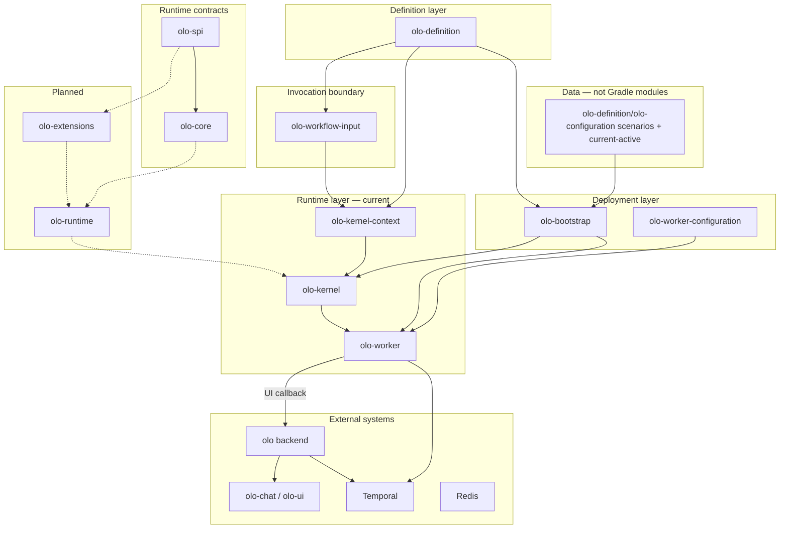
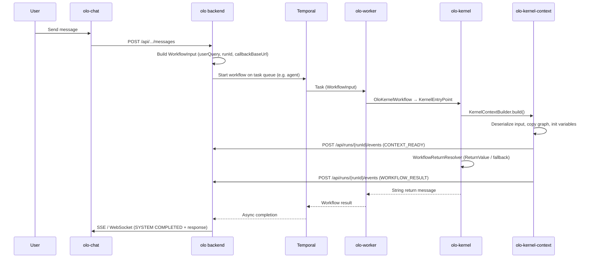
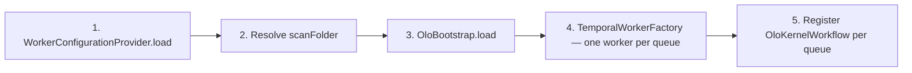

<!--
Copyright (c) 2026 Olo Labs
SPDX-License-Identifier: Apache-2.0
-->
# OLO monorepo architecture

OLO separates **what a workflow is** (a portable graph definition), **how a worker is deployed** (settings and scan paths), and **what data a single run carries** (invocation input). Execution today is routed through **Temporal**; the **kernel** is the synchronous entry point that builds runtime context and resolves the workflow return message.

## Design principles

1. **Definition vs invocation vs deployment** — `WorkflowDefinition`, `WorkflowInput`, and worker settings are three different artifacts with different lifecycles.
2. **Standalone Gradle modules** — Each library has its own `settings.gradle`, wrapper, and `publishToMavenLocal` coordinates (`org.olo:*:0.1.0-SNAPSHOT`). There is no single root Gradle build yet.
3. **Dependency direction** — Data flows inward: `olo-definition` has no knowledge of workers; `olo-kernel` orchestrates context building but does not own graph execution (planned in `olo-runtime`).
4. **Configuration on disk** — Scenario presets live under `olo-definition/olo-configuration/<scenario>/`. Runtime active folder is `current-active/` — activate via **olo-ui Administration → Scenarios** or copy manually. Docker dev may mount a separate copy under `olo-docker/dev/configuration/olo-configuration`.

## Layer model



| Layer | Responsibility | Mutable at runtime? |
|-------|----------------|---------------------|
| **Definition** | Graph shape: nodes, edges, variables, capability, queue | No (versioned JSON) |
| **Invocation** | Per-run payload: user inputs, session, callback URL, routing | Yes (each chat message) |
| **Deployment** | Worker port, Temporal target, cache, `scanFolder` | Yes (config refresh) |
| **Bootstrap** | In-memory index of definitions by id / queue | Yes (`load(..., refresh)`) |
| **Kernel context** | Isolated graph copy + variable map + UI events | Per Temporal task |
| **Kernel** | Queue entry, return message resolution | Per Temporal task |
| **Worker process** | Temporal pollers, one per task queue | Long-lived |

## End-to-end chat flow

Typical local dev: **olo-docker** runs API + Temporal + Redis + chat UI; **olo-worker** runs on the host.



### Callback URL

The backend embeds a **host-reachable** callback base URL in `WorkflowInput` (e.g. `http://localhost:47080` when the worker runs on the host against olo-docker). The worker POSTs run events to:

`{callbackBaseUrl}/api/runs/{runId}/events`

Resolution order: `execution.callbackUrl` (full URL) → `context.callbackBaseUrl` + path.

### Workflow return message

Preset workflows declare a return variable in JSON:

```json
"metadata": { "returnVariable": "ReturnValue" },
"variables": [{
  "name": "ReturnValue",
  "type": "string",
  "metadata": { "role": "return" }
}]
```

When `metadata.returnVariable` is set, the kernel returns that variable's value from the runtime variable map after graph traversal completes. If the variable is missing or blank, the caller receives a fixed admin-contact message. When no return variable is configured, the kernel falls back to the user message from `WorkflowInput` (`userQuery` or first input).

**Child workflows:** orchestrator nodes dispatch specialist agents via `agentCalls` or `CHILD_WORKFLOW` execution model. Each child runs as a Temporal child workflow; worker logs correlate parent and child by `transactionId`, `parentWorkflowId`, and `childWorkflowId`.

**Cancel:** `POST /api/runs/{runId}/cancel` signals Temporal cancellation; olo-ui and olo-chat expose Cancel during in-progress runs.

## Worker bootstrap

On `WorkerBootstrap.start()`:



| Step | Module | Output |
|------|--------|--------|
| 1 | olo-worker-configuration | `WorkerSettings` (Temporal target, scan path, cache, port) |
| 2 | olo-worker | Absolute path to `olo-definition/olo-configuration/current-active` (or override) |
| 3 | olo-bootstrap | `WorkflowDefinitionRegistry` (all JSON under scan folder, including child-agent presets) |
| 4–5 | olo-worker + olo-kernel | Temporal `Worker` per queue, `workflowType=olo` |

`start(true)` refreshes configuration and the definition registry without restarting the JVM.

## Configuration topology

| Path | Consumer | Purpose |
|------|----------|---------|
| `olo-definition/olo-configuration/<scenario>/` | Source control | Scenario presets (orchestrator + child agents + README) |
| `olo-definition/olo-configuration/current-active/` | olo-ui, olo-be, olo-worker | **Active** runtime folder — activate from olo-ui **Administration → Scenarios** |
| `olo-worker-configuration/samples/*.yaml` | olo-worker only | Process settings (`scanFolder`, Temporal, Redis cache) — not workflow graphs |

**olo-ui activation flow:** `POST /api/v1/configuration/folders/{id}/activate` copies a scenario into `current-active`, then `POST /api/v1/system/refresh` signals the worker via Redis (`olo:worker:refresh`).

Keep `olo-definition/olo-configuration/current-active`, `olo/olo-configuration`, and `olo-docker/dev/configuration/olo-configuration` aligned when testing Docker stacks.

## Build and local development

### Composite build (recommended for worker)

`olo-worker/settings.gradle` uses Gradle **composite builds** (`includeBuild`) for kernel and dependency modules. Running the worker compiles against monorepo sources directly:

```bash
cd olo-worker
./gradlew run
```

Restart the worker after editing `olo-kernel` or `olo-kernel-context`.

### Maven local (standalone modules)

When building a module in isolation:

```bash
cd olo-definition && ./gradlew publishToMavenLocal
# … repeat for dependents in dependency order (see MODULES.md)
```

### Docker + host worker

| Service | Host URL (olo-docker dev) |
|---------|---------------------------|
| OLO API | http://localhost:47080 |
| OLO Chat | http://localhost:43000 |
| Temporal | localhost:47233 |
| Redis | localhost:46379 |

Worker config: `olo-worker-configuration/samples/worker-config.local-debug.yaml`.

## Planned extensions

| Module | Role |
|--------|------|
| **olo-runtime** | Traverse and execute the workflow graph; write node outputs and `ReturnValue` |
| **olo-extensions** | LLM providers, tools, vector stores, MCP |
| **olo-annotation** / **olo-annotation-processor** | Extension metadata annotations + compile-time catalog JSON for plug-and-play workflow editing UIs |

The kernel and kernel-context APIs are shaped so runtime execution can plug in after context build without changing the Temporal contract (`WorkflowInput` in, `String` message out).

## Related repositories

| Repo | Role |
|------|------|
| [olo](../olo/) | Spring Boot chat backend, REST/SSE/WebSocket, starts Temporal workflows |
| [olo-docker](../../olo-docker/) | Dev/prod Docker Compose stacks |
| [olo-chat](../olo-chat/) | Chat UI |
| [olo-ui](../olo-ui/) | Studio UI — workflow builder, scenario activation, tenant admin |
