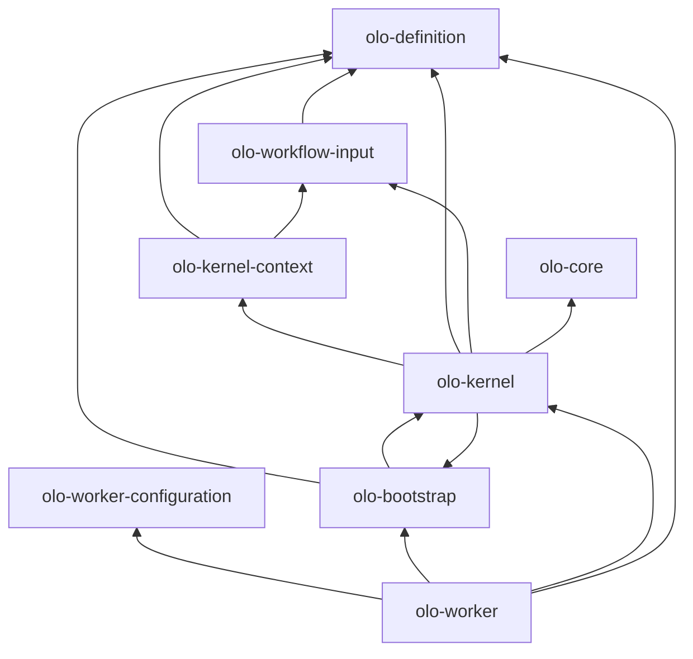

<!--
Copyright (c) 2026 Olo Labs
SPDX-License-Identifier: Apache-2.0
-->
# Module reference

Each row is a **standalone Gradle project** under `olo-mono/`. All publish as `org.olo:<artifactId>:0.1.0-SNAPSHOT` unless noted.

## Summary table

| Directory | Artifact | Type | Purpose |
|-----------|----------|------|---------|
| `olo-definition/` | `olo-definition` | Library | Workflow graph POJOs, builders, JSON/YAML, validation |
| `olo-workflow-input/` | `olo-workflow-input` | Library | `WorkflowInput` invocation payload at worker boundary |
| `olo-worker-configuration/` | `olo-worker-configuration` | Library | Worker deployment document (port, Temporal, scanFolder) |
| `olo-bootstrap/` | `olo-bootstrap` | Library | Load `WorkflowDefinition` files into `WorkflowDefinitionRegistry` |
| `olo-kernel-context/` | `olo-kernel-context` | Library | `KernelRuntimeContext`, variables, UI callbacks |
| `olo-kernel/` | `olo-kernel` | Library | `KernelEntryPoint`, Temporal `OloKernelWorkflow` |
| `olo-worker/` | `olo-worker` | Application | Runnable Temporal worker (`WorkerApplication`) |
| `olo-spi/` | `olo-spi` | Library | Runtime SPI contracts — nodes, tools, hooks (no implementations) |
| `olo-annotation/` | `olo-annotation` | Library | `@OloNode` / `@OloTool` / `@OloHook` metadata annotations + catalog loader |
| `olo-annotation-processor/` | `olo-annotation-processor` | Library | Compile-time processor → `META-INF/olo/catalog/*.json` |
| `olo-core/` | `olo-core` | Multi-module library | Default implementations + `ExecutionEngine` (submodules: nodes, tools, hooks, runtime) |
## Dependency graph



**Rule of thumb:** `olo-definition` is the root. Nothing in `olo-definition` depends on worker or kernel code.

## Per-module detail

### olo-definition

**Package root:** `org.olo.definition`

| Area | Packages / types |
|------|------------------|
| Graph model | `WorkflowDefinition`, `WorkflowBuilder`, nodes, edges, ports |
| Variables | `VariableDefinition` — includes `ReturnValue` + `metadata.role=return` |
| Serialization | `JsonWorkflowSerializer`, `YamlWorkflowSerializer` |
| Validation | `WorkflowValidator`, `ValidationResult` |
| Samples | `samples/**/workflow.json` — generated by `gradlew generateSamples` |
| Presets | `olo-definition/olo-configuration/<scenario>/` and `current-active/` — scenario presets and active runtime folder (data, not a Gradle module) |

**Docs:** [olo-definition/doc/ARCHITECTURE.md](../olo-definition/doc/ARCHITECTURE.md)

**Does not:** Execute workflows, talk to Temporal, or load worker config.

#### olo-configuration (under olo-definition)

**Not a Gradle module** — versioned preset data co-located with workflow definitions.

```
olo-definition/olo-configuration/
├── <scenario>/          # e.g. capacity-planning/, travel-planner/
│   └── *.json
└── current-active/      # Active runtime folder (activate via olo-ui Administration → Scenarios)
    └── *.json
```

Each file is a complete `WorkflowDefinition` plus UI fields (`emoji`, `shortDescription`, `runAgain`, etc.). Loaded by the **olo backend** (`OLO_CONFIGURATION_DIR`) and **olo-worker** (`workflowDefinitions.scanFolder` → `OloBootstrap`).

---

### olo-workflow-input

**Package root:** `org.olo.input`

| Package | Role |
|---------|------|
| `model` | `WorkflowInput`, `InputItem`, `Context`, `Execution`, `Routing` |
| `producer` | Build payloads; offload large strings via `CacheWriter` |
| `consumer` | Read-only `WorkflowInputValues` for workers |
| `validation` | `WorkflowInvocationValidator` vs definition inputs |

The API backend builds `WorkflowInput` when a user sends a chat message. Temporal passes it as a **JSON object** to `OloKernelWorkflow`.

**Docs:** [olo-workflow-input/docs/ARCHITECTURE.md](../olo-workflow-input/docs/ARCHITECTURE.md)

---

### olo-worker-configuration

**Package root:** `org.olo.worker.config`

Single entry point for worker settings. Workers must use `WorkerConfigurationProvider.load()` — not raw env vars for port, Temporal host, etc.

| Bootstrap env | Meaning |
|---------------|---------|
| `OLO_WORKER_CONFIG_SOURCE` | `FILE` (default), future: `DATABASE`, `REDIS`, `GITHUB` |
| `OLO_WORKER_CONFIG_PATH` | Path to `worker-config.yaml` when source is `FILE` |

| Document field | Example |
|----------------|---------|
| `workflowDefinitions.scanFolder` | `../../olo-definition/olo-configuration/current-active` |
| `temporal.target` | `localhost:47233` |
| `server.port` | Worker management HTTP port |

**Docs:** [olo-worker-configuration/docs/ARCHITECTURE.md](../olo-worker-configuration/docs/ARCHITECTURE.md)

---

### olo-bootstrap

**Package root:** `org.olo.bootstrap`

```java
WorkflowDefinitionRegistry registry = OloBootstrap.load(scanFolder, recursive);
registry.findByQueue("agent");
```

Caches scan results. `OloBootstrap.load(folder, recursive, true)` forces refresh.

**Depends on:** `olo-definition` only.

---

### olo-kernel-context

**Package root:** `org.olo.kernel.context`

Builds immutable-ish execution context for one queue task.

| Type | Responsibility |
|------|----------------|
| `KernelContextBuilder` | Deserialize input, `WorkflowDefinition.copyOf`, init variables |
| `KernelRuntimeContext` | `queue`, `input`, `graph`, `graphReady`, `getVariableMap()` |
| `WorkflowRuntimeVariables` | Mutable map seeded from graph `variables[]` |
| `WorkflowReturnVariable` | Resolve name from `metadata.returnVariable` / role / legacy |
| `UiCallbackReporter` | POST CONTEXT_READY (seq 1) and WORKFLOW_RESULT (seq 2) |
| `GraphIsolation` | Stub — returns `true` without traversing nodes |

**Depends on:** `olo-definition`, `olo-workflow-input`

---

### olo-kernel

**Package root:** `org.olo.kernel`

| Type | Responsibility |
|------|----------------|
| `KernelEntryPoint` | Queue handler: context build → graph traversal → callbacks → return message. Snapshot API: `buildContextAndNotifyUi`, `executeTraversalStep`, `traverse`, `resumeHumanInput` |
| `WorkflowReturnResolver` | Resolve `String` result from return variable or input fallback |
| `OloKernelWorkflow` / `OloKernelWorkflowImpl` | Temporal workflow (`workflowType=olo`) |
| `OloKernelActivitiesImpl` | Activity delegating to `KernelEntryPoint` |
| `KernelWorkflowRegistrar` | Register workflow + activities on Temporal `Worker` |

**Depends on:** `olo-kernel-context`, `olo-bootstrap`, `olo-definition`, `olo-workflow-input`, `olo-core`, Temporal SDK

---

### olo-worker

**Package root:** `org.olo.worker`

| Type | Responsibility |
|------|----------------|
| `WorkerApplication` | `main` — calls `WorkerBootstrap.start()` |
| `WorkerBootstrap` | 5-step bootstrap (config → scan → registry → LLM check → Temporal) |
| `TemporalWorkerFactory` | Create factory, one worker per registered queue |
| `WorkerRuntimeContext` | Holds `WorkerSettings` + `WorkflowDefinitionRegistry` |

**Composite builds** in `settings.gradle` substitute local projects for Maven artifacts when developing kernel changes.

**Run:**

```bash
cd olo-worker
./gradlew run --args=../olo-worker-configuration/samples/worker-config.local-debug.yaml
```

**IDE:** `.vscode/launch.json` — *olo-worker (local debug, olo-docker)*

---

## Publish order (Maven local only)

When not using composite builds, publish in dependency order:

1. `olo-definition`
2. `olo-spi`
3. `olo-annotation`
4. `olo-annotation-processor`
5. `olo-core` (nodes, tools, hooks, runtime, core)
6. `olo-workflow-input`
7. `olo-worker-configuration`
8. `olo-bootstrap`
9. `olo-kernel-context`
10. `olo-kernel`
11. `olo-worker` (application — `run` does not require publish if composite builds enabled)

## Java and Gradle

| Requirement | Value |
|-------------|-------|
| Java | 21 (toolchain in all modules) |
| Gradle | 8.12+ via wrapper per module |
| Group ID | `org.olo` |
| Version | `0.1.0-SNAPSHOT` |

### olo-spi

**Package root:** `org.olo.spi`

Runtime **Service Provider Interface** — interfaces, request/response records, extension points, and annotations only. No dependency on other OLO modules.

| Package | Key types |
|---------|-----------|
| `context` | `ExecutionContext` |
| `node` | `Node`, `NodeRequest`, `NodeResult` |
| `tool` | `Tool`, `ToolRequest`, `ToolResult` |
| `hook` | `Hook`, `HookRequest`, `HookResult`, `HookPhase` |
| `extension` | `NodeProvider`, `ToolProvider`, `HookProvider` |
| `annotation` | `@NodeType`, `@ToolId`, `@ImplementationId`, `@OloExtension` |

**Docs:** [olo-spi/docs/ARCHITECTURE.md](../olo-spi/docs/ARCHITECTURE.md)

---

### olo-annotation

**Package root:** `org.olo.annotation`

Compile-time annotations that describe extension metadata for workflow editor UIs.

| Annotation | Purpose |
|------------|---------|
| `@OloNode` | Node type catalog entry (ports, config schema, capabilities) |
| `@OloTool` | Tool catalog entry |
| `@OloHook` | Hook catalog entry |
| `@OloPort` / `@OloProperty` | Port and configuration field schema |

**Runtime:** `org.olo.annotation.catalog.ExtensionCatalogLoader` merges `META-INF/olo/catalog/*.json` from the classpath.

**Docs:** [olo-annotation/docs/V1.md](../olo-annotation/docs/V1.md), [ANNOTATIONS.md](../olo-annotation/docs/ANNOTATIONS.md), [EDITOR_CONVENTIONS.md](../olo-annotation/docs/EDITOR_CONVENTIONS.md)

---

### olo-annotation-processor

**Package root:** `org.olo.annotation.processor`

Annotation processor invoked at compile time on `@OloNode`, `@OloTool`, and `@OloHook`. Writes per-module catalogs:

| Resource | Contents |
|----------|----------|
| `META-INF/olo/catalog/nodes.json` | Node descriptors for the module |
| `META-INF/olo/catalog/tools.json` | Tool descriptors |
| `META-INF/olo/catalog/hooks.json` | Hook descriptors |
| `META-INF/olo/catalog/catalog.json` | Per-module convenience bundle (not merged by `ExtensionCatalogLoader`) |

Compiler option: `-Aolo.catalog.module=<module-name>` (e.g. `olo-core-nodes`).

**Docs:** [olo-annotation-processor/docs/ARCHITECTURE.md](../olo-annotation-processor/docs/ARCHITECTURE.md)

---

### olo-core

**Package root:** `org.olo.core`

Multi-module Gradle project publishing a single aggregator artifact `org.olo:olo-core`.

| Subproject | Artifact | Contents |
|------------|----------|----------|
| `nodes` | `olo-core-nodes` | Six built-in `Node` implementations (annotated with `@OloNode`) |
| `tools` | `olo-core-tools` | HTTP, calculator, web search, RAG, observability, human-input, conversation, and scenario tools (`@OloTool`) |
| `hooks` | `olo-core-hooks` | `LoggingHook`, `MetricsHook`, `TracingHook` (`@OloHook`) |
| `runtime` | `olo-core-runtime` | `ExecutionEngine`, registries, `DefaultExecutionContext` |
| `core` | **`olo-core`** | `Core.defaultEngine()`, `CoreExtensionCatalog.loadMerged()` |

Each implementation module uses `annotationProcessor olo-annotation-processor` so its JAR ships UI-ready catalog JSON. `CoreExtensionCatalog.loadMerged()` merges catalogs from nodes, tools, and hooks on the classpath.

**Docs:** [olo-core/docs/ARCHITECTURE.md](../olo-core/docs/ARCHITECTURE.md)

---

## Planned modules

| Module | Will depend on | Purpose |
|--------|----------------|---------|
| `olo-extensions` | `olo-spi` | Additional provider adapters (OpenAI, Ollama, Qdrant, …) beyond olo-core defaults |

Graph traversal is implemented in **olo-kernel** (`GraphTraversalEngine`). Per-step SPI execution uses **olo-core** `ExecutionEngine`.
