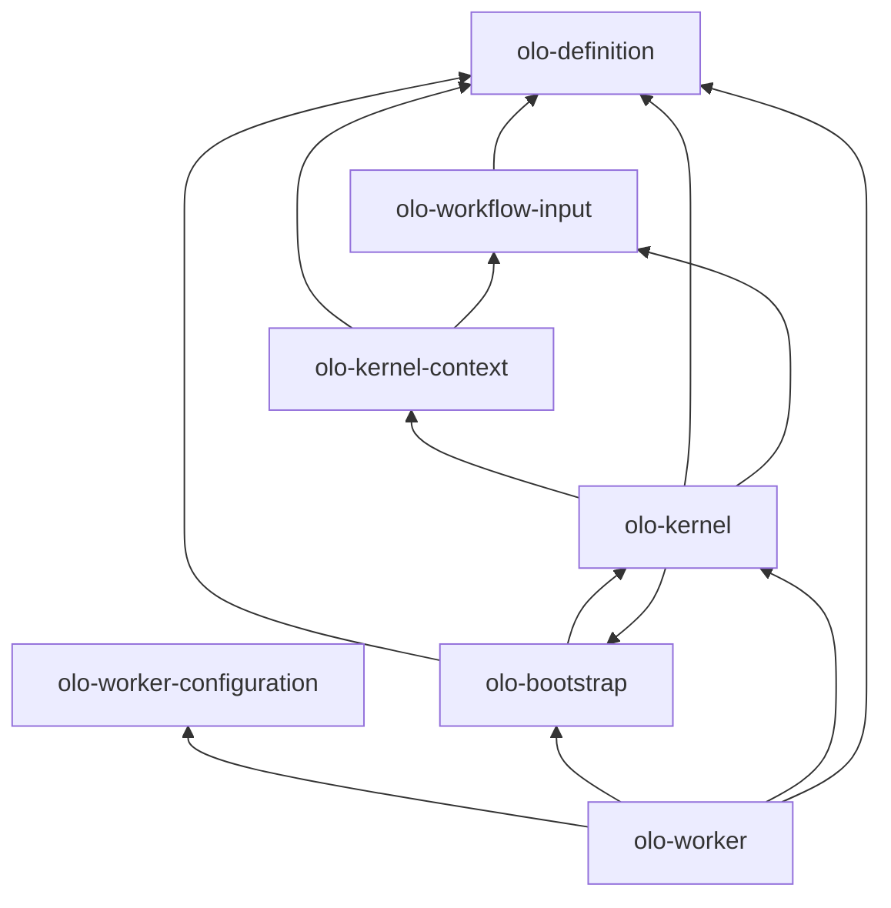

# Module reference

Each row is a **standalone Gradle project** under `olo-mono/`. All publish as `org.olo:<artifactId>:0.1.0-SNAPSHOT` unless noted.

## Summary table

| Directory | Artifact | Type | Purpose |
|-----------|----------|------|---------|
| `olo-definition/` | `olo-definition` | Library | Workflow graph POJOs, builders, JSON/YAML, validation |
| `olo-workflow-input/` | `olo-workflow-input` | Library | `WorkflowInput` invocation payload at worker boundary |
| `olo-worker-configuration/` | `olo-worker-configuration` | Library | Worker deployment document (port, Temporal, scanFolder) |
| `olo-bootstrap/` | `olo-bootstrap` | Library | Load `WorkflowDefinition` files into `WorkflowDefinitionRegistry` |
| `olo-kernel-context/` | `olo-kernel-context` | Library | `KernelRuntimeContext`, variables, UI callbacks |
| `olo-kernel/` | `olo-kernel` | Library | `KernelEntryPoint`, Temporal `OloKernelWorkflow` |
| `olo-worker/` | `olo-worker` | Application | Runnable Temporal worker (`WorkerApplication`) |
| `olo-configuration/` | — | Data | Preset workflow JSON (`default/*.json`) |
| `olo-annotation/` | — | Placeholder | Future annotation APIs |
| `olo-annotation-processor/` | — | Placeholder | Future annotation processing |

## Dependency graph



**Rule of thumb:** `olo-definition` is the root. Nothing in `olo-definition` depends on worker or kernel code.

## Per-module detail

### olo-definition

**Package root:** `org.olo.definition`

| Area | Packages / types |
|------|------------------|
| Graph model | `WorkflowDefinition`, `WorkflowBuilder`, nodes, edges, ports |
| Variables | `VariableDefinition` — includes `ReturnValue` + `metadata.role=return` |
| Serialization | `JsonWorkflowSerializer`, `YamlWorkflowSerializer` |
| Validation | `WorkflowValidator`, `ValidationResult` |
| Samples | `samples/**/workflow.json` — generated by `gradlew generateSamples` |

**Docs:** [olo-definition/doc/ARCHITECTURE.md](../olo-definition/doc/ARCHITECTURE.md)

**Does not:** Execute workflows, talk to Temporal, or load worker config.

---

### olo-workflow-input

**Package root:** `org.olo.input`

| Package | Role |
|---------|------|
| `model` | `WorkflowInput`, `InputItem`, `Context`, `Execution`, `Routing` |
| `producer` | Build payloads; offload large strings via `CacheWriter` |
| `consumer` | Read-only `WorkflowInputValues` for workers |
| `validation` | `WorkflowInvocationValidator` vs definition inputs |

The API backend builds `WorkflowInput` when a user sends a chat message. Temporal passes it as a **JSON object** to `OloKernelWorkflow`.

**Docs:** [olo-workflow-input/docs/ARCHITECTURE.md](../olo-workflow-input/docs/ARCHITECTURE.md)

---

### olo-configuration

**Not a Gradle module** — versioned data only.

```
olo-configuration/
└── default/
    ├── agent.json
    ├── architect.json
    ├── ask.json
    └── … (one file per chat profile / task queue)
```

Each file is a complete `WorkflowDefinition` plus UI fields (`emoji`, `shortDescription`, `runAgain`, etc.). Standard return variable pattern:

- `metadata.returnVariable: "ReturnValue"`
- `variables[]` entry with `metadata.role: "return"`

Loaded by:

- **olo backend** — `OLO_CONFIGURATION_DIR` → chat profiles, default task queue
- **olo-worker** — `workflowDefinitions.scanFolder` in worker config → `OloBootstrap`

---

### olo-worker-configuration

**Package root:** `org.olo.worker.config`

Single entry point for worker settings. Workers must use `WorkerConfigurationProvider.load()` — not raw env vars for port, Temporal host, etc.

| Bootstrap env | Meaning |
|---------------|---------|
| `OLO_WORKER_CONFIG_SOURCE` | `FILE` (default), future: `DATABASE`, `REDIS`, `GITHUB` |
| `OLO_WORKER_CONFIG_PATH` | Path to `worker-config.yaml` when source is `FILE` |

| Document field | Example |
|----------------|---------|
| `workflowDefinitions.scanFolder` | `../../olo-configuration/default` |
| `temporal.target` | `localhost:47233` |
| `server.port` | Worker management HTTP port |

**Docs:** [olo-worker-configuration/docs/ARCHITECTURE.md](../olo-worker-configuration/docs/ARCHITECTURE.md)

---

### olo-bootstrap

**Package root:** `org.olo.bootstrap`

```java
WorkflowDefinitionRegistry registry = OloBootstrap.load(scanFolder, recursive);
registry.findByQueue("agent");
```

Caches scan results. `OloBootstrap.load(folder, recursive, true)` forces refresh.

**Depends on:** `olo-definition` only.

---

### olo-kernel-context

**Package root:** `org.olo.kernel.context`

Builds immutable-ish execution context for one queue task.

| Type | Responsibility |
|------|----------------|
| `KernelContextBuilder` | Deserialize input, `WorkflowDefinition.copyOf`, init variables |
| `KernelRuntimeContext` | `queue`, `input`, `graph`, `graphReady`, `getVariableMap()` |
| `WorkflowRuntimeVariables` | Mutable map seeded from graph `variables[]` |
| `WorkflowReturnVariable` | Resolve name from `metadata.returnVariable` / role / legacy |
| `UiCallbackReporter` | POST CONTEXT_READY (seq 1) and WORKFLOW_RESULT (seq 2) |
| `GraphIsolation` | Stub — returns `true` without traversing nodes |

**Depends on:** `olo-definition`, `olo-workflow-input`

---

### olo-kernel

**Package root:** `org.olo.kernel`

| Type | Responsibility |
|------|----------------|
| `KernelEntryPoint` | Synchronous queue handler: context → callbacks → return message |
| `WorkflowReturnResolver` | Resolve `String` result from return variable or input fallback |
| `OloKernelWorkflow` / `OloKernelWorkflowImpl` | Temporal workflow (`workflowType=olo`) |
| `OloKernelActivitiesImpl` | Activity delegating to `KernelEntryPoint` |
| `KernelWorkflowRegistrar` | Register workflow + activities on Temporal `Worker` |

**Depends on:** `olo-kernel-context`, `olo-bootstrap`, `olo-definition`, `olo-workflow-input`, Temporal SDK

---

### olo-worker

**Package root:** `org.olo.worker`

| Type | Responsibility |
|------|----------------|
| `WorkerApplication` | `main` — calls `WorkerBootstrap.start()` |
| `WorkerBootstrap` | 4-step bootstrap (config → scan → registry → Temporal) |
| `TemporalWorkerFactory` | Create factory, one worker per registered queue |
| `WorkerRuntimeContext` | Holds `WorkerSettings` + `WorkflowDefinitionRegistry` |

**Composite builds** in `settings.gradle` substitute local projects for Maven artifacts when developing kernel changes.

**Run:**

```bash
cd olo-worker
./gradlew run --args=../olo-worker-configuration/samples/worker-config.local-debug.yaml
```

**IDE:** `.vscode/launch.json` — *olo-worker (local debug, olo-docker)*

---

## Publish order (Maven local only)

When not using composite builds, publish in dependency order:

1. `olo-definition`
2. `olo-workflow-input`
3. `olo-worker-configuration`
4. `olo-bootstrap`
5. `olo-kernel-context`
6. `olo-kernel`
7. `olo-worker` (application — `run` does not require publish if composite builds enabled)

## Java and Gradle

| Requirement | Value |
|-------------|-------|
| Java | 21 (toolchain in modules; workflow-input also documents 17+) |
| Gradle | 8.12+ via wrapper per module |
| Group ID | `org.olo` |
| Version | `0.1.0-SNAPSHOT` |

## Planned modules

| Module | Will depend on | Purpose |
|--------|----------------|---------|
| `olo-runtime` | `olo-definition`, `olo-kernel-context` | Graph execution engine |
| `olo-extensions` | `olo-runtime` | Provider adapters (OpenAI, Ollama, Qdrant, …) |

Kernel entry point is intended to call into `olo-runtime` after context build once execution exists.
