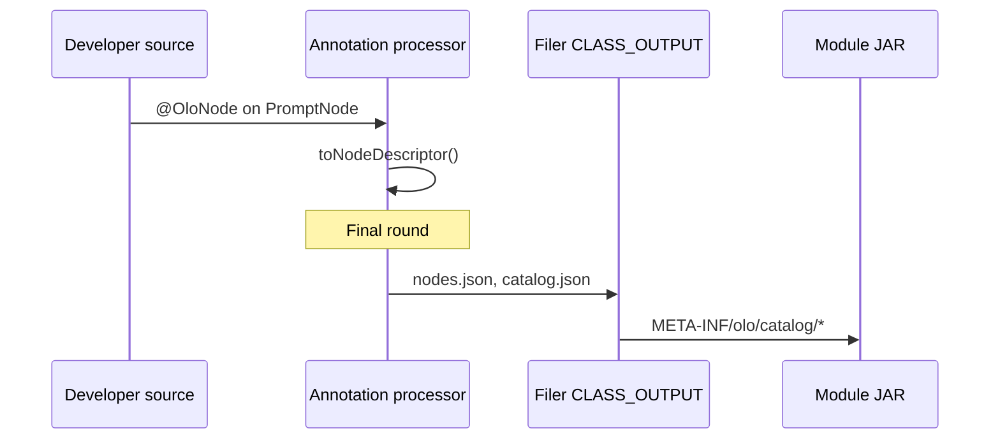

# olo-annotation-processor architecture

> **OLO 1.0:** Catalog generation architecture is frozen. See [OLO_1_0.md](../../olo-annotation/docs/OLO_1_0.md). Next processor work: compile-time validation (OLO-AP-001–003), not schema redesign.

## Purpose

`olo-annotation-processor` is a **compile-time** annotation processor. It scans `@OloNode`, `@OloTool`, and `@OloHook` on implementation classes and writes **extension catalog JSON** into each compiled JAR.

Those catalogs let workflow editor UIs (for example `olo-ui`) discover nodes, tools, and hooks as **plug-and-play modules** without hard-coding palettes or property forms.

## What belongs here

| In scope | Out of scope |
|----------|--------------|
| `OloExtensionCatalogProcessor` | Runtime graph execution |
| Descriptor model classes (`*ExtensionDescriptor`) | Workflow JSON/YAML parsing (`olo-definition`) |
| Writing `META-INF/olo/catalog/*.json` | SPI interface definitions (`olo-spi`) |
| Processor unit tests (`compile-testing`) | Merging catalogs at runtime (`olo-annotation`) |

## Position in the stack

```mermaid
flowchart TB
    ANN[olo-annotation<br/>@OloNode @OloTool @OloHook]
    PROC[olo-annotation-processor]
    IMPL[Implementation JAR<br/>olo-core-nodes, extensions, …]
    LOAD[olo-annotation<br/>ExtensionCatalogLoader]
    UI[Workflow editor UI]

    ANN --> PROC
    PROC -->|"compile"| IMPL
    IMPL -->|"classpath"| LOAD
    LOAD --> UI
```

| Layer | Responsibility |
|-------|----------------|
| **Annotations** (`olo-annotation`) | Declare UI/planner metadata on implementation types |
| **Processor** (this module) | Materialize metadata as versioned JSON resources |
| **Loader** (`olo-annotation`) | Merge catalogs from all JARs on the classpath |
| **SPI** (`olo-spi`) | Runtime execution contracts; separate from compile-time metadata |
| **Definition** (`olo-definition`) | Serialized workflow graph; catalog informs how editors build it |

## Compile-time flow

1. Developer annotates a class implementing `Node`, `Tool`, or `Hook`.
2. Gradle (or Maven) runs `annotationProcessor 'org.olo:olo-annotation-processor'`.
3. `OloExtensionCatalogProcessor` collects annotated types across annotation processing rounds.
4. On the final round (`processingOver()`), it serializes descriptors to classpath resources.
5. Resources are packaged into the module JAR under `META-INF/olo/catalog/`.



### Processor entry point

| Class | Package |
|-------|---------|
| `OloExtensionCatalogProcessor` | `org.olo.annotation.processor` |

Registered via `META-INF/services/javax.annotation.processing.Processor`.

Supported annotations:

- `org.olo.annotation.OloNode`
- `org.olo.annotation.OloTool`
- `org.olo.annotation.OloHook`

Supported source version: **Java 21**.

## Generated resources

All paths are defined in `org.olo.annotation.OloCatalogLocations`:

| Resource | Written when | Contents |
|----------|--------------|----------|
| `META-INF/olo/catalog/nodes.json` | Module has `@OloNode` types | Node descriptors + document header |
| `META-INF/olo/catalog/tools.json` | Module has `@OloTool` types | Tool descriptors |
| `META-INF/olo/catalog/hooks.json` | Module has `@OloHook` types | Hook descriptors |
| `META-INF/olo/catalog/catalog.json` | Any extension type present | Per-module convenience bundle (not authoritative) |

Empty kinds are omitted. A tools-only module does not produce `nodes.json`.

### Authoritative vs convenience catalogs

| File | Role |
|------|------|
| `nodes.json`, `tools.json`, `hooks.json` | **Authoritative** — one descriptor type per file; merged by `ExtensionCatalogLoader` |
| `catalog.json` | **Generated convenience** — single-file snapshot of the module’s catalogs for indexing and inspection |

`ExtensionCatalogLoader` reads **only** the three per-type files. It does **not** load `catalog.json`, because merging both `tools.json` and `catalog.json` would duplicate every descriptor.

**Why keep all four files?** OLO is evolving into a platform with plugins, not just a framework. Type-specific catalogs support:

| Consumer | Benefit |
|----------|---------|
| **Studio** | Palette loads `nodes.json`; tool picker loads `tools.json`; hook editor loads `hooks.json` — no filtering |
| **Marketplace** | Plugin repository inspects `tools.json` without parsing nodes or hooks |
| **CLI** | `olo plugins list-tools` reads `tools.json` directly |

`catalog.json` remains useful for admin UIs, quick module inspection, and marketplace indexing without opening three files — but runtime merge and `ExtensionCatalog` assembly use the per-type sources of truth.

### Community plugins

Every community, enterprise, or marketplace plugin follows the same predictable JAR layout. The annotation processor generates catalogs at compile time; validators, marketplaces, and CLIs can inspect the archive without running code.

```
my-plugin.jar
└── META-INF/olo/catalog/
    ├── nodes.json      (if the plugin defines @OloNode types)
    ├── tools.json      (if the plugin defines @OloTool types)
    ├── hooks.json      (if the plugin defines @OloHook types)
    └── catalog.json    (convenience bundle — optional to read)
```

A tools-and-hooks-only plugin might ship:

```
acme-integrations.jar
└── META-INF/olo/catalog/
    ├── tools.json
    ├── hooks.json
    └── catalog.json
```

Only non-empty kinds are emitted. Empty arrays are omitted from `catalog.json`. This structure is easy to validate in CI (`jar tf`, JSON schema checks, marketplace upload gates) and easy for plugin authors to reason about.

### Extension id uniqueness

**Extension ids must be globally unique** across every plugin and core module on the classpath.

| Rule | Detail |
|------|--------|
| **Authoring** | Prefer kebab-case, self-describing ids (`logging-hook`, `company-logging-hook`). Prefix with org/plugin when needed — see [CATALOG_SCHEMA.md — Extension id naming](CATALOG_SCHEMA.md#extension-id-naming). |
| **Duplicates** | `ExtensionCatalogLoader` logs a **warning** naming both modules and keeps the first descriptor discovered. |
| **Not an override** | Duplicate-id handling exists only for **diagnostics** and **backward compatibility**. It is **not** a supported override mechanism. |
| **Classpath order** | “First wins” follows `ClassLoader.getResources()` order, which varies across IDEs, fat JARs, containers, and tests — plugin authors must not rely on it. |

To replace or extend core behavior, use a **new id** and explicit workflow/editor configuration — not a silent classpath collision.

### Document header

Every per-kind file includes:

| Field | Example | Meaning |
|-------|---------|---------|
| `schemaVersion` | `"1.0"` | Catalog schema version |
| `moduleId` | `"olo-core-nodes"` | Logical module id (from compiler option `-Aolo.catalog.module`) |
| `catalogType` | `"nodes"` | Which descriptor array this file carries (`"nodes"`, `"tools"`, or `"hooks"`). Named `catalogType` rather than `kind` to avoid confusion with per-descriptor `kind` (`NODE` / `TOOL` / `HOOK`). |
| `generatedAt` | ISO-8601 instant | Compile timestamp (see below) |
| `generatedBy` | `"olo-annotation-processor"` | Catalog writer identity |
| `generatedByVersion` | `"1.0.0"` | Processor release (marketplace diagnostics) |
| `moduleVersion` | `"1.2.0"` | **Reserved (not emitted in v1)** — plugin implementation semver for marketplace, diagnostics, compatibility ([CATALOG_SCHEMA.md](CATALOG_SCHEMA.md#module-version-reserved)) |

`generatedAt` is included by default — useful for debugging which JAR produced a catalog and when metadata last changed. Because it varies per compile, it can affect **reproducible builds** (identical inputs producing byte-identical JARs). If that matters later, reproducible build pipelines may **omit or normalize** `generatedAt` (for example a fixed epoch or a pinned timestamp via processor configuration). The field is not consumed by runtime execution or catalog merge logic.

See [CATALOG_SCHEMA.md](CATALOG_SCHEMA.md) for per-descriptor fields.

## Compiler option

| Option | Default | Purpose |
|--------|---------|---------|
| `olo.catalog.module` | `extensions` | Embedded in generated JSON as `moduleId` |

Gradle example (`olo-core/nodes`):

```gradle
tasks.withType(JavaCompile).configureEach {
    options.compilerArgs += ['-Aolo.catalog.module=olo-core-nodes']
}
```

Use a stable, unique name per published artifact so UIs and logs can attribute catalog entries.

## Gradle integration

Minimal wiring for an extension module:

```gradle
dependencies {
    compileOnly 'org.olo:olo-annotation:0.1.0-SNAPSHOT'
    annotationProcessor 'org.olo:olo-annotation-processor:0.1.0-SNAPSHOT'
}

tasks.withType(JavaCompile).configureEach {
    options.compilerArgs += ['-Aolo.catalog.module=my-extension-module']
}
```

**Publish order** (when not using composite builds):

1. `olo-annotation`
2. `olo-annotation-processor`
3. Your implementation module

`olo-core` uses `includeBuild` for local development so processor changes apply without `publishToMavenLocal`.

## Annotating implementations

Keep **runtime SPI markers** (`@NodeType`, `@ToolId`, `@ImplementationId` from `olo-spi`) alongside compile-time metadata (`@OloNode`, etc.). They serve different lifecycles:

| Annotation set | Retention | Consumer |
|----------------|-----------|----------|
| `olo-spi` | Runtime | Registries, `ServiceLoader`, reflection |
| `olo-annotation` | CLASS | This processor → JSON catalogs |

Example (from `olo-core`):

```java
@OloNode(
    type = CoreNodeTypes.PROMPT,
    name = "Prompt",
    description = "Template prompt assembly",
    category = "llm",
    emoji = "💬",
    tags = {"prompt", "core"},
    inputs = @OloPort(id = "in", name = "in", schema = "any", required = true),
    outputs = @OloPort(id = "out", name = "out", schema = "any"),
        configuration = @OloProperty(name = "prompt", type = OloPropertyType.TEXTAREA,
        description = "Prompt template; use {{input}} for user text"),
    capabilityInputs = {"input"},
    capabilityOutputs = {"output"})
@NodeType(CoreNodeTypes.PROMPT)
public final class PromptNode implements Node { … }
```

### SPI consistency (required today, validated tomorrow)

Compile-time metadata and runtime SPI markers on the **same class** must agree. Mismatches are easy to introduce during refactors and often surface only at runtime (editor shows one id, worker resolves another).

| Compile-time (`olo-annotation`) | Runtime SPI (`olo-spi`) | Catalog / workflow field |
|--------------------------------|-------------------------|--------------------------|
| `@OloNode.type()` | `@NodeType` | Node `id` / `NodeDefinition.type` |
| `@OloTool.id()` | `@ToolId` | Tool `id` |
| `@OloHook.implementationId()` | `@ImplementationId` | Hook `id` |

Today the processor **does not** enforce these pairs — contributors must keep them aligned manually. See [VALIDATION_RULES.md](VALIDATION_RULES.md).

### Mapping to workflow definition

| Catalog field | Workflow model |
|---------------|----------------|
| Node `id` | `NodeDefinition.type` |
| Tool `id` | `ToolDefinition.id` / runtime `implementationId` |
| Hook `id` | `HookActionDefinition.implementationId` |
| `configuration` / `arguments` | Editor property panels and validation hints |
| `inputs` / `outputs` | Port wiring in the canvas |
| `capability` | Planner hints (`inputs`, `outputs` semantic arrays) |

## Metadata philosophy

The processor **serializes editor metadata**. It copies annotation attributes into catalog JSON so workflow editors can render palettes, property forms, and in-editor help — nothing more.

Fields such as:

- `featured`
- `examples`
- `help`
- `placeholder`
- `group`

**must never influence runtime execution.** Do not branch in `Node`, `Tool`, or `Hook` implementations on these values. Do not read catalog JSON inside the worker or runtime engine to change behavior.

| Concern | Where it lives |
|---------|----------------|
| Editor UX (palette, forms, onboarding) | Catalog JSON from this processor |
| Execution (which class runs, how it behaves) | `olo-spi` markers, workflow definition, implementation code |

Runtime code should depend on SPI contracts and serialized workflow configuration — not on whether a node is `featured` or which `help` text the editor showed.

Full editor semantics: [EDITOR_CONVENTIONS.md](../../olo-annotation/docs/EDITOR_CONVENTIONS.md).  
Broader rationale: [Metadata philosophy](../../olo-annotation/docs/ARCHITECTURE.md#metadata-philosophy) in `olo-annotation`.

## Runtime loading

The processor does **not** run at runtime. Catalogs are read by `org.olo.annotation.catalog.ExtensionCatalogLoader` in `olo-annotation`:

```java
import org.olo.annotation.catalog.ExtensionCatalog;
import org.olo.annotation.catalog.ExtensionCatalogLoader;

ExtensionCatalog catalog = ExtensionCatalogLoader.loadMerged(classLoader);
catalog.nodes(); // merged palette across all JARs
```

When using `olo-core`:

```java
import org.olo.core.catalog.CoreExtensionCatalog;

ExtensionCatalog catalog = CoreExtensionCatalog.loadMerged();
```

Merge rules:

- Scan **only** `nodes.json`, `tools.json`, and `hooks.json` on the classpath (`catalog.json` is not loaded).
- For each path, merge **all** occurrences across JARs (`ClassLoader.getResources`).
- Deduplicate by descriptor `id`. Duplicate ids generate a warning log entry including both module names; the first descriptor discovered on the classpath wins.
- Return a typed `ExtensionCatalog` with `schemaVersion()`, `nodes()`, `tools()`, and `hooks()` — Jackson is not part of the public consumer API.

See [Extension id uniqueness](#extension-id-uniqueness), [Schema evolution](#schema-evolution), and [CATALOG_SCHEMA.md — Merge and deduplication](CATALOG_SCHEMA.md#merge-and-deduplication).

## Internal model

Descriptor POJOs in `org.olo.annotation.processor.model` mirror the JSON shape the processor writes:

| Class | Used for |
|-------|----------|
| `NodeExtensionDescriptor` | `@OloNode` |
| `ToolExtensionDescriptor` | `@OloTool` |
| `HookExtensionDescriptor` | `@OloHook` |
| `PortDescriptor` | `@OloPort` |
| `PropertyDescriptor` | `@OloProperty` |
| `ExtensionCatalogDocument` | Per-kind file envelope |

**These classes are internal processor implementation details and are not a public API.** Do not depend on them from extension modules, UIs, or runtime code. They may change without notice as the processor evolves.

Consumers that load catalogs at runtime should use the typed types in `org.olo.annotation.catalog` (`ExtensionCatalog`, `NodeDescriptor`, `ToolDescriptor`, `HookDescriptor`, …) via `ExtensionCatalogLoader`.

Jackson serializes the internal model directly during compilation; field names in JSON match public fields on those classes.

## Testing

`OloExtensionCatalogProcessorTest` uses Google `compile-testing` to compile a minimal `@OloNode` source in-memory and assert:

- Compilation succeeds.
- `META-INF/olo/catalog/nodes.json` is generated.
- Output contains expected `id`, `implementationClass`, and `moduleId`.

Run:

```bash
cd olo-annotation-processor
./gradlew test
```

## Dependency rule

```
olo-annotation          (annotations + runtime loader)
olo-annotation-processor → olo-annotation, jackson-databind
implementation modules  → compileOnly olo-annotation
                         annotationProcessor olo-annotation-processor
```

Implementation modules should **not** depend on the processor at runtime. Only `compileOnly` + `annotationProcessor` scopes.

## UI consumption

Workflow editors load typed `ExtensionCatalog` instances and render:

1. **Node / tool palette** — `category`, `name`, `emoji`, `examples`, `featured`, `deprecated`, `experimental`.
2. **Properties panel** — `configuration` / `arguments` with full `PropertyDescriptor` metadata (`label`, `help`, `placeholder`, `group`, `order`, `secret`, `examples`, …).
3. **Port graph** — `inputs` / `outputs` including `description`.
4. **Validation** — ensure `NodeDefinition.type` values exist in the merged catalog.

Full field-by-field guide: [EDITOR_CONVENTIONS.md](../../olo-annotation/docs/EDITOR_CONVENTIONS.md).  
See [Metadata philosophy](#metadata-philosophy) above for the runtime boundary.

## Schema evolution

Catalog consumers **must ignore unknown fields**. Future `schemaVersion` bumps may add new header or descriptor attributes; existing readers should keep working without requiring immediate upgrades.

| Consumer | Rule |
|----------|------|
| `ExtensionCatalogLoader` | Deserializes with `@JsonIgnoreProperties(ignoreUnknown = true)` on catalog and descriptor types |
| Workflow editors / UIs | Ignore unknown property or descriptor fields when rendering forms and palettes |
| Extension authors | Prefer additive changes; bump `schemaVersion` for breaking renames or removals |

Forward-compatible evolution makes it safe to ship richer metadata (for example `moduleVersion`, validation hints) before every consumer understands every field.

## Compile-time validation

With the catalog format frozen for v1 ([V1.md](../../olo-annotation/docs/V1.md)), the processor enforces structural and SPI consistency checks at compile time. These eliminate plugin mistakes where Studio metadata does not match runtime SPI resolution.

Full rule reference: **[VALIDATION_RULES.md](VALIDATION_RULES.md)**.

| Code | Check |
|------|-------|
| **OLO-AP-001** | `@OloNode.type()` ↔ `@NodeType` |
| **OLO-AP-002** | `@OloTool.id()` ↔ `@ToolId` |
| **OLO-AP-003** | `@OloHook.implementationId()` ↔ `@ImplementationId` |
| **OLO-AP-004–006** | Duplicate node / tool / hook ids in the same module |
| **OLO-AP-007–010** | Duplicate properties, ports, capability tokens; ENUM without values |

Mismatches fail compilation (not a warning). Example:

```text
error: [OLO-AP-001] @OloNode.type "PROMPT" does not match @NodeType "PROMPT_V2" on sample.PromptNode
```

Not implemented yet. Full codes, examples, and migration guidance: **[VALIDATION_RULES.md](VALIDATION_RULES.md)**.

## Related documentation

- [OLO_1_0.md](../../olo-annotation/docs/OLO_1_0.md) — OLO 1.0 architecture freeze
- [CATALOG_SCHEMA.md](CATALOG_SCHEMA.md) — JSON field reference
- [VALIDATION_RULES.md](VALIDATION_RULES.md) — processor error codes (OLO-AP-*)
- [olo-annotation README](../../olo-annotation/README.md) — annotation API
- [olo-core ARCHITECTURE](../../olo-core/docs/ARCHITECTURE.md) — default implementations
- [olo-mono MODULES](../../docs/MODULES.md) — monorepo module index
