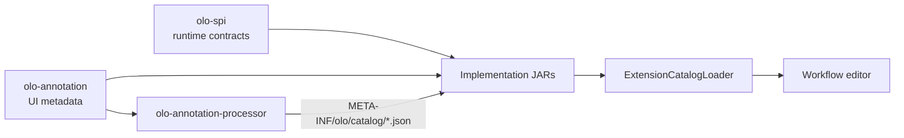

# olo-annotation architecture

> **OLO 1.0:** Catalog architecture is frozen. See [OLO_1_0.md](OLO_1_0.md). Do not redesign the metadata system for 1.0 — build Studio, marketplace, validation, and AI workflows on this foundation.

## Purpose

`olo-annotation` provides **metadata annotations** for OLO extension implementations (nodes, tools, hooks) and a **runtime catalog loader** that merges processor-generated JSON from the classpath.

Workflow editor UIs use this metadata to render palettes, property forms, and port wiring without hard-coding extension lists.

## What belongs here

| In scope | Out of scope |
|----------|--------------|
| `@OloNode`, `@OloTool`, `@OloHook` | SPI execution interfaces (`olo-spi`) |
| `@OloPort`, `@OloProperty` | Annotation processor implementation |
| `OloCatalogLocations` | Workflow graph POJOs (`olo-definition`) |
| `ExtensionCatalogLoader` | Graph execution (`olo-runtime`) |

## Position in the stack



| Concern | Module | When |
|---------|--------|------|
| **Execute** a node/tool/hook | `olo-spi` | Runtime |
| **Describe** it for editors | `olo-annotation` | Compile time (source) |
| **Serialize** descriptions | `olo-annotation-processor` | Compile time (processor) |
| **Discover** all extensions | `olo-annotation` (`ExtensionCatalogLoader`) | Runtime (classpath) |

## Two annotation layers

Extension classes typically carry **both** SPI and OLO metadata annotations:

| Layer | Package | Retention | Example | Consumer |
|-------|---------|-----------|---------|----------|
| Runtime SPI | `org.olo.spi.annotation` | `RUNTIME` | `@NodeType`, `@ToolId` | Registries, reflection |
| UI metadata | `org.olo.annotation` | `CLASS` | `@OloNode`, `@OloTool` | Annotation processor → JSON |

They must stay **consistent** — for example `@OloNode.type()` should match `@NodeType` and `nodeType()` on the same class.

```java
@OloNode(type = "PROMPT", name = "Prompt", …)
@NodeType("PROMPT")
public final class PromptNode implements Node {
    @Override
    public String nodeType() { return "PROMPT"; }
}
```

## Compile-time lifecycle

1. Developer adds `@OloNode` / `@OloTool` / `@OloHook` on implementation types.
2. `compileOnly` dependency brings annotation types into the compiler classpath.
3. `olo-annotation-processor` reads annotations and writes JSON under `META-INF/olo/catalog/`.
4. Annotations are **not** retained at runtime (`RetentionPolicy.CLASS`); only the generated JSON survives in the JAR.

### Why `CLASS` retention (not `RUNTIME`)

`CLASS` retention is **intentional**.

Annotations are consumed by the annotation processor and serialized into catalog JSON. Runtime systems should use **generated catalogs** (`ExtensionCatalogLoader`) or **SPI annotations** (`@NodeType`, `@ToolId`, `@ImplementationId`), not reflection on `@OloNode`, `@OloTool`, or `@OloHook`.

| If retention were `RUNTIME` | Problem |
|-----------------------------|---------|
| Registries read `@OloNode` via reflection | Duplicates catalog JSON; two sources of truth |
| Kernel checks `node.featured()` | UX metadata leaks into execution (see [Metadata philosophy](#metadata-philosophy)) |
| Extension JARs grow annotation metadata at runtime | Catalog loader becomes optional instead of canonical |

Future contributors: do not change to `RUNTIME` without a deliberate architecture review.

See [olo-annotation-processor docs](../../olo-annotation-processor/docs/ARCHITECTURE.md) for processor details.

## Runtime lifecycle

1. Application puts implementation JARs (for example `olo-core-nodes`, `olo-core-tools`) on the classpath.
2. `ExtensionCatalogLoader.loadMerged()` scans catalog resources into typed descriptors.
3. UI or API layer uses `ExtensionCatalog.nodes()`, `.tools()`, `.hooks()` — no Jackson on the consumer classpath.

```java
import org.olo.annotation.catalog.ExtensionCatalog;
import org.olo.annotation.catalog.ExtensionCatalogLoader;

ExtensionCatalog catalog = ExtensionCatalogLoader.loadMerged();
for (var node : catalog.nodes()) {
    String type = node.id;
    String name = node.name;
    // build palette entry …
}
```

### Convenience entry points

| API | When to use |
|-----|-------------|
| `ExtensionCatalogLoader.loadMerged()` | Generic — any classpath with catalog JARs |
| `ExtensionCatalogLoader.loadMerged(classLoader)` | Custom class loader (for example in containers) |
| `CoreExtensionCatalog.loadMerged()` | When `olo-core` aggregator is on the classpath |

### Catalog immutability contract

`ExtensionCatalogLoader.loadMerged()` returns an **`ExtensionCatalog` that must be treated as immutable** by consumers.

- Descriptor lists from `nodes()`, `tools()`, and `hooks()` are unmodifiable.
- Do not mutate descriptor fields after load — cache the catalog instance, not individual descriptors you intend to edit in place.
- If a UI layer needs derived or enriched state (search indexes, selection, draft edits), wrap or copy — do not patch catalog objects shared across panels.

This prevents subtle caching bugs when multiple editor components read the same merged catalog.

## Catalog resource locations

`OloCatalogLocations` defines stable classpath paths:

| Constant | Path |
|----------|------|
| `CATALOG_DIR` | `META-INF/olo/catalog` |
| `NODES_CATALOG` | `META-INF/olo/catalog/nodes.json` |
| `TOOLS_CATALOG` | `META-INF/olo/catalog/tools.json` |
| `HOOKS_CATALOG` | `META-INF/olo/catalog/hooks.json` |
| `MERGED_CATALOG` | `META-INF/olo/catalog/catalog.json` (convenience bundle; not loaded by merge) |

## Authoritative catalogs

| File | Role |
|------|------|
| `nodes.json`, `tools.json`, `hooks.json` | **Authoritative** — merged into `ExtensionCatalog` |
| `catalog.json` | **Convenience** — per-module snapshot for marketplace, admin UIs, CLIs; not merged |

Type-specific files let Studio, marketplace indexers, and `olo plugins list-tools` read exactly what they need without filtering a merged blob.

## Merge semantics

`ExtensionCatalogLoader` reads only the three authoritative paths from the given class loader. For each path it loads **every** matching resource across JARs (`getResources`), extracts `nodes`, `tools`, and `hooks` arrays, and merges into maps keyed by descriptor `id`.

| Rule | Behavior |
|------|----------|
| Missing resource | Skipped silently |
| Duplicate `id` | First occurrence wins; **WARNING** logged with winner and ignored module |
| Output type | `ExtensionCatalog` with `schemaVersion()`, `nodes()`, `tools()`, `hooks()` |

**Extension ids must be globally unique.** Duplicate-id handling exists only for diagnostics and backward compatibility — not as a supported override mechanism. Plugin authors must not rely on classpath order. See [Community plugins](../../olo-annotation-processor/docs/ARCHITECTURE.md#community-plugins) and [Extension id uniqueness](../../olo-annotation-processor/docs/ARCHITECTURE.md#extension-id-uniqueness).

Example warning:

```
WARNING: Duplicate tool id detected: HTTP
Winner:
  olo-core
Ignored:
  company-extension
```

## Mapping to workflow definition

Annotations describe what editors write into `olo-definition` workflow JSON:

| Annotation field | Workflow model |
|------------------|----------------|
| `@OloNode.type()` | `NodeDefinition.type` |
| `@OloTool.id()` | `ToolDefinition.id` |
| `@OloHook.implementationId()` | `HookActionDefinition.implementationId` |
| `@OloPort` on node | Port wiring in the canvas |
| `@OloProperty` | Node configuration / tool arguments in the properties panel |
| `capabilityInputs` / `capabilityOutputs` | Planner validation hints |

## Gradle usage

### Implementation module (generates catalog JSON)

```gradle
dependencies {
    compileOnly 'org.olo:olo-annotation:0.1.0-SNAPSHOT'
    annotationProcessor 'org.olo:olo-annotation-processor:0.1.0-SNAPSHOT'
}

tasks.withType(JavaCompile).configureEach {
    options.compilerArgs += ['-Aolo.catalog.module=my-module-name']
}
```

### Consumer that only reads catalogs

```gradle
dependencies {
    implementation 'org.olo:olo-annotation:0.1.0-SNAPSHOT'
    implementation 'org.olo:olo-core:0.1.0-SNAPSHOT'  // ships catalog JSON
}
```

Jackson is an **implementation** dependency of `olo-annotation` only — used internally to parse catalog JSON. Consumers depend on typed `org.olo.annotation.catalog.*` classes, not `JsonNode`.

## Package layout

| Package | Contents |
|---------|----------|
| `org.olo.annotation` | Annotations, `OloCatalogLocations`, `OloHookPhase` |
| `org.olo.annotation.catalog` | `ExtensionCatalogLoader`, `ExtensionCatalog`, `*Descriptor` |

## Dependency rule

```
olo-annotation           (no dependency on olo-spi or olo-definition)
olo-annotation-processor → olo-annotation
implementation modules   → compileOnly olo-annotation
                           annotationProcessor olo-annotation-processor
UI / services            → implementation olo-annotation (+ extension JARs)
```

Keeping `olo-annotation` independent of `olo-spi` allows the annotation JAR to stay tiny and usable from build tools without pulling runtime contracts.

## Metadata philosophy

**Annotations and catalog metadata describe editor behavior, not implementation behavior.**

Catalog metadata is **descriptive only**. Runtime execution must not depend on:

`featured`, `examples`, `help`, `placeholder`, `group`, `order`, `deprecated`, `experimental`, `label`, `secret`, or other UX-only fields.

| Correct | Incorrect |
|---------|-----------|
| UI reads `node.featured` from `ExtensionCatalog` to sort the palette | `if (node.experimental) { … }` in `Node.execute()` |
| UI renders `property.help` under a form field | Kernel branches on `property.secret` |
| Runtime resolves `Node` via `@NodeType` / registry | Runtime reflects on `@OloNode` |

Execution uses **olo-spi** + **workflow definition JSON**. Catalog metadata is for **olo-ui** and similar tooling.

Editor semantics (`featured` advisory rules, `examples` = use-cases not config values, groups, badges): **[EDITOR_CONVENTIONS.md](EDITOR_CONVENTIONS.md)**.

## Typed catalog model (implemented)

`ExtensionCatalogLoader.loadMerged()` returns **`ExtensionCatalog`** with `List<NodeDescriptor>`, `ToolDescriptor`, `HookDescriptor` — not `JsonNode`. This keeps Jackson internal to `olo-annotation` and gives UIs compile-time safety.

The annotation model for v1 is effectively **complete**; further investment belongs in editor integration and the typed catalog API, not new annotation fields. See [V1.md](V1.md).

## Related documentation

- [ANNOTATIONS.md](ANNOTATIONS.md) — annotation API contracts only
- [EDITOR_CONVENTIONS.md](EDITOR_CONVENTIONS.md) — how UIs interpret metadata
- [olo-annotation-processor ARCHITECTURE](../../olo-annotation-processor/docs/ARCHITECTURE.md)
- [olo-annotation-processor CATALOG_SCHEMA](../../olo-annotation-processor/docs/CATALOG_SCHEMA.md)
- [olo-spi ARCHITECTURE](../../olo-spi/docs/ARCHITECTURE.md)
- [olo-core ARCHITECTURE](../../olo-core/docs/ARCHITECTURE.md)
