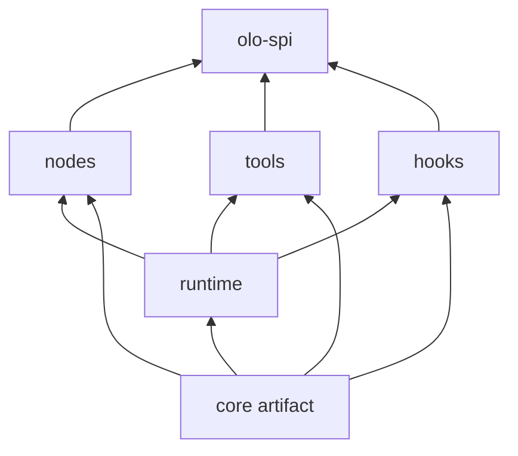

# olo-core architecture

## Role

`olo-core` supplies **default implementations** for `olo-spi` contracts. Workflow **shape** remains in `olo-definition`; **contracts** in `olo-spi`; **built-in behavior** here.

```
olo-spi   ← interfaces
olo-core  ← default Node / Tool / Hook + ExecutionEngine
```

## Module structure



Consumers add a single dependency:

```gradle
implementation("org.olo:olo-core")
```

## Extension catalog (compile-time JSON)

`nodes`, `tools`, and `hooks` compile with `olo-annotation-processor`. Each JAR ships authoritative catalogs under `META-INF/olo/catalog/`:

| Subproject | `moduleId` | Generated files |
|------------|------------|-----------------|
| `nodes` | `olo-core-nodes` | `nodes.json`, `catalog.json` |
| `tools` | `olo-core-tools` | `tools.json`, `catalog.json` |
| `hooks` | `olo-core-hooks` | `hooks.json`, `catalog.json` |

Gradle wiring (root `build.gradle`):

```gradle
compileOnly 'org.olo:olo-annotation:0.1.0-SNAPSHOT'
annotationProcessor 'org.olo:olo-annotation-processor:0.1.0-SNAPSHOT'
// -Aolo.catalog.module=olo-core-<subproject>
```

Composite builds (`includeBuild` for `olo-annotation` and `olo-annotation-processor` in `settings.gradle`) apply processor changes without `publishToMavenLocal`.

Load merged core metadata at runtime:

```java
import org.olo.core.catalog.CoreExtensionCatalog;
import org.olo.annotation.catalog.ExtensionCatalog;

ExtensionCatalog catalog = CoreExtensionCatalog.loadMerged();
```

Every implementation pairs `@OloNode` / `@OloTool` / `@OloHook` with the matching SPI marker (`@NodeType`, `@ToolId`, `@ImplementationId`). See [olo-annotation-processor VALIDATION_RULES.md](../../olo-annotation-processor/docs/VALIDATION_RULES.md).

### `dist/` output (single folder)

```bash
./gradlew dist
```

```
dist/
├── lib/                 # kernel / worker classpath
│   ├── nodes-*.jar
│   ├── tools-*.jar
│   ├── hooks-*.jar
│   ├── runtime-*.jar
│   └── core-*.jar       # aggregator (olo-core)
└── catalog/
    ├── catalog.json     # merged Studio bundle (no JVM bindings)
    ├── runtime.json     # merged JVM bindings (workers / classpath)
    ├── nodes.json       # per-type debug slice
    ├── tools.json       # per-type debug slice
    └── hooks.json       # per-type debug slice
```

| Consumer | Picks up | Uses |
|----------|----------|------|
| **olo-be** | `dist/catalog/catalog.json` | Serves `/api/v1/catalog` — no runtime JARs, no JVM bindings |
| **workers** | `META-INF/olo/catalog/runtime.json` (classpath) | Resolve `implementationClass` by global extension id |
| **debug / CI** | `dist/catalog/{catalog,runtime,nodes,tools,hooks}.json` | Inspect editor vs runtime output |
| **olo-ui** | via olo-be API or copied JSON | Metadata-driven Studio components |
| **olo-kernel** | `org.olo:olo-core` Maven dep or `dist/lib` | Graph traversal + `ExecutionEngine` |

## Built-in catalog

### Nodes (`CoreNodeTypes`)

| Type | Class | Behavior |
|------|-------|----------|
| `PROMPT` | `PromptNode` | Renders `{{input}}` template |
| `AGENT` | `AgentNode` | Stub agent (until extensions) |
| `PARALLEL` | `ParallelNode` | Fan-out marker |
| `LOOP` | `LoopNode` | Iteration counter |
| `SWITCH` | `SwitchNode` | Branch selection |
| `APPROVAL` | `ApprovalNode` | Human gate → `WAITING` |

### Tools (`CoreToolIds`)

| Id | Class |
|----|-------|
| `http-tool` | `HttpTool` |
| `calculator` | `CalculatorTool` |
| `web-search` | `WebSearchTool` (stub) |

### Hooks (`CoreHookIds`)

| Id | Class |
|----|-------|
| `logging-hook` | `LoggingHook` |
| `metrics-hook` | `MetricsHook` |
| `tracing-hook` | `TracingHook` |

## Runtime

| Type | Responsibility |
|------|----------------|
| `DefaultExecutionContext` | In-memory `ExecutionContext` |
| `NodeRegistry` / `ToolRegistry` / `HookRegistry` | Lookup tables |
| `ExecutionEngine` | `executeNode`, `invokeTool`, `runHook` |
| `Core` | `defaultEngine()` factory |

`ExecutionEngine` executes **individual steps** today. Full graph traversal will live in a future `olo-runtime` module that uses this engine.

## Extension

Register additional implementations on the registries before passing them to `ExecutionEngine`:

```java
NodeRegistry nodes = NodeRegistry.withDefaults();
nodes.register(myCustomNode);
ExecutionEngine engine = new ExecutionEngine(nodes, ToolRegistry.withDefaults(), HookRegistry.withDefaults());
```
