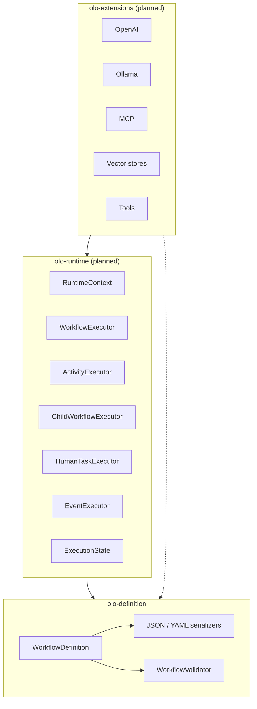
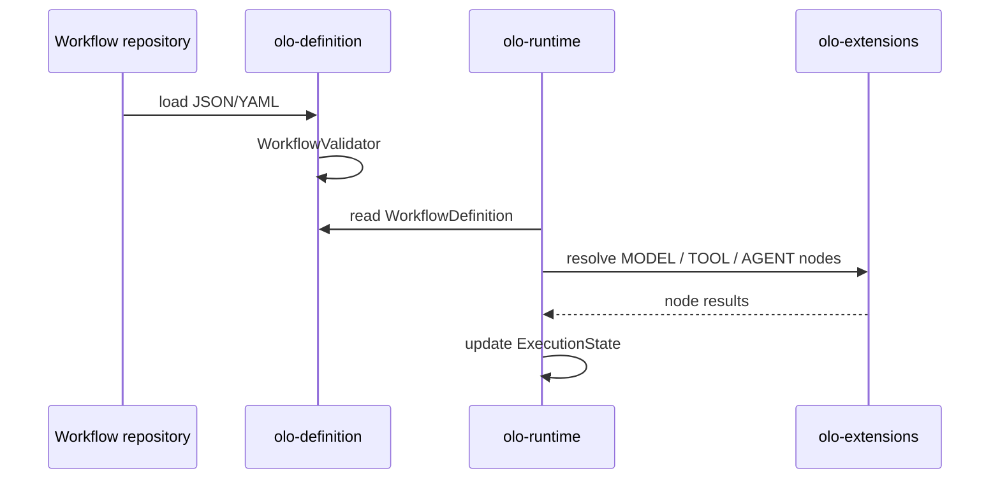

# OLO Architecture

This document describes the architecture of the **OLO** (AI orchestration) monorepo: how declarative workflow graphs are separated from execution, how modules depend on each other, and how workflows are built, serialized, validated, and extended.

## 1. Design goals

OLO treats an AI workflow as a **portable artifact**—similar to BPMN diagrams, Temporal workflow definitions, LangGraph state machines, or Kubernetes manifests:

| Goal | Approach |
|------|----------|
| Version in Git | JSON/YAML workflow files |
| No vendor lock-in at definition time | Pure POJOs, no Spring or provider SDKs in `olo-definition` |
| Safe composition | Structural validation before execution |
| Typed data contracts | `inputs` / `outputs` with `PortDefinition` and schema checks on edges |
| Enterprise controls | First-class `approval`, `onFailure`—not buried in `configuration` |
| Runtime flexibility | Multiple engines can execute the same definition |
| Dynamic evolution | Extend workflows at load time (`WorkflowBuilder.from`) |

**Core principle:** *definition* and *execution* are separate layers. Definitions never import runtime code.

**Readable artifacts:** Workflow files should be reviewable by humans and machines. Cross-cutting semantics (ports, retries, approvals) use **named structures**; `configuration` is reserved for integration-specific knobs (`providerRef`, `toolRef`, prompts).

## 2. Monorepo overview

```
olo-mono/
├── doc/                    # Architecture and design docs (this file)
├── olo-definition/         # Serializable workflow graphs (implemented)
├── olo-runtime/            # Execution engine (planned)
└── olo-extensions/         # Provider integrations (planned)
```



### Module responsibilities

| Module | Responsibility | Must not contain |
|--------|----------------|------------------|
| **olo-definition** | POJOs, builders, JSON/YAML, structural validation | Execution, model API calls, runtime state, Spring |
| **olo-runtime** | Execute graphs, manage state, invoke node handlers | Provider-specific SDKs (delegated to extensions) |
| **olo-extensions** | OpenAI, Ollama, Temporal, Kafka, MCP, vector DBs, tools | Core graph model (uses definition types only) |

### Dependency rules

```
olo-definition  ←  olo-runtime  ←  olo-extensions
     ↑                ↑
     │                └── may also read definitions directly for config
     └── NEVER imports olo-runtime or olo-extensions
```

Violating this direction creates circular dependencies and couples stored workflows to a single engine.

## 3. The workflow as root artifact

Everything is rooted in **`WorkflowDefinition`**: the single aggregate that can be stored, diffed, and executed.

```
WorkflowDefinition
├── id, name, role, shortDescription, longDescription, isExternalWorkflow, isChildWorkflow, childWorkflows[], version
├── capability       → CapabilityDefinition (planner-readable contract)
├── inputs           → Map<String, WorkflowInputDefinition>  (invocation inputs)
├── state            → Map<String, StateFieldDefinition>       (shared workflow state schema)
├── parameters       → Map<String, WorkflowParameterDefinition> (runtime tuning)
├── nodes[]          → NodeDefinition (each with ports[])
├── edges[]          → EdgeDefinition
├── variables[]      → VariableDefinition (deprecated; use inputs)
├── tools[]          → ToolDefinition
├── agents[]         → AgentDefinition
├── modelProviders[] → ModelProviderDefinition
├── modelRouting[]   → ModelRoutingDefinition
├── extensions[]     → ExtensionDefinition
├── hooks[]          → HookDefinition (PRE / ON_ERROR / FINALLY)
└── metadata         → Map<String, Object>
```

Workflows are **immutable value objects** after `build()`. Lists and maps exposed from getters are unmodifiable copies.

### 3.1 Capability contract (planner-facing)

Every **workflow**, **tool**, and **agent** exposes the same `CapabilityDefinition` block. Planners never inspect `nodes`, `edges`, or `configuration` — they consume `PlannerCatalog` instead (§3.3).

**Workflow** — required on `WorkflowDefinition`:

Every workflow **must** declare `capability` so planners and orchestrators understand the orchestration goal.

```yaml
id: research-agent
name: Research Agent
role: agent
shortDescription: Web and document research with citations
longDescription: >
  Performs web, news and document research,
  summarizes findings and produces citations.
version: "2.1.0"
capability:
  name: Research Agent
  description: >
    Performs web, news and document research,
    summarizes findings and produces citations.
  tags:
    - research
    - news
    - documents
  required_inputs:
    - query
  required_outputs:
    - summary
    - citations
  examples:
    - Research Nvidia earnings
    - Find competitors of Tesla
  cost: 0.15
  latency: 45000
  confidence: 0.85
nodes: [...]
```

| Field | Purpose |
|-------|---------|
| `name`, `description` | Human- and LLM-readable summary (required) |
| `required_inputs`, `required_outputs` | **Semantic** names the planner can bind — what the capability conceptually consumes/produces (required on workflows, non-empty) |
| `tags` | Discovery / routing facets |
| `examples` | Few-shot hints for tool selection |
| `cost`, `latency`, `confidence` | Optional operational hints for planning |
| `tool_requirements` | Tool ids the capability depends on |
| `required_context` | Context keys that must be present (e.g. `user_profile`, `market_regime`) |

The workflow `id` is the registry key. Optional `capability.id` must match when set. Sample: `samples/research-agent/`.

**Do not confuse with workflow `inputs`:** `capability.required_inputs` is planner vocabulary (“this workflow answers queries”). Workflow `inputs` (§3.2) is invocation data (`symbol: INFY` with schemas). Legacy capability YAML may still use `inputs` / `outputs`; deserializers accept those as aliases.

**Tool** — `tools[]` on the workflow (or standalone artifact):

```yaml
id: screener-tool
type: TOOL
capability:
  name: Stock Screener
  description: >
    Filters stocks based on volume, RSI, moving averages and price action.
  examples:
    - Find breakout candidates
    - Find oversold stocks
runtimeBinding:
  implementationId: stock-screener
```

**Agent** — `agents[]` registry + child workflow artifact:

```yaml
id: research-agent
type: AGENT
capability:
  name: Research Agent
  description: Performs web and document research, summarizes findings.
  examples:
    - Research Nvidia earnings
workflowRef:
  workflowId: research-agent
  version: "2.1.0"
runtimeBinding:
  implementationId: default-agent-runner
```

The executable graph lives in `research-agent/workflow.yaml`; the registry entry is what the planner sees.

**Node capability** (optional, **not in planner V1**) — `capability` on `NodeDefinition` may still be validated structurally, but `PlannerCatalog` deliberately excludes `NODE` entries so planners do not see duplicate rows alongside workflow/agent/tool capabilities.

### 3.2 Workflow data: inputs, state, parameters

Three concepts replace the ambiguous legacy `variables[]` list:

| Concept | Field | Meaning | Example |
|---------|-------|---------|---------|
| **Inputs** | `inputs` | Values supplied when the workflow is **invoked** | `symbol: INFY` |
| **State** | `state` | **Shared mutable** fields agents/tools read and write during execution | `analysis`, `news[]` |
| **Parameters** | `parameters` | **Runtime tuning** knobs, not business data | `temperature: 0.2` |

```yaml
inputs:
  symbol:
    schema: String
    required: true
    # populateState: true   # default — copies input.symbol → state.symbol at workflow start

state:
  marketData:
    schema: MarketData
  news:
    schema: News[]
  analysis:
    schema: Analysis

parameters:
  temperature:
    schema: number
    defaultValue: 0.2
```

**Input → state hydration (default):** At workflow start, each input with `populateState: true` (the default) initializes the matching state field: `input.symbol` → `state.symbol`. Declare invocation inputs under `inputs` only; use `state` for fields produced or mutated during execution (`analysis`, `news`, …). Set `populateState: false` on an input when it must not appear in state (e.g. one-shot trigger payloads).

**Ports vs state:** `inputs`/`outputs` on nodes remain for **edge wiring** between steps. `reads`/`writes` on nodes declare **workflow state** access without chaining every agent through explicit port edges:

```yaml
id: research-agent
type: AGENT
reads:
  - state.symbol
  - state.news
writes:
  - state.analysis
execution:
  executionKind: SUBWORKFLOW
  workflowRef:
    workflowId: research-agent
```

### 3.2.1 Data path language

Node `reads` / `writes`, future overrides, and mappings use a single **path language** parsed by `DataPathParser`:

| Root | Prefix | Declared on workflow | Example |
|------|--------|----------------------|---------|
| State | `state.` | `state` map **plus** auto-populated inputs (§3.2) | `state.analysis.score`, `state.news[0]`, `state.symbol` from input |
| Input | `input.` | `inputs` map | `input.symbol` |
| Parameter | `parameter.` | `parameters` map | `parameter.temperature` |

**Syntax**

- Qualified: `{root}.{segment}(.{segment})*`
- Segment: `[a-zA-Z_][a-zA-Z0-9_]*` with optional zero-based index: `news[0]`
- Shorthand: bare `symbol` ⇒ `state.symbol` (legacy-friendly)

**Validation (structural)**

- Every `reads` path must parse and its **top-level** segment must exist in the matching workflow declaration (`state` / effective state including auto-populated inputs / `inputs` / `parameters`).
- Every `writes` path must use the `state.` root only; top-level field must exist in **effective state** (explicit `state` keys or inputs with `populateState: true`).
- Redundant `inputs.symbol` + `state.symbol` when `populateState` is true fails validation.
- Typos fail early: `state.analysys` when only `analysis` exists → `writes unknown state field: state.analysys (no state field 'analysys')`.

Types in `org.olo.definition.path`: `DataPath`, `PathRoot`, `PathSegment`, `DataPathParser`.

`variables[]` (`VariableDefinition`) is **deprecated** — migrate to `inputs` with `WorkflowInputDefinition` (`schema` replaces legacy `type`).

### 3.3 Planner catalog

`PlannerCatalog.from(workflow)` aggregates capability metadata only:

| `CatalogKind` | Source | V1 |
|---------------|--------|-----|
| `WORKFLOW` | `WorkflowDefinition.capability` | yes |
| `AGENT` | `agents[]` | yes |
| `TOOL` | `tools[]` | yes |
| `NODE` | `NodeDefinition.capability` | **no** (empty list; avoids duplicate catalog entries) |

`plannerView()` returns full {@link PlannerCapability} entries — rich metadata for modern planners, still no graph or config:

```json
[
  {
    "id": "research-agent",
    "kind": "AGENT",
    "name": "Research Agent",
    "description": "Research topics and summarize findings",
    "required_inputs": ["query"],
    "required_outputs": ["summary"],
    "cost": 0.15,
    "latency": 45000,
    "confidence": 0.85,
    "tool_requirements": ["web-search"],
    "required_context": ["user_profile"],
    "examples": ["Research Nvidia earnings"]
  }
]
```

Use `getEntries()`, `getAgents()`, `getTools()`, etc. for the same {@link PlannerCapability} shape grouped by kind.

Runtime still uses the full graph; planners must not receive `nodes`, `edges`, or `configuration`.

### 3.4 Runtime binding (execution dispatch)

`RuntimeBindingDefinition` selects **how** an artifact runs (separate from `capability`, which is **what** it does for planners).

| Field | Purpose |
|-------|---------|
| `implementationClass` | Custom executor class (JVM when `runtime` is `java` or omitted) |
| `implementationId` | Registry key (`default-agent-runner`, `stock-screener`, …) |
| `endpoint` | Remote service URL (with `runtime: http`) |
| `runtime` | `java`, `python`, `http` — avoids JVM-only lock-in |
| `provider` | Optional registry grouping |

**Resolution order** (`RuntimeBindingResolver`):

```
implementationClass → implementationId → endpoint → default execution
```

Default execution means standard `WorkflowExecutor` / child workflow from `workflowRef` / built-in tool runner.

```yaml
id: technical-analysis
type: AGENT
workflowRef:
  workflowId: technical-analysis-v1
runtimeBinding:
  implementationId: default-agent-runner
```

Custom override:

```yaml
runtimeBinding:
  runtime: java
  implementationClass: com.company.ai.CustomResearchAgent
```

Python / HTTP:

```yaml
runtimeBinding:
  runtime: python
  implementationId: risk-agent-service
# or
runtimeBinding:
  runtime: http
  implementationId: risk-agent-api
```

Applies to `WorkflowDefinition`, `ToolDefinition`, `AgentDefinition`, and `AGENT` / `TOOL` / `WORKFLOW_REF` nodes. `PlannerCatalog` never includes `runtimeBinding`.

#### 3.4.1 Purity tension: why `runtimeBinding` lives here today

The monorepo principle is **definition ≠ execution**. `runtimeBinding` is the main place that principle is stretched.

| Strict `olo-definition` | What `runtimeBinding` adds today |
|-------------------------|----------------------------------|
| `tool: screener`, `agent: research-agent` — logical identity only | `implementationClass`, `runtime: java \| python \| http`, `endpoint` |
| Runtime + extensions resolve *how* to run | Definition file hints at JVM class, language, URL |

**Why it was added (pragmatic, not pure):**

- **Deploy-time overrides** — same workflow artifact, different executor in dev vs prod without forking the graph
- **Multi-runtime routing** — one registry entry can point at Java, Python, or HTTP backends
- **Explicit escape hatch** — `implementationClass` for teams that need a custom executor without waiting for extension packaging

**Strict alternative (your model):**

```yaml
tools:
  - id: screener-tool
    capability: { ... }

agents:
  - id: research-agent
    workflowRef: { workflowId: research-agent }
```

No `runtimeBinding` in the workflow file. Resolution happens entirely in `olo-runtime` / `olo-extensions` via a **deployment manifest** or environment registry:

```yaml
# olo-deployment (hypothetical, not in repo yet)
bindings:
  screener-tool: { implementationId: stock-screener }
  research-agent: { implementationId: default-agent-runner }
```

The definition answers *what* exists and *what it can do*; deployment answers *where* and *how* it runs.

**Current compromise:**

- `capability` = planner-facing (what)
- `execution` = graph scheduling (when/how in the workflow)
- `runtimeBinding` = optional physical dispatch hint (where) — **excluded from planners**, validated structurally only

**Likely evolution (not a blocker now):**

1. Treat `runtimeBinding` as **deprecated overlay** — keep deserializing, stop recommending in new samples
2. Introduce `olo-deployment` (or extension registry config) as the home for `implementationId` / `endpoint`
3. Remove `implementationClass` and `runtime` from definition first (most JVM/HTTP-specific); keep `implementationId` longest as a logical registry key if needed
4. Default path stays: agent/tool id → extension registry → executor

Until then, samples may show `implementationId` on tools/agents as a **registry key** (logical), not as proof that definition must know Java or HTTP.

## 4. Graph model

### 4.0 Structured fields vs `configuration`

A single `NodeDefinition` carries both **portable contracts** and **provider-specific settings**. The split is intentional:

| Concern | First-class field | Types | Avoid |
|---------|-------------------|-------|--------|
| What it is | `capability` | `CapabilityDefinition` | bury in `metadata` |
| Data wiring | `inputs`, `outputs` | `PortDefinition` | `configuration.schema` |
| How it runs | `execution` | `NodeExecutionDefinition` | scattered root keys |
| Integration | `configuration` | arbitrary JSON map | retry/approval/port schemas |
| Tool registry | `tools[]` | `ToolDefinition` | untyped extension-only tools |
| Agent registry | `agents[]` | `AgentDefinition` | agent identity in `configuration` |

Inside `execution`:

| Concern | Field | Types |
|---------|-------|-------|
| Runtime schedule | `executionKind` | `ExecutionKind` enum |
| Child workflow | `workflowRef` | `WorkflowReferenceDefinition` |
| Parallel join | `join` | `JoinDefinition` |
| Resilience | `onFailure` | `RetryPolicy`, `ErrorRoute` |
| Human gate | `approval` | `HumanApprovalDefinition` |
| Routing | `routers` | `NodeRouterDefinition` |
| Runtime binding | `runtimeBinding` | `RuntimeBindingDefinition` |
| Refinement | `subtype`, `version` | strings |

**Benefits of first-class blocks:**

- **Static validation** — `WorkflowValidator` checks ports, schemas, approvers, and fallback targets before runtime
- **Readable workflow files** — reviewers see retry, fallback, and approval in diffs without spelunking maps
- **Generic runtime** — executors read one shape per concern; no per-vendor key conventions
- **Tooling** — visual editors, codegen, and workflow marketplaces can bind to stable schemas

Reserve `configuration` for values that vary by backend (API keys refs, model params, tool implementations). When a field is something *every* enterprise workflow needs, promote it out of the map.

### 4.1 Mental model: node anatomy

Each node is structured as **what it is**, **what it consumes**, **what it produces**, and **how it runs**:

| Block | Answers |
|-------|---------|
| `id`, `type` | Identity and business role (`MODEL`, `AGENT`, `HUMAN`, …) |
| `capability` | Planner contract — what this step can do |
| `inputs`, `outputs` | Typed data ports |
| `execution` | Runtime scheduling, child workflows, joins, retries, approvals, routers |
| `configuration` | Provider-specific knobs only |

Do **not** conflate “what this step means” (`type`) with “how the runtime runs it” (`execution.executionKind`).

| Dimension | Field | Answers |
|-----------|--------|---------|
| **Business / logical type** | `type` (`NodeType`) | What is this step? (`MODEL`, `AGENT`, `HUMAN`, `TOOL`, …) |
| **Execution kind** | `execution.executionKind` (`ExecutionKind`) | How does the engine schedule it? (`ACTIVITY`, `SUBWORKFLOW`, `HUMAN_WAIT`, …) |
| **Integration** | `configuration` | Provider keys, prompts, tool refs |

Every `NodeDefinition` includes `id`, `type`, optional `capability`, optional `inputs`/`outputs`, optional `execution`, and optional `configuration`. Inside `execution`: `workflowRef` (required for `AGENT`), `join` (required for `PARALLEL`), plus optional `onFailure`, `approval`, `routers`, etc.

#### `ExecutionKind` (runtime scheduling)

```java
enum ExecutionKind {
    ACTIVITY,      // single schedulable unit
    WORKFLOW,      // workflow boundary
    SUBWORKFLOW,   // child workflow (Temporal-aligned)
    HUMAN_WAIT,    // external human signal + wait
    EVENT          // timer / message / signal
}
```

`AGENT` is a **business** `type` only—it is never an `executionKind`. Agent nodes **must** declare `execution.workflowRef` and run as `SUBWORKFLOW` child workflows.

Example:

```json
{
  "id": "technical-agent",
  "type": "AGENT",
  "capability": {
    "id": "technical-analysis",
    "name": "Technical Analysis",
    "inputs": ["symbol"],
    "outputs": ["analysis"]
  },
  "inputs": [
    { "name": "symbol", "schema": "string" }
  ],
  "outputs": [
    { "name": "analysis", "schema": "object" }
  ],
  "execution": {
    "executionKind": "SUBWORKFLOW",
    "workflowRef": {
      "workflowId": "technical-analysis",
      "version": "v1"
    }
  },
  "configuration": {}
}
```

When `execution.executionKind` is omitted, a conforming runtime **infers** it from `type` using §4.1.4.

### 4.1.1 `NodeDefinition` fields

| Field | Purpose |
|-------|---------|
| `id` | Unique within the workflow |
| `type` | Business role (`MODEL`, `AGENT`, `HUMAN`, …)—string, not locked to enum |
| `capability` | Optional planner contract (`CapabilityDefinition`) |
| `inputs` / `outputs` | Typed ports (`PortDefinition`) |
| `execution` | How the node runs (`NodeExecutionDefinition`) — see §4.1.2 |
| `configuration` | Provider- and tool-specific settings only |

### 4.1.2 `NodeExecutionDefinition` fields

| Field | Purpose |
|-------|---------|
| `executionKind` | Optional runtime scheduling (`ExecutionKind`) |
| `workflowRef` | **`WorkflowReferenceDefinition`** — **required** on `AGENT`; required on `WORKFLOW_REF` |
| `join` | **`JoinDefinition`** — **required** on `PARALLEL` |
| `subtype` | Optional refinement (`CHAT`, `APPROVAL`, …) |
| `version` | Node definition version |
| `routers` | `NodeRouterDefinition` list for `CONDITION` / `ROUTER` |
| `onFailure` | Retry + fallback route (§4.4) |
| `approval` | Human gate metadata on `HUMAN` nodes (§4.5) |
| `runtimeBinding` | Optional executor override (§3.4) |

Java builders and validators expose flat accessors (`node.getWorkflow()`, `node.getOnFailure()`, …) for convenience; serialized artifacts nest them under `execution`.

#### `WorkflowReferenceDefinition`

Replaces a bare string id. Supports versioning and port mapping at the workflow boundary:

| Field | Role |
|-------|------|
| `workflowId` | Artifact id (e.g. `research-agent` → `research-agent.yaml`) |
| `version` | Optional pinned version |
| `inputMapping` | Parent port/context → child workflow input names |
| `outputMapping` | Child output names → parent port names |

```json
{
  "id": "technical-agent",
  "type": "AGENT",
  "execution": {
    "executionKind": "SUBWORKFLOW",
    "workflowRef": {
      "workflowId": "technical-analysis",
      "version": "v1",
      "inputMapping": { "symbol": "ticker" },
      "outputMapping": { "analysis": "result" }
    }
  }
}
```

**Validation:** `type == AGENT` ⇒ `execution.workflowRef` required. `type == WORKFLOW_REF` ⇒ `execution.workflowRef` required. `workflowRef` only allowed on `AGENT` or `WORKFLOW_REF`.

### 4.1.3 Agent = workflow (not a special runtime object)

An **agent is not a magical runtime class**. It is a **workflow artifact**:

```text
research-agent.yaml

INPUT → SearchTool → Summarizer → OUTPUT
```

A **parent** workflow composes agents as steps:

```text
Planner → ResearchAgent → RiskAgent → OUTPUT
```

**Runtime view:**

```text
Planner                    (Activity)
   ↓
ResearchAgent              (Child workflow: research-agent.yaml)
   ↓
RiskAgent                  (Child workflow: risk-agent.yaml)
   ↓
OUTPUT
```

This aligns with **Temporal child workflows**, reusable Git-versioned definitions, and typed ports on the parent boundary (black-box inputs/outputs).

**`AGENT`** is business meaning (“autonomous logical actor”). **`workflow`** is the mandatory link to the agent’s workflow artifact. Use **`WORKFLOW_REF`** when the node is purely compositional (invoke another workflow without the “actor” semantics).

**`AGENT` definition:** Represents an autonomous logical actor. It is executed as an **independent workflow** (child workflow) that may contain its own planner, tools, evaluators, memory, and sub-agents. The parent graph treats the agent as a **black box** with typed `inputs` and `outputs`.

Do **not** put agent identity in `configuration`—that breaks consistency and validation.

#### Well-known types (`NodeType`)

| Category | Types |
|----------|--------|
| I/O | `INPUT`, `OUTPUT` |
| Model & data | `MODEL`, `VECTOR_SEARCH`, `TOOL`, `MEMORY`, `RETRIEVER` |
| Agent-oriented | `AGENT`, `PLANNER`, `REFLECTION`, `EVALUATOR` |
| Composition | `WORKFLOW_REF` |
| Control flow | `CONDITION`, `ROUTER`, `PARALLEL` |
| Human | `HUMAN` |

| `type` | Role |
|--------|------|
| `PLANNER` | Decompose goals (often a workflow, not a single LLM call) |
| `AGENT` | Autonomous actor — **requires** `workflow` |
| `WORKFLOW_REF` | Invoke versioned workflow artifact — **requires** `workflow` |
| `PARALLEL` | Fan-out — **requires** `join` |
| `HUMAN` | Approval before side effects |

### 4.1.4 Graph → runtime mapping

Canonical mapping from definition `type` to runtime behavior. Prefer explicit `executionKind` when set; otherwise infer defaults below.

| Definition `type` | Default `executionKind` | Runtime executor |
|-------------------|-------------------------|------------------|
| `MODEL` | `ACTIVITY` | `ActivityExecutor` |
| `TOOL` | `ACTIVITY` | `ActivityExecutor` |
| `VECTOR_SEARCH` | `ACTIVITY` | `ActivityExecutor` |
| `RETRIEVER` | `ACTIVITY` | `ActivityExecutor` |
| `MEMORY` | `ACTIVITY` | `ActivityExecutor` |
| `PLANNER` | `ACTIVITY` | `ActivityExecutor` — or `ChildWorkflowExecutor` if `workflow` set |
| `EVALUATOR` | `ACTIVITY` | `ActivityExecutor` — or `ChildWorkflowExecutor` if `workflow` set |
| `REFLECTION` | `ACTIVITY` | `ActivityExecutor` — or `ChildWorkflowExecutor` if `workflow` set |
| `AGENT` | `SUBWORKFLOW` | **`ChildWorkflowExecutor`** (`workflow` required) |
| `WORKFLOW_REF` | `SUBWORKFLOW` | **`ChildWorkflowExecutor`** |
| `HUMAN` | `HUMAN_WAIT` | **`HumanTaskExecutor`** (external signal + wait) |
| `CONDITION` | `ACTIVITY` | Branch inside `WorkflowExecutor` |
| `ROUTER` | `ACTIVITY` | Dynamic branch |
| `PARALLEL` | `ACTIVITY` | Parallel fan-out; **`join`** defines synchronization |
| `INPUT` / `OUTPUT` | `ACTIVITY` | Graph I/O boundaries |

Modern **planners**, **evaluators**, and **reflection** loops (task decomposition, replanning, critique) are often **workflows** themselves—not single activities. Model them with `workflow` + `SUBWORKFLOW` when complexity warrants it.

### 4.1.5 Multi-agent orchestration

**Agent** = one workflow artifact. **Multi-agent system** = a **workflow that composes multiple agent workflows**.

```text
Main workflow (orchestration)

Planner
   ↓
ResearchAgent      ← workflow: research-agent.yaml
   ↓
RiskAgent          ← workflow: risk-agent.yaml
   ↓
ExecutionAgent     ← workflow: execution-agent.yaml
   ↓
OUTPUT
```

**Runtime (Temporal-aligned):**

```text
Parent WorkflowExecutor
    ↓ ChildWorkflowExecutor → research-agent
    ↓ ChildWorkflowExecutor → risk-agent
    ↓ ChildWorkflowExecutor → execution-agent
```

This enables:

- **Agent specialization** — each agent workflow evolves independently
- **Independent versioning** — `workflow.version` per agent
- **Isolated deployment** — ship `risk-agent-v2` without touching the parent graph
- **Workflow reuse** — same agent workflow referenced from multiple parents

Sample: `samples/multi-agent-orchestration/`.

### 4.1.6 Agent handoff pattern

Sequential agent chains are a primary enterprise pattern—each hop is a child workflow with typed ports:

```text
ResearchAgent → AnalysisAgent → ReviewAgent → Output
```

The parent graph only wires **outputs → inputs**; each agent’s internal planner/tools/evaluators stay inside its workflow file. Sample: `multi-agent-orchestration` (linear handoff).

### 4.1.7 Parallel fan-out and join

`PARALLEL` without a **join** leaves runtime behavior ambiguous (Temporal needs a clear sync point).

```text
Planner
   ↓
PARALLEL (join: ALL)
 ├─ ResearchAgent
 ├─ NewsAgent
 └─ RiskAgent
   ↓
Synthesis (MODEL)
```

```json
{
  "id": "fan-out",
  "type": "PARALLEL",
  "join": { "strategy": "ALL" }
}
```

| `JoinStrategy` | Behavior |
|----------------|----------|
| `ALL` | Continue when every branch completes |
| `ANY` | Continue when any branch completes |
| `FIRST_SUCCESS` | Continue on first successful branch |
| `QUORUM` | Continue when `quorumCount` branches complete |

Sample: `samples/parallel-agent-fan-out/`.

`NodeRouterDefinition` fields: `id`, `name`, `targetPort`, `targetNodeId`, `providerId`, `match`, `configuration`.

Input and output remain **graph nodes**, not plugins—keeping the model a plain directed graph.

### 4.2 Typed ports and edges

Typed ports are the **most important structural improvement** for maintainable workflows. Instead of passing opaque `Map<String, Object>` between every step, nodes declare contracts:

```json
{
  "id": "screener",
  "type": "TOOL",
  "outputs": [{ "name": "stockList", "schema": "Stock[]" }]
}
```

```json
{
  "id": "response",
  "type": "OUTPUT",
  "inputs": [{ "name": "stocks", "schema": "Stock[]" }]
}
```

**Example pipeline:**

```text
MODEL  ──stockList: Stock[]──▶  TOOL  ──analysis: Analysis──▶  OUTPUT
```

Edges reference port names; `WorkflowValidator` (via `SchemaCompatibility`) checks that:

- Port names exist on the source output and target input lists
- Output schema is compatible with input schema (exact match, or target accepts `any` / `*`)

```text
EdgeDefinition
├── sourceNodeId, sourcePortId (optional)
└── targetNodeId, targetPortId (optional)
```

When a node declares multiple ports in one direction, `sourcePortId` / `targetPortId` is required on the edge. With exactly one declared port, the id may be omitted.

**Why this matters:**

| Capability | Enabled by typed ports |
|------------|-------------------------|
| Static validation | Catch `String` → `Stock[]` mismatches before runtime |
| Visual workflow editors | Render ports and highlight invalid wires |
| Code generation | Emit typed handlers from `schema` strings |
| Runtime optimization | Skip coercion when schemas match |
| Workflow marketplace | Advertise inputs/outputs without reading `configuration` |

Untyped workflows (empty `inputs` / `outputs`) remain valid for backward compatibility and trivial graphs.

### 4.3 Variables, models, extensions

| Type | Role |
|------|------|
| `WorkflowInputDefinition` | Invocation inputs under `inputs` (schema, default, required) |
| `StateFieldDefinition` | Shared workflow state schema under `state` |
| `WorkflowParameterDefinition` | Runtime tuning under `parameters` |
| `VariableDefinition` | **Deprecated** — legacy list form of inputs |
| `ModelProviderDefinition` | Declarative LLM provider (`id`, `provider`, `model`, `configuration`) |
| `ModelRoutingDefinition` | Rules to select a provider by context |
| `ExtensionDefinition` | External capabilities (MCP server, vector store, tool registry) |
| `HookDefinition` | Cross-cutting lifecycle hooks matched by node id pattern |

Runtime resolves these references; the definition layer only stores **what** is wired, not **how** calls are made.

#### Workflow hooks

Hooks attach observability and policy around node execution without duplicating nodes in the graph. Each hook declares a **pattern** (glob on node id) and one or more phases:

| Phase | JSON key | When it runs |
|-------|----------|--------------|
| `PRE` | `pre` | Before matched nodes execute |
| `ON_ERROR` | `onError` | When a matched node fails |
| `FINALLY` | `finally` | After matched nodes complete |

```yaml
hooks:
  - id: tracing
    pattern: "analysis.*"
    pre:
      implementationId: tracing-start
    finally:
      implementationId: tracing-end

  - id: metrics
    pattern: "**"
    pre:
      implementationId: metrics-start
    finally:
      implementationId: metrics-stop

  - id: audit
    pattern: "trading.*"
    onError:
      implementationId: audit-error
```

Each phase binds to a runtime registry entry via `implementationId` (`HookActionDefinition`). Pattern matching semantics are enforced in `olo-runtime`; the definition layer validates structure only.

#### Node-specific hooks

Nodes may opt into workflow-registered hook implementations explicitly. Every `implementationId` on a node must appear on at least one workflow-level hook (the **catalog**). Pattern-based workflow hooks still auto-apply at runtime; node `hooks` add or override bindings for that node.

```yaml
id: llm1
type: MODEL
hooks:
  pre:
    - implementationId: prompt-validator
  onError:
    - implementationId: model-failure-alert
  finally:
    - implementationId: cleanup
```

`NodeHooksDefinition` holds a list per phase (`pre`, `onError`, `finally`). Validation rejects unknown `implementationId` values and node hooks when no workflow-level hooks are declared.

### 4.4 Failure handling

Per-node error policy is **not** stored as `configuration.put("retry", ...)`. It uses `execution.onFailure`:

```json
{
  "id": "openai",
  "type": "MODEL",
  "execution": {
    "onFailure": {
      "retry": { "attempts": 3, "initialDelayMs": 500 },
      "route": { "targetNodeId": "fallback-model" }
    }
  }
}
```

| Type | Role |
|------|------|
| `RetryPolicy` | `attempts` (required, ≥ 1); optional `initialDelayMs`, `maxDelayMs` |
| `ErrorRoute` | Fallback `targetNodeId` (required); optional `targetPort` |
| `OnFailureDefinition` | Groups `retry` and/or `route` under `onFailure` |

**Runtime contract:** Apply retry first; after exhaustion (or when no retry is declared), follow `route` to the fallback node. The fallback node is **not** required on the happy-path `edges` list—only referenced from `onFailure`.

**Benefits:** workflow files stay readable; validation enforces attempts and target existence; the executor stays generic.

### 4.5 Human-in-the-loop

Regulated and high-stakes flows need a person between AI output and side effects:

```text
recommendation (MODEL) → trade-approval (HUMAN) → execute-trade (TOOL) → output
```

Approval metadata is **`HumanApprovalDefinition`**, not a pile of keys in `configuration`:

```json
{
  "id": "trade-approval",
  "type": "HUMAN",
  "execution": {
    "subtype": "APPROVAL",
    "executionKind": "HUMAN_WAIT",
    "approval": {
      "title": "Approve trade execution?",
      "description": "Review the AI recommendation before executing.",
      "approvers": ["trading-desk"],
      "timeoutSeconds": 3600,
      "requireCommentOnReject": true
    }
  }
}
```

| Field | Role |
|-------|------|
| `title` | Prompt shown to approvers (required) |
| `description` | Optional context |
| `approvers` | Roles or user ids (required, non-empty) |
| `timeoutSeconds` | Optional SLA before escalation |
| `requireCommentOnReject` | Audit trail when rejecting |

`WorkflowBuilder.humanNode(id, approval)` sets `subtype` to `APPROVAL` by default. Runtime pauses until approval; future versions may use `approved` / `rejected` output ports (similar to `CONDITION`) for explicit branching.

## 5. Building workflows

Two complementary APIs exist in `olo-definition`:

### 5.1 Fluent builder (`WorkflowBuilder`)

High-level helpers: `inputNode`, `outputNode`, `modelNode`, `toolNode`, `vectorSearchNode`, `agentNode`, `humanNode`, `connect` (with optional port names).

```java
WorkflowDefinition workflow = WorkflowBuilder.create("Stock Workflow")
    .id("stock-analysis")
    .inputNode("request")
    .modelNode("analysis", "CHAT")
    .toolNode("screener")
    .outputNode("response")
    .connect("request", "analysis")
    .connect("analysis", "screener")
    .connect("screener", "stockList", "response", "stocks")  // typed ports
    .build();
```

**Human approval + trade execution:**

```java
.agentNode("research-agent", WorkflowReferenceDefinition.builder()
    .workflowId("research-agent")
    .version("1.0.0")
    .build())

.humanNode("trade-approval", HumanApprovalDefinition.builder()
    .title("Approve trade execution?")
    .approvers(List.of("trading-desk"))
    .timeoutSeconds(3600L)
    .build())
```

**Dynamic extension (branching workflows):**

```java
WorkflowDefinition enhanced = WorkflowBuilder.from(baseWorkflow)
    .addNode(ragNode)
    .connect("input", "rag1")
    .connect("rag1", "llm1")
    .build();
```

Think of `from()` as *git branch for workflows*: load a base definition, add nodes/edges, produce a new immutable artifact.

**Immutable copy (no changes):**

```java
WorkflowDefinition snapshot = workflow.copy();
// or: WorkflowDefinition.copyOf(workflow);
// or: workflow.toBuilder().build();
```

Use `copy()` / `copyOf()` when you need a separate immutable instance with the same content. Use `toBuilder()` (or `WorkflowBuilder.from()`) when you will modify before `build()`.

### 5.2 Low-level builder (`WorkflowDefinition.builder()`)

For deserialization-aligned construction or fine-grained control (ports, `onFailure`, `approval`):

```java
NodeDefinition.builder()
    .id("openai")
    .type(NodeType.MODEL)
    .onFailure(OnFailureDefinition.builder()
        .retry(RetryPolicy.builder().attempts(3).build())
        .route(ErrorRoute.builder().targetNodeId("fallback-model").build())
        .build())
    .build();
```

## 6. Serialization

| Format | Class | Library |
|--------|-------|---------|
| JSON | `JsonWorkflowSerializer` | Jackson |
| YAML | `YamlWorkflowSerializer` | Jackson YAML |

Shared configuration lives in `JacksonWorkflowMapper`:

- `NON_NULL` / `NON_EMPTY` on output where applicable
- `FAIL_ON_UNKNOWN_PROPERTIES` disabled (forward-compatible schema evolution)
- JSR-310 time types supported for metadata

Workflows round-trip through POJO builders (`@JsonDeserialize` / `@JsonPOJOBuilder`) so the same types are used for API, files, and builders.

## 7. Validation

`WorkflowValidator` performs **structural** checks only—no execution, no reachability analysis, no semantic “business rules”:

| Area | Rules |
|------|--------|
| Workflow | `id` present |
| Identity | Unique node, variable, provider, extension IDs |
| Ports | Unique port names per node; each port has a schema; edge ports exist; schema compatibility |
| Capability | workflow `capability` required; tools/agents require `capability`; workflow requires `required_inputs` / `required_outputs` |
| Execution | `AGENT` / `WORKFLOW_REF` require `workflow`; `workflow` only on those types |
| Parallel | `PARALLEL` requires `join`; `join` only on `PARALLEL`; `QUORUM` requires `quorumCount` ≥ 1 |
| Edges | Endpoints exist; no self-loops |
| `onFailure` | At least one of `retry` or `route`; `attempts` ≥ 1; route target exists and ≠ self |
| `approval` | Only on `HUMAN` nodes; `HUMAN` requires `approval` with `title` and non-empty `approvers` |
| **Data paths (`reads` / `writes`)** | Parsed via `DataPathParser`; top-level `state.*` / `input.*` / `parameter.*` must exist on workflow; writes only on `state.*` (§3.2.1) |
| Routing | Model routing default provider references a declared provider (when providers exist) |

Failures return `ValidationResult`; `validateOrThrow` raises `WorkflowValidationException`.

Runtime engines may add further checks (e.g. exactly one INPUT, acyclic graph, subscribed topics).

## 8. Package layout (`olo-definition`)

```
org.olo.definition
├── capability/     CapabilityDefinition, CapabilityValidator
├── tool/           ToolDefinition
├── agent/          AgentDefinition
├── planner/        PlannerCatalog, PlannerCapability, CatalogKind
├── runtime/        RuntimeBindingDefinition, RuntimeBindingResolver (binding package)
├── workflow/       WorkflowDefinition, WorkflowBuilder, WorkflowReferenceDefinition
├── execution/      ExecutionKind
├── parallel/       JoinDefinition, JoinStrategy
├── node/           NodeDefinition, NodeExecutionDefinition, NodeRouterDefinition, NodeType
├── port/           PortDefinition
├── error/          RetryPolicy, ErrorRoute, OnFailureDefinition
├── human/          HumanApprovalDefinition
├── edge/           EdgeDefinition
├── input/          WorkflowInputDefinition
├── path/           DataPath, DataPathParser, PathRoot, PathSegment
├── state/          StateFieldDefinition, EffectiveStateFields
├── parameter/      WorkflowParameterDefinition
├── variable/       VariableDefinition (deprecated)
├── model/          ModelProviderDefinition, ModelRoutingDefinition
├── extension/      ExtensionDefinition
├── hook/           HookDefinition, NodeHooksDefinition, HookActionDefinition, HookPhase, HookCatalog, HookValidator
├── serializer/     WorkflowSerializer, Json/Yaml implementations
└── validation/     WorkflowValidator, SchemaCompatibility, ValidationResult
```

## 9. Samples and code generation

Example workflows live under [samples/](../samples/). Regenerate JSON/YAML from Java builders:

```bat
gradlew.bat generateSamples
```

`generateSamples` runs before tests; CI validates on-disk files via `SampleWorkflowsTest`.

| Sample | Illustrates |
|--------|-------------|
| `minimal-echo` | INPUT → OUTPUT |
| `stock-analysis` | Typed ports, `onFailure` retry + fallback, MODEL → TOOL → OUTPUT |
| `rag-chat` | VECTOR_SEARCH, model routing, embedding + chat |
| `analysis-with-rag-extension` | Base vs extended workflow (`WorkflowBuilder.from`) |
| `condition-branch` | CONDITION → `AGENT` with named output ports |
| `human-approval-trade` | MODEL → `HUMAN` approval → TOOL execution |
| `multi-agent-orchestration` | Planner → agent handoff chain (child workflows) |
| `parallel-agent-fan-out` | `PARALLEL` + `join: ALL` → multiple agents |
| `research-agent` | Full `capability` contract for planner discovery |

## 10. Planned: `olo-runtime`

Execution module (not yet in the repo). **Do not bury everything in a single `NodeExecutor`**—map `executionKind` and `type` to focused executors (Temporal-native shape):

| Component | Responsibility |
|-----------|----------------|
| `RuntimeContext` | Execution-scoped configuration, provider registry, tracing |
| `WorkflowExecutor` | Graph traversal, branching, parallel fan-out / **join** |
| `ActivityExecutor` | `ACTIVITY` nodes (`MODEL`, `TOOL`, `PLANNER` as activity, …) |
| `ChildWorkflowExecutor` | `SUBWORKFLOW` — `AGENT`, `WORKFLOW_REF` via `WorkflowReferenceDefinition` |
| `HumanTaskExecutor` | `HUMAN_WAIT` — create task, wait for external signal |
| `EventExecutor` | Timers, signals, external events |
| `ExecutionState` | Mutable run state (inputs, outputs, checkpoints, branch results) |
| `ExecutionResult` | Final payload and status |

The runtime **reads** structured definition fields; it does not redefine them:

- `executionKind` + `type` → dispatch to the executor in §4.1.4
- `workflow` → resolve artifact (`workflowId` + `version`), apply mappings, start child workflow
- `join` → synchronize `PARALLEL` branches before continuing
- `PortDefinition` → wire payloads between node executors
- `OnFailureDefinition` → retry policy and fallback routing
- `HumanApprovalDefinition` → task creation and wait/resume
- `configuration` → delegate to extensions



`olo-runtime` depends on `olo-definition` only for graph shape and configuration—not for serialization, unless the runtime also loads files directly.

## 11. Planned: `olo-extensions`

Provider and infrastructure adapters:

- OpenAI, Ollama, other LLM backends
- Temporal, Kafka (durable orchestration / events)
- MCP, vector stores, tool implementations

Extensions implement runtime contracts (e.g. `NodeExecutor` for `type=MODEL`) and read `configuration` / `ExtensionDefinition` from the workflow. They must not redefine graph types or first-class blocks.

## 12. Comparison to similar systems

| System | Declarative layer | Runtime layer |
|--------|-------------------|---------------|
| **OLO** | `olo-definition` (JSON/YAML POJOs) | `olo-runtime` + `olo-extensions` |
| BPMN | `.bpmn` XML | Process engine (Camunda, etc.) |
| Temporal | Workflow code / DSL | Temporal worker |
| LangGraph | Graph spec / code | Python runtime |
| Kubernetes | Manifests | kubelet + controllers |

OLO follows the same split: **artifacts you store and review** vs **engines that mutate state and call APIs**.

## 13. Non-goals (definition module)

The following are explicitly **out of scope** for `olo-definition`:

- Invoking LLMs, tools, or human task systems
- Thread pools, async scheduling, or actually performing retries
- Spring, CDI, or DI frameworks
- Persistence (database, S3)—callers own storage
- Secret resolution (only declarative references in variables/config)

**In scope:** declaring retry policy, fallback routes, and approval requirements so runtime and tooling can enforce them consistently.

## 14. Evolution guidelines

1. **Prefer new `type` / `subtype` values** over new Java classes for node kinds.
2. **Group runtime semantics under `execution`** (`executionKind`, `workflowRef`, `join`, `onFailure`, `approval`, `routers`) instead of scattering them at the node root or in `configuration`.
3. **Every workflow must declare `capability`** — planners reason over contracts, not raw graphs.
4. **Every `AGENT` must declare `workflow`** — agent = workflow is non-negotiable.
5. **Use `metadata` and `configuration`** for experimental or provider-specific fields only.
6. **Keep validators structural**; semantic validation belongs in runtime or extensions.
7. **Never add runtime dependencies** to `olo-definition`.
8. **Bump `version` on `WorkflowDefinition`** when making breaking graph changes in stored files.
9. **Prefer logical ids over physical dispatch in definition** — `tool` / `agent` identity and `workflowRef` belong in `olo-definition`; `implementationClass`, `runtime`, and `endpoint` belong in deployment/runtime registry long term (§3.4.1).

## 15. References

- Module README: [olo-definition/README.md](../olo-definition/README.md)
- Samples: [samples/README.md](../samples/README.md)
- Monorepo README: [README.md](../README.md)
- License: [LICENSE](../LICENSE) (Apache 2.0)
