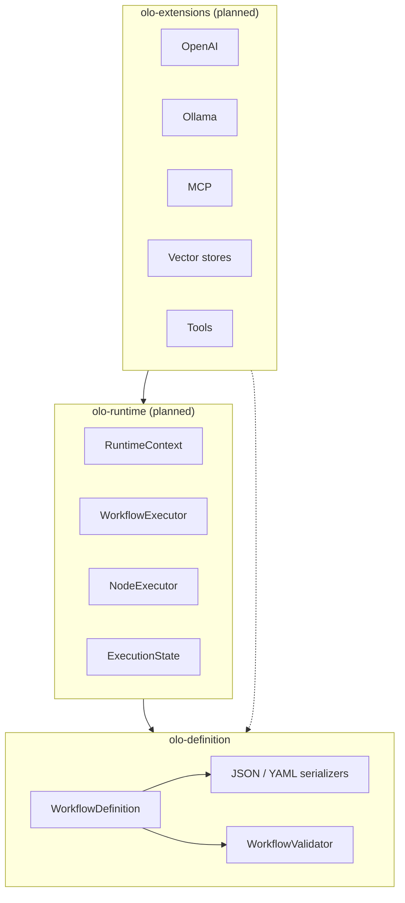
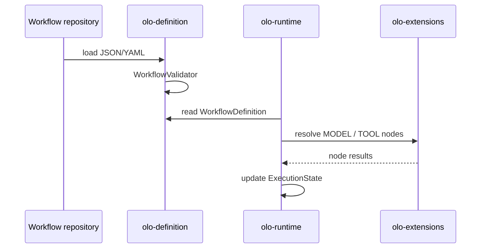

# OLO Architecture

This document describes the architecture of the **OLO** (AI orchestration) monorepo: how declarative workflow graphs are separated from execution, how modules depend on each other, and how workflows are built, serialized, validated, and extended.

## 1. Design goals

OLO treats an AI workflow as a **portable artifact**—similar to BPMN diagrams, Temporal workflow definitions, LangGraph state machines, or Kubernetes manifests:

| Goal | Approach |
|------|----------|
| Version in Git | JSON/YAML workflow files |
| No vendor lock-in at definition time | Pure POJOs, no Spring or provider SDKs in `olo-definition` |
| Safe composition | Structural validation before execution |
| Runtime flexibility | Multiple engines can execute the same definition |
| Dynamic evolution | Extend workflows at load time (`WorkflowBuilder.from`) |

**Core principle:** *definition* and *execution* are separate layers. Definitions never import runtime code.

## 2. Monorepo overview

```
olo-mono/
├── doc/                    # Architecture and design docs (this file)
├── olo-definition/         # Serializable workflow graphs (implemented)
├── olo-runtime/            # Execution engine (planned)
└── olo-extensions/         # Provider integrations (planned)
```



### Module responsibilities

| Module | Responsibility | Must not contain |
|--------|----------------|------------------|
| **olo-definition** | POJOs, builders, JSON/YAML, structural validation | Execution, model API calls, runtime state, Spring |
| **olo-runtime** | Execute graphs, manage state, invoke node handlers | Provider-specific SDKs (delegated to extensions) |
| **olo-extensions** | OpenAI, Ollama, Temporal, Kafka, MCP, vector DBs, tools | Core graph model (uses definition types only) |

### Dependency rules

```
olo-definition  ←  olo-runtime  ←  olo-extensions
     ↑                ↑
     │                └── may also read definitions directly for config
     └── NEVER imports olo-runtime or olo-extensions
```

Violating this direction creates circular dependencies and couples stored workflows to a single engine.

## 3. The workflow as root artifact

Everything is rooted in **`WorkflowDefinition`**: the single aggregate that can be stored, diffed, and executed.

```
WorkflowDefinition
├── id, name, version
├── nodes[]          → NodeDefinition
├── edges[]          → EdgeDefinition
├── variables[]      → VariableDefinition
├── modelProviders[] → ModelProviderDefinition
├── modelRouting[]   → ModelRoutingDefinition
├── extensions[]     → ExtensionDefinition
└── metadata         → Map<String, Object>
```

Workflows are **immutable value objects** after `build()`. Lists and maps exposed from getters are unmodifiable copies.

## 4. Graph model

### 4.1 Nodes — generic, extensible

Nodes are **not** modeled as one Java class per node kind. A single `NodeDefinition` carries:

| Field | Purpose |
|-------|---------|
| `id` | Unique within the workflow |
| `type` | Logical kind (`MODEL`, `TOOL`, `INPUT`, …) |
| `subtype` | Optional refinement (`CHAT`, `EMBEDDING`, …) |
| `version` | Node definition version (for upgrades, A/B, migrations) |
| `routers` | Optional list of `NodeRouterDefinition` (ports, targets, match rules) |
| `configuration` | Arbitrary JSON-serializable map |

This matches how orchestration platforms evolve: new node kinds appear without changing the definition JAR.

**Well-known types** (`NodeType` enum) include `INPUT`, `OUTPUT`, `MODEL`, `VECTOR_SEARCH`, `TOOL`, `CONDITION`, `PARALLEL`, `SUBWORKFLOW`, and others. The enum documents conventions; `type` remains a **string** so custom types are valid.

Example definitions:

```json
{ "id": "llm1", "type": "MODEL", "subtype": "CHAT", "version": "1.0.0" }
{ "id": "vec1", "type": "VECTOR_SEARCH" }
{ "id": "router", "type": "CONDITION", "version": "1.0.0", "routers": [
    { "id": "to-support", "targetPort": "true", "targetNodeId": "support-agent", "match": { "intent": "support" } }
  ]}
{ "id": "input", "type": "INPUT" }
{ "id": "output", "type": "OUTPUT" }
```

`NodeRouterDefinition` fields: `id`, `name`, `targetPort`, `targetNodeId`, `providerId`, `match`, `configuration`.

Input and output are **graph nodes**, not plugins—keeping the model a plain directed graph.

### 4.2 Edges — port-aware connections

```text
EdgeDefinition
├── sourceNodeId, sourcePort (optional)
└── targetNodeId, targetPort (optional)
```

Ports allow multi-output nodes (e.g. condition branches) without special-case types in the definition layer.

### 4.3 Variables, models, extensions

| Type | Role |
|------|------|
| `VariableDefinition` | Named workflow inputs, defaults, required flags |
| `ModelProviderDefinition` | Declarative LLM provider (`id`, `provider`, `model`, `configuration`) |
| `ModelRoutingDefinition` | Rules to select a provider by context |
| `ExtensionDefinition` | External capabilities (MCP server, vector store, tool registry) |

Runtime resolves these references; the definition layer only stores **what** is wired, not **how** calls are made.

## 5. Building workflows

Two complementary APIs exist in `olo-definition`:

### 5.1 Fluent builder (`WorkflowBuilder`)

High-level API for programmatic construction and **dynamic extension**:

```java
WorkflowDefinition workflow = WorkflowBuilder.create("Stock Workflow")
    .id("stock-analysis")
    .inputNode("request")
    .modelNode("analysis", "CHAT")
    .toolNode("screener")
    .outputNode("response")
    .connect("request", "analysis")
    .connect("analysis", "screener")
    .connect("screener", "response")
    .build();
```

**Extension (branching workflows):**

```java
WorkflowDefinition enhanced = WorkflowBuilder.from(baseWorkflow)
    .addNode(ragNode)
    .connect("input", "rag1")
    .connect("rag1", "llm1")
    .build();
```

Think of `from()` as *git branch for workflows*: load a base definition, add nodes/edges, produce a new immutable artifact.

### 5.2 Low-level builder (`WorkflowDefinition.builder()`)

For deserialization-aligned construction or fine-grained control:

```java
WorkflowDefinition workflow = WorkflowDefinition.builder()
    .id("stock-analysis")
    .name("StockAnalysis")
    .addNode(...)
    .addEdge(...)
    .build();
```

## 6. Serialization

| Format | Class | Library |
|--------|-------|---------|
| JSON | `JsonWorkflowSerializer` | Jackson |
| YAML | `YamlWorkflowSerializer` | Jackson YAML |

Shared configuration lives in `JacksonWorkflowMapper`:

- `NON_NULL` on output
- `FAIL_ON_UNKNOWN_PROPERTIES` disabled (forward-compatible schema evolution)
- JSR-310 time types supported for metadata

Workflows round-trip through POJO builders (`@JsonDeserialize` / `@JsonPOJOBuilder`) so the same types are used for API, files, and builders.

**Example JSON:**

```json
{
  "id": "stock-analysis",
  "name": "Stock Workflow",
  "nodes": [
    { "id": "llm1", "type": "MODEL", "subtype": "CHAT" }
  ],
  "edges": []
}
```

**Example YAML:**

```yaml
id: stock-analysis
name: Stock Workflow
nodes:
  - id: input
    type: INPUT
edges: []
```

## 7. Validation

`WorkflowValidator` performs **structural** checks only—no execution, no reachability analysis, no model connectivity:

- Workflow `id` present
- Unique node, variable, provider, and extension IDs
- Every edge references existing nodes
- No self-loops on edges
- Model routing default provider references a declared provider (when providers exist)

Failures return `ValidationResult`; `validateOrThrow` raises `WorkflowValidationException`.

Runtime engines may add further checks (e.g. exactly one INPUT, acyclic graph, subscribed topics).

## 8. Package layout (`olo-definition`)

```
io.olo.definition
├── workflow/       WorkflowDefinition, WorkflowBuilder
├── node/           NodeDefinition, NodeRouterDefinition, NodeType
├── edge/           EdgeDefinition
├── variable/       VariableDefinition
├── model/          ModelProviderDefinition, ModelRoutingDefinition
├── extension/      ExtensionDefinition
├── serializer/     WorkflowSerializer, Json/Yaml implementations
└── validation/     WorkflowValidator, ValidationResult
```

## 9. Planned: `olo-runtime`

Execution module (not yet in the repo). Intended surface:

| Component | Responsibility |
|-----------|----------------|
| `RuntimeContext` | Execution-scoped configuration, provider registry, tracing |
| `WorkflowExecutor` | Walk the graph, schedule nodes, handle completion |
| `NodeExecutor` | Strategy per `NodeDefinition.type` |
| `ExecutionState` | Mutable run state (inputs, outputs, checkpoints) |
| `ExecutionResult` | Final payload and status |



`olo-runtime` depends on `olo-definition` only for graph shape and configuration—not for serialization, unless the runtime also loads files directly.

## 10. Planned: `olo-extensions`

Provider and infrastructure adapters:

- OpenAI, Ollama, other LLM backends
- Temporal, Kafka (durable orchestration / events)
- MCP, vector stores, tool implementations

Extensions implement runtime contracts (e.g. `NodeExecutor` for `type=MODEL`) and read `configuration` / `ExtensionDefinition` maps from the workflow. They must not redefine graph types.

## 11. Comparison to similar systems

| System | Declarative layer | Runtime layer |
|--------|-------------------|---------------|
| **OLO** | `olo-definition` (JSON/YAML POJOs) | `olo-runtime` + `olo-extensions` |
| BPMN | `.bpmn` XML | Process engine (Camunda, etc.) |
| Temporal | Workflow code / DSL | Temporal worker |
| LangGraph | Graph spec / code | Python runtime |
| Kubernetes | Manifests | kubelet + controllers |

OLO follows the same split: **artifacts you store and review** vs **engines that mutate state and call APIs**.

## 12. Non-goals (definition module)

The following are explicitly **out of scope** for `olo-definition`:

- Invoking LLMs or tools
- Thread pools, async execution, retries
- Spring, CDI, or DI frameworks
- Persistence (database, S3)—callers own storage
- Secret resolution (only declarative references in variables/config)

## 13. Evolution guidelines

1. **Prefer new `type` / `subtype` values** over new Java classes for node kinds.
2. **Use `metadata` and `configuration`** for experimental fields before promoting to first-class properties.
3. **Keep validators structural**; semantic validation belongs in runtime or extensions.
4. **Never add runtime dependencies** to `olo-definition`.
5. **Bump `version` on `WorkflowDefinition`** when making breaking graph changes in stored files.

## 14. Sample workflows

Ready-to-load examples live under [samples/](../samples/):

| Sample | Illustrates |
|--------|-------------|
| `minimal-echo` | INPUT → OUTPUT (JSON + YAML) |
| `stock-analysis` | MODEL, TOOL, variables, providers, extensions |
| `rag-chat` | VECTOR_SEARCH, model routing, embedding + chat |
| `analysis-with-rag-extension` | Base vs extended workflow (branching) |
| `condition-branch` | CONDITION node with named source ports |

Samples are validated in CI via `SampleWorkflowsTest` in `olo-definition`.

## 15. References

- Module README: [olo-definition/README.md](../olo-definition/README.md)
- Samples: [samples/README.md](../samples/README.md)
- Monorepo README: [README.md](../README.md)
- License: [LICENSE](../LICENSE) (Apache 2.0)
