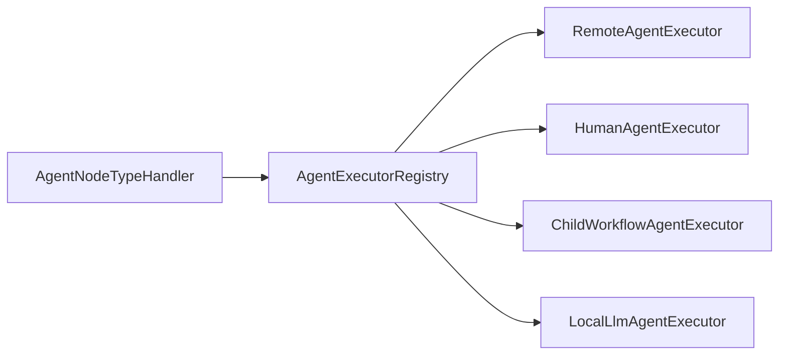
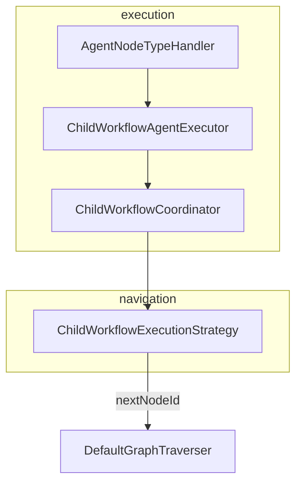

<!--
Copyright (c) 2026 Olo Labs
SPDX-License-Identifier: Apache-2.0
-->
# Orchestration Roadmap

**Target architecture** for agent execution backends, child workflows, and related traversal gaps. This document describes what is **planned** — not what the kernel implements today.

For the **current traversal contract**, see [traversal.md](./traversal.md).

Related:

- [parallelism-roadmap.md](./parallelism-roadmap.md) — fan-out/join, `JoinNode`, `BarrierNode`
- [runtime-roadmap.md](./runtime-roadmap.md) — `WorkflowStatus`, scope enforcement, `WAITING` checkpoints
- [runtime-model.md](./runtime-model.md) — normative lifecycle and variable scope model

---

## Vision

Open LLM Orchestrator (OLO) orchestration spans more than local LLM calls:

| Backend | Role |
|---------|------|
| **Agent** (local LLM) | Prompt + model on canvas `AGENT` node |
| **Tool** | SPI / olo-core tool nodes |
| **Workflow** | Nested or referenced child workflow |
| **Human** | Approval gate, `WAITING` until signal |
| **Remote service** | External agent or API |

`AgentNodeTypeHandler` delegates to **`AgentExecutor`** implementations. Only **`LocalLlmAgentExecutor`** is active today; other executors are registered stubs.

---

## Agent executor backends (target)

Registry order (specific first, fallback last):

| Executor | `id` | Target | Today |
|----------|------|--------|-------|
| `RemoteAgentExecutor` | `remote` | HTTP / external agent service | Stub (`supports` false) |
| `HumanAgentExecutor` | `human` | HUMAN gate, `WAITING` + resume | Stub |
| `ChildWorkflowAgentExecutor` | `child-workflow` | Delegates to `ChildWorkflowCoordinator` | Stub (`DISPATCH_ENABLED = false`) |
| `LocalLlmAgentExecutor` | `local-llm` | Workflow prompt + model | **Implemented** |

Tool, Workflow, and Human **canvas node types** remain separate handlers (`SpiNodeTypeHandler` or future dedicated handlers). `AgentExecutor` covers **how an AGENT node runs**, not the full orchestration catalog.

### Suggested phases

| Phase | Deliverable |
|-------|-------------|
| **O0** (now) | `LocalLlmAgentExecutor`, `AgentNodeTypeHandler`, registry |
| **O1** | `ChildWorkflowCoordinator` + enable `ChildWorkflowAgentExecutor` |
| **O2** | `HumanAgentExecutor` + sync/async `WAITING` traversal |
| **O3** | `RemoteAgentExecutor` |
| **O4** | Dedicated handlers for non-AGENT orchestration types where SPI is insufficient |

---

## Child workflow coordination

Child workflows touch **execution** (dispatch), **suspension** (`WAITING`), **resume** (signal / child complete), **output merge** (AGENT scope → parent `ExecutionOutputs`), and **navigation** (successor edge). These must not be split across `ChildWorkflowAgentExecutor` and `ChildWorkflowExecutionStrategy`.

### Target ownership

| Concern | Owner |
|---------|--------|
| Dispatch child run | `ChildWorkflowCoordinator` |
| Parent `WAITING` while child runs | `ChildWorkflowCoordinator` |
| Resume on child completion | `ChildWorkflowCoordinator` |
| Merge child outputs into parent | `ChildWorkflowCoordinator` |
| Next node after child step settles | `ChildWorkflowCoordinator.nextNodeId` |
| Select child-workflow navigation path | `ChildWorkflowExecutionStrategy` (thin) |
| Invoke coordinator for AGENT nodes | `ChildWorkflowAgentExecutor` |

`ChildWorkflowExecutionStrategy` **only** decides that this step uses the coordinator for navigation. `ChildWorkflowAgentExecutor` routes AGENT execution to the same coordinator.

Interface (stub today): `org.olo.kernel.childworkflow.ChildWorkflowCoordinator`.

### Canvas metadata

AGENT nodes may declare `execution.executionModel: CHILD_WORKFLOW` with `workflowRef`. Until the coordinator is wired, presets with this metadata still resolve to **`LocalLlmAgentExecutor`** because `ChildWorkflowAgentExecutor.DISPATCH_ENABLED = false`.

### AGENT scope fork/merge

On child `COMPLETED`, merge declared `outputMapping` into parent `WORKFLOW` / `ExecutionOutputs`. See [runtime-model.md](./runtime-model.md#variable-scope-architecture) and [runtime-roadmap.md](./runtime-roadmap.md).

---

## Traversal gaps (non-parallel)

Items moved from traversal docs — **not implemented** in the synchronous kernel traverser:

| Area | Current state | Target |
|------|---------------|--------|
| Child workflows | `workflowRef` / `CHILD_WORKFLOW` not dispatched | `ChildWorkflowCoordinator` |
| AGENT backends | Local prompt + default model routing only | Full executor registry |
| Conditional match rules | Port/router selection only | Full expression evaluation |
| Model routing rules | Only `defaultProviderId` | Honor routing `rules[]` |
| `Routing.configVersion` | Ignored | Version-aware resolution |
| Injectable traverser | `KernelEntryPoint` uses static `withDefaults()` | Factory injection for tests / custom clients |
| Multi-AGENT return | `metadata.returnOutputKey`; outputs per slot | Documented in [runtime-model.md](./runtime-model.md) — **implemented** |

---

## Diagnostics note

If traversal logs contain `"child workflow dispatch pending"`, the olo-core `AgentNode` stub ran instead of `AgentNodeTypeHandler`. That should not occur once **O1** lands.

---

## Summary

| Concept | Today | Target |
|---------|-------|--------|
| AGENT execution | `LocalLlmAgentExecutor` | Registry of backends |
| Child workflow | Linear edge fallback; no dispatch | `ChildWorkflowCoordinator` |
| Human / remote | Not active | Dedicated executors |
| Navigation after child | `ChildWorkflowExecutionStrategy` → first edge | Coordinator `nextNodeId` |

Define presets and Studio graphs against this roadmap so orchestration types do not diverge as implementation catches up.
