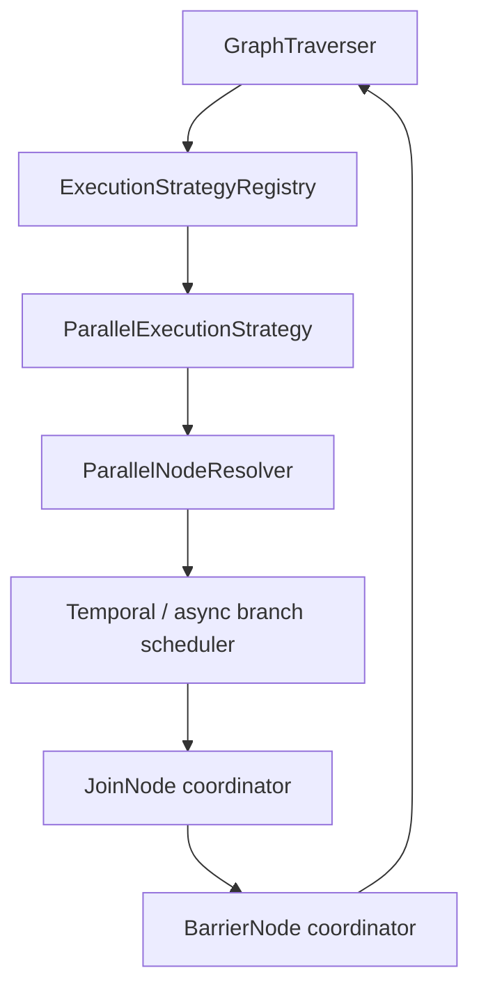

<!--
Copyright (c) 2026 Olo Labs
SPDX-License-Identifier: Apache-2.0
-->
# Parallelism Roadmap

Normative **target contract** for parallel multi-agent orchestration in OLO. Nothing in this document is required to be fully implemented yet; it exists so graph design, catalog types, kernel traversal, and Temporal scheduling do not diverge.

Related:

- [traversal.md](./traversal.md) — **current** `ExecutionStrategy` implementation contract
- [orchestration-roadmap.md](./orchestration-roadmap.md) — agent backends, child workflows
- [runtime-model.md](./runtime-model.md) — workflow status (`WAITING` at barriers) and `ExecutionOutputs`
- [runtime-roadmap.md](./runtime-roadmap.md) — `WorkflowStatus` enum, scope enforcement

---

## Vision

Multi-agent pipelines are not linear chains. A typical target graph:

```text
Planner
   ↓
 PARALLEL  (fork)
 ┌─┴─┐
 A   B
 ↓   ↓
 C   D
 └─┬─┘
 JOIN / BARRIER
   ↓
Reviewer
   ↓
 END
```

Requirements:

- **Fan-out** — one planner dispatches independent agent branches.
- **Concurrency** — branches A/B (and nested C/D) may run at the same time.
- **Join** — downstream steps (Reviewer) start only when join policy is satisfied.
- **Isolation** — branch failures or partial outputs must not corrupt sibling `ExecutionOutputs`.
- **Observability** — UI events per branch; workflow status reflects `RUNNING` until join completes.

---

## Current contract (today)

| Capability | Status | Implementation |
|------------|--------|----------------|
| Single successor navigation | **Implemented** | `LinearExecutionStrategy` |
| One node executed at a time | **Implemented** | `DefaultGraphTraverser` main loop |
| `PARALLEL` node detection | **Partial** | `ParallelExecutionStrategy` → `PARALLEL_FORK` decision |
| Branch execution | **Sequential only** | `walkBranchUntilJoin` runs A then B, not concurrent |
| Join node resolution | **Heuristic** | `GraphEdgeNavigator.findCommonJoinNode` (closest common reachable node) |
| Catalog `join.strategy` | **Validated, not enforced** | `JoinStrategy.ALL`, `ANY`, `FIRST_SUCCESS`, `QUORUM` on `PARALLEL` nodes |
| Nested forks | **Rejected** | `KernelException` if a branch hits another `PARALLEL_FORK` |
| Temporal async fan-out | **Not started** | Single kernel activity / sync traverser |

`SingleEdgeNextNodeResolver` is **deprecated**; linear navigation lives in `LinearExecutionStrategy`. The effective guarantee today is still **one active graph step at a time** in the synchronous traverser.

---

## Target parallelism contract

### Layering



| Layer | Responsibility |
|-------|----------------|
| `ExecutionStrategy` | Decide *what kind* of move comes next (`LINEAR`, `PARALLEL_FORK`, …) |
| `ParallelNodeResolver` | Expand a `PARALLEL` node into a **branch set** + **join target** |
| Branch scheduler | Run branch subgraphs concurrently (Temporal child workflows / activities) |
| `JoinNode` | Apply `JoinDefinition.strategy` when branches report completion |
| `BarrierNode` | Optional explicit sync canvas node after join (human review, merge policy) |

---

## Planned components

### `ParallelNodeResolver`

**Replaces** ad-hoc edge walking inside `ParallelExecutionStrategy` for fork planning.

```java
public interface ParallelNodeResolver {
    ParallelForkPlan resolve(GraphIndex index, NodeDefinition parallelNode);
}

public record ParallelForkPlan(
    String parallelNodeId,
    List<ParallelBranch> branches,
    String joinNodeId,
    JoinDefinition join) {}

public record ParallelBranch(
    String branchId,          // stable id for events + outputs
    String entryNodeId,
    List<String> exitNodeIds // usually the join node
) {}
```

Responsibilities:

- Read all outgoing edges from `PARALLEL` as branch entries (supports A, B, …, N).
- Resolve **join node id** from graph structure (not only BFS heuristic) — ideally explicit edge to `JOIN` / `BARRIER` canvas node.
- Attach catalog `join` (`JoinStrategy`, `quorumCount`) to the plan.
- Support **nested parallelism** (C/D under A/B) as a tree of `ParallelForkPlan`, not a flat special case.

**Status:** Not implemented. Today `GraphEdgeNavigator.allTargets` + `findCommonJoinNode` are inline substitutes.

---

### `JoinNode`

A **runtime coordinator** (not necessarily a new `NodeType`, but may map to one) that:

1. Tracks branch completion tokens (`branchId`, `NodeStatus`, `ExecutionOutput`).
2. Evaluates `JoinDefinition.strategy`:

| `JoinStrategy` | Continue when |
|--------------|---------------|
| `ALL` | Every branch completed successfully |
| `ANY` | At least one branch completed |
| `FIRST_SUCCESS` | First branch with `COMPLETED` (cancel or ignore stragglers per policy) |
| `QUORUM` | `quorumCount` branches completed |

3. On satisfy → promote workflow from `RUNNING` to next linear step (or `WAITING` if join feeds a `HUMAN` node).
4. On unrecoverable branch failure → workflow `FAILED` or partial merge per `onFailure` route.

Canvas options (to be decided in catalog):

- **Implicit join** — reviewer node with multiple incoming edges (today’s heuristic).
- **Explicit `JOIN` node type** — unambiguous merge point; preferred for Studio layout and validation.

**Status:** Join semantics exist in `olo-definition` (`JoinDefinition`); kernel does not evaluate strategy — it only walks branches sequentially until a common node id.

---

### `BarrierNode`

An optional **synchronization primitive** stricter than `JoinNode`:

- **Join** = “enough branches finished per strategy.”
- **Barrier** = “all branches reached this exact node *and* optional merge/side-effect ran.”

Use cases:

- Merge branch `ExecutionOutputs` into a single structured object before Reviewer.
- Apply a deterministic **reduce** (concat, vote, best-of-N) across branch outputs.
- Hold workflow in `WAITING` until an operator acknowledges merged state.
- Act as Temporal **signal boundary** (parent workflow blocks until all children signal).

Proposed canvas shape:

```text
PARALLEL → [branches] → BARRIER → Reviewer
```

`BarrierNode` handler responsibilities:

- Read `context.getOutputs()` for each `branchId` in the preceding fork.
- Write merged artifact to `outputs["merged"]` or a WORKFLOW variable.
- Emit a single SYSTEM event for UI (“all branches merged”).

**Status:** Not implemented. Documented here as the explicit merge step between raw parallel completion and downstream agents.

---

## Graph example (target metadata)

```json
{
  "id": "parallel-fanout",
  "type": "PARALLEL",
  "execution": {
    "join": {
      "strategy": "ALL",
      "quorumCount": null
    }
  }
},
{
  "id": "barrier-merge",
  "type": "BARRIER",
  "configuration": {
    "mergeStrategy": "COLLECT_OUTPUTS",
    "outputKey": "merged"
  }
}
```

Edges:

```text
planner → parallel-fanout
parallel-fanout → agent-a, agent-b
agent-a → task-c
agent-b → task-d
task-c → barrier-merge
task-d → barrier-merge
barrier-merge → reviewer → end
```

Return selection after parallel merge:

```json
"metadata": {
  "returnOutputKey": "reviewer"
}
```

---

## Execution decision evolution

Today:

```java
ExecutionDecision.parallelFork(strategyName, branchEntryNodeIds, joinNodeId)
```

Target:

```java
ExecutionDecision.parallelFork(ParallelForkPlan plan)
// branch scheduler runs plan.branches() concurrently
// JoinNode.await(plan.join(), plan.joinNodeId())
// optional BarrierNode.execute(plan.joinNodeId())
// resume LinearExecutionStrategy at reviewer
```

`DefaultGraphTraverser` should **not** embed branch-walking loops long term; it should delegate to a `ParallelExecutionCoordinator` that can swap sync vs Temporal backends.

---

## Temporal alignment

| Sync kernel (today) | Temporal (target) |
|---------------------|-------------------|
| `walkBranchUntilJoin` sequential | Child workflow per branch |
| Single activity timeout | Per-branch heartbeat + retry |
| `TraversalResult.failed` on branch error | Branch failure policy + join `ALL` vs `ANY` |
| No checkpoint | Workflow `WAITING` at barrier until signals |

Parent workflow status:

```text
RUNNING (planner)
  → RUNNING (branches A,B,C,D in flight)
  → RUNNING or WAITING (barrier / join)
  → RUNNING (reviewer)
  → COMPLETED
```

---

## Implementation phases (suggested)

| Phase | Deliverable | Unlocks |
|-------|-------------|---------|
| **P0** (now) | `LinearExecutionStrategy`, `ExecutionOutputs`, docs | Single- and multi-agent *linear* graphs |
| **P1** | `ParallelNodeResolver` + explicit join node in catalog | Validated fork/join graphs in Studio |
| **P2** | `JoinNode` coordinator enforcing `JoinStrategy` | Correct ALL/ANY/QUORUM semantics (sync) |
| **P3** | Temporal parallel branch scheduler | True concurrent A/B/C/D |
| **P4** | `BarrierNode` + merge strategies | Reviewer sees one merged artifact |
| **P5** | Nested parallelism + cancellation | Deep agent trees |

---

## Non-goals (for initial parallel MVP)

- Dynamic branch count at runtime (fan-out from model output list) — future `ROUTER` + `PARALLEL` combo.
- Cross-workflow joins (join branches that are different queue workflows) — use `CHILD_WORKFLOW` + `BarrierNode` instead.
- Distributed barrier across machines without Temporal — kernel sync path remains single-process.

---

## Summary

| Concept | Today | Target |
|---------|-------|--------|
| Navigation | `LinearExecutionStrategy` (1 edge) | + `ParallelNodeResolver` (N edges) |
| Concurrency | None (sequential) | Temporal branch scheduler |
| Merge | Closest common node heuristic | `JoinNode` + optional `BarrierNode` |
| Join policy | Ignored | `JoinStrategy` from catalog |
| Outputs | `ExecutionOutputs` per branch slot | + barrier merge into `merged` / reviewer input |

Define graphs and presets against this roadmap so `Planner → [A,B] → [C,D] → Reviewer` remains valid as implementation catches up.

## Contributors and owners

Contributions are welcome. Start with [CONTRIBUTING.md](../../CONTRIBUTING.md), use the [contributor guide](../../docs/CONTRIBUTOR_GUIDE.md) to find the right module or scenario, route review through [OWNERS.md](../../OWNERS.md), and record meaningful module or scenario credit in [CREDITS.md](../../CREDITS.md).
