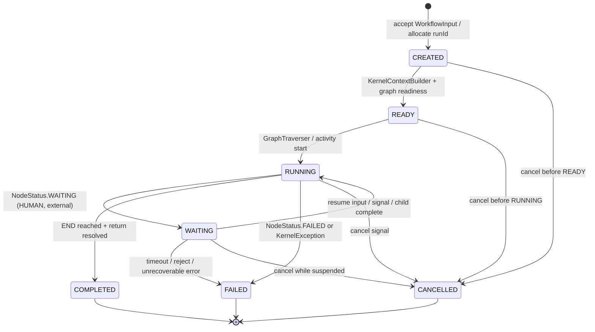
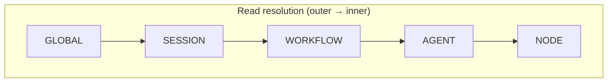

# Runtime Model

Normative model for **workflow execution status** and **variable scope** in OLO. This document defines target contracts before implementations diverge.

Related:

- [traversal.md](./traversal.md) — **current** graph traversal implementation contract
- [runtime-roadmap.md](./runtime-roadmap.md) — planned runtime gaps and phases
- [orchestration-roadmap.md](./orchestration-roadmap.md) — agent backends, child workflows
- [parallelism-roadmap.md](./parallelism-roadmap.md) — fan-out/join, `JoinNode`, `BarrierNode`
- [../README.md](../README.md) — kernel entry point and Temporal wiring

---

## Why two layers of state?

OLO has always had **node-level** outcomes (`NodeStatus`). As the platform adds human approval, child workflows, and long-running activities, callers also need a **workflow-level** lifecycle that spans many nodes, suspensions, and nested runs.

| Layer | Granularity | Examples |
|-------|-------------|----------|
| **Node status** | One graph step | MODEL completed, HUMAN waiting |
| **Workflow status** | One queue run / workflow execution | RUNNING, WAITING, COMPLETED |

Do not infer workflow status from a single node event without the transition rules below.

---

## Workflow state lifecycle

### States

| State | Meaning | Terminal? |
|-------|---------|-----------|
| `CREATED` | Run id allocated; payload accepted; not yet executing kernel logic | No |
| `READY` | Runtime context built; graph validated; callbacks may emit context-ready | No |
| `RUNNING` | Traversal or child activity in progress | No |
| `WAITING` | Execution suspended — human gate, external event, child workflow pause | No |
| `FAILED` | Unrecoverable error; return/admin fallback may still be sent | Yes |
| `COMPLETED` | Successful terminal state; return variable resolved | Yes |
| `CANCELLED` | User or operator cancelled before natural completion | Yes |

### Transition diagram



### Relationship to `NodeStatus`

Defined in `olo-spi` (`org.olo.spi.node.NodeStatus`):

| NodeStatus | Typical node types | Workflow transition |
|------------|-------------------|---------------------|
| `COMPLETED` | START, MODEL, AGENT, END, TOOL | Stay in `RUNNING` until graph completes; last END → `COMPLETED` |
| `WAITING` | HUMAN, external gate | `RUNNING` → `WAITING` |
| `FAILED` | Any | `RUNNING` or `WAITING` → `FAILED` |

**Rules:**

1. A single node `COMPLETED` does **not** mean the workflow is `COMPLETED`.
2. A node `WAITING` promotes the workflow to `WAITING` and records the suspending `nodeId`.
3. Synchronous kernel traversal today treats `WAITING` as a failed traversal (`TraversalResult.failed`); async/Temporal paths must persist `WAITING` and resume later.
4. `TraversalResult.completed == true` with a resolved return variable is the kernel’s signal for workflow `COMPLETED` on inline queue runs.

### Implementation today (mapping)

| Target state | Where it appears now | Notes |
|--------------|----------------------|-------|
| `CREATED` | `ChatRunStore.RunRecord` construction | `status` initially set on next row |
| `READY` | `UiCallbackReporter.reportContextReady` | CONTEXT_READY event (seq 1) |
| `RUNNING` | `ChatRunStore.status = "running"` | Default after run creation |
| `WAITING` | `deriveRunStatus` → `"waiting_human"` | When last event is HUMAN + `WAITING` |
| `COMPLETED` | `deriveRunStatus` → `"completed"` | SYSTEM + `COMPLETED` or kernel return |
| `FAILED` | `deriveRunStatus` → `"failed"` | Any event with `FAILED` |
| `CANCELLED` | *Not implemented* | Reserved |

**Gap:** `ChatRunStore` and `RunServiceImpl` use string statuses, not the enum above. Kernel code has no `WorkflowStatus` type yet — only `TraversalResult` and `NodeStatus`. See [runtime-roadmap.md](./runtime-roadmap.md).

---

## Variable scope architecture

### Target scopes

Runtime reads and writes flow through a **scope stack**. Inner scopes shadow outer names only when policy allows.

| Scope | Lifetime | Owner | Typical contents |
|-------|----------|-------|------------------|
| `GLOBAL` | Process / tenant | Platform config, credentials | API keys, default model registry |
| `SESSION` | Chat or user session | `olo` app / `WorkflowInput.context` | `sessionId`, `correlationId`, conversation metadata |
| `WORKFLOW` | Single queue execution | `KernelRuntimeContext` | `message`, `ReturnValue`, planner outputs |
| `AGENT` | Child workflow invocation | Child kernel context | Delegated sub-task state, isolated until merge |
| `NODE` | Single step | `ExecutionContext` (olo-core SPI) | Scratch I/O for one handler invocation |



**Write policy (normative):**

| Scope | Who may write | Persisted after step? |
|-------|---------------|------------------------|
| `GLOBAL` | Bootstrap / admin only | Yes |
| `SESSION` | Input layer, session service | Across runs in same session |
| `WORKFLOW` | Node handlers, output appliers | Entire workflow execution |
| `AGENT` | Child workflow only | Until merge into parent WORKFLOW |
| `NODE` | Current handler only | Discarded after step (copied per policy) |

### Catalog `VariableScope` mapping

Workflow JSON declares variables with `org.olo.definition.variable.VariableScope` (catalog). Map to runtime scopes:

| Catalog scope | Runtime scope | Semantics |
|---------------|---------------|-----------|
| `LOCAL` | `WORKFLOW` | Mutable for this execution |
| `READONLY_EXTERNAL` | `SESSION` + `WORKFLOW` (read) | Inbound from caller; nodes must not overwrite (e.g. `message`) |
| `EXTERNAL` | `SESSION` (write-back) | May be exported to caller/UI after run |
| `GLOBAL` | `GLOBAL` | Shared across workflows in tenant |
| `CREDENTIAL` | `GLOBAL` (secured) | Secrets; never logged or sent to UI events |

Example from `agent.json` preset:

```json
{
  "name": "message",
  "scope": "READONLY_EXTERNAL"
},
{
  "name": "ReturnValue",
  "scope": "LOCAL",
  "metadata": { "role": "return" }
}
```

| Variable | Catalog scope | Runtime scope | Set by |
|----------|---------------|---------------|--------|
| `message` | `READONLY_EXTERNAL` | SESSION → WORKFLOW bind | `MessageVariableInputBinder` at START |
| `ReturnValue` | `LOCAL` | WORKFLOW | `ReturnVariableNodeOutputApplier` after AGENT/MODEL |

`metadata.returnVariable` and `metadata.role = "return"` designate which WORKFLOW variable is the caller-facing result (`WorkflowReturnVariable`).

### Implementation today

| Target | Current code | Gap |
|--------|--------------|-----|
| `WORKFLOW` map | `WorkflowRuntimeVariables` — flat `Map<String,Object>` from graph definitions | No scope enforcement on `set()` |
| `SESSION` fields | `WorkflowInput` items + `Context` (sessionId, callback URL) | Not unified with variable map |
| `NODE` scratch | `DefaultExecutionContext` via SPI | `VariableScopeBridge.copyFromExecutionContext` merges into WORKFLOW wholesale |
| `AGENT` isolation | *Not implemented* | Child runs would share parent map today |
| `GLOBAL` | Bootstrap / tenant config | Not visible in kernel variable map |
| Catalog `scope` on `VariableDefinition` | Validated at load time | **Ignored at runtime** in kernel |

**Kernel entry today:**

```java
context.getVariables().set("message", inboundText);   // WORKFLOW (should respect READONLY_EXTERNAL)
context.getVariables().set("ReturnValue", llmText);   // WORKFLOW return slot
```

### Resolution algorithm (target)

When a prompt template or node reads `{variableName}`:

1. Resolve declaration on graph (`variables[]` or `inputs`).
2. Apply scope policy:
   - `READONLY_EXTERNAL`: read SESSION/WORKFLOW bind; reject node writes.
   - `LOCAL` / WORKFLOW: read/write WORKFLOW map.
   - `NODE`: handler local only.
3. For child `AGENT` / `WORKFLOW_REF`: fork `AGENT` scope; on child `COMPLETED`, merge declared `outputMapping` into parent WORKFLOW.
4. `ReturnValue` / return role: WORKFLOW only; exposed via `WorkflowReturnResolver` at workflow `COMPLETED`.

### Prompt and return variable binding

| Concern | Scope | Component |
|---------|-------|-----------|
| Inbound user text | SESSION → WORKFLOW | `MessageVariableInputBinder`, `WorkflowInputMessages` |
| Prompt `{message}` substitution | WORKFLOW | `WorkflowPromptRenderer` |
| LLM / node output | WORKFLOW (`ExecutionOutputs`) | `ExecutionOutputApplier` |
| Legacy return mirror | WORKFLOW (`ReturnValue`) | `ExecutionOutputApplier` (when configured) |
| Caller return string | WORKFLOW / outputs | `WorkflowReturnResolver` |
| UI callback body | SESSION + WORKFLOW | `UiCallbackReporter.reportWorkflowResult` |

---

## Execution outputs (multi-agent return model)

### Problem

A single `ReturnValue` workflow variable is unsafe for multi-agent graphs:

```text
Planner → Researcher → Reviewer → Writer
```

Each agent step used to overwrite `ReturnValue`, so the **Writer** destroyed earlier outputs.

### Model

`KernelRuntimeContext` carries two distinct stores:

| Store | API | Purpose |
|-------|-----|---------|
| Workflow variables | `context.getVariables()` | Declared graph state (`message`, parameters) |
| Execution outputs | `context.getOutputs()` | Named slot per node/agent output |

Example after traversal:

```java
context.getOutputMap()
// {
//   "planner"  -> ExecutionOutput(value="…plan…"),
//   "research" -> ExecutionOutput(value="…findings…"),
//   "review"   -> ExecutionOutput(value="…critique…"),
//   "writer"   -> ExecutionOutput(value="…final…")
// }
```

Each `ExecutionOutput` records `nodeId`, `nodeType`, `value`, `message`, and full `payload` from `NodeResult.output`.

### Output slot keys

| Source | Key |
|--------|-----|
| Default | `node.id` (e.g. `"agent"`, `"planner"`) |
| Alias | `node.configuration.outputKey` (e.g. `"research"`, `"final"`) |

### Return selection (`WorkflowReturnResolver`)

Resolution order:

1. `metadata.returnOutputKey` → `context.getOutputs().get(key)`
2. `metadata.returnVariable` → `context.getVariables()` (legacy)
3. Last output key in insertion order (multi-agent default when no metadata)
4. Resolved return variable / input fallback

Example workflow metadata for a writer-final pipeline:

```json
{
  "metadata": {
    "returnOutputKey": "writer",
    "returnVariable": "ReturnValue"
  }
}
```

`ReturnValue` is **mirrored** only when:

- `returnOutputKey` is **unset** (legacy single-agent: last producer wins), or
- the completing node's output slot **matches** `returnOutputKey`

### Components

| Class | Module | Role |
|-------|--------|------|
| `ExecutionOutput` | olo-kernel-context | One captured node result |
| `ExecutionOutputs` | olo-kernel-context | Ordered map of slots |
| `WorkflowReturnOutput` | olo-kernel-context | `returnOutputKey` + `outputKey` resolution |
| `ExecutionOutputApplier` | olo-kernel | Records outputs after each completed step |
| `WorkflowReturnResolver` | olo-kernel | Selects caller-facing message |

Planned deliverables and phases: [runtime-roadmap.md](./runtime-roadmap.md).

---

## Quick reference

### Workflow status vs traversal outcome

```
WorkflowInput received          → CREATED
KernelContextBuilder.build()    → READY
UiCallbackReporter context      → READY (observable)
GraphTraverser.traverse()       → RUNNING (implicit)
NodeResult.WAITING              → WAITING (target; sync kernel fails today)
TraversalResult.completed       → COMPLETED
TraversalResult.failed          → FAILED
```

### Variable scopes vs presets

```
GLOBAL        tenant secrets, defaults
SESSION       chat session, correlation, callback URL
WORKFLOW      message, ReturnValue, node outputs  ← kernel today
AGENT         child workflow state                ← not wired
NODE          per-step SPI scratch                ← partial via VariableScopeBridge
```
