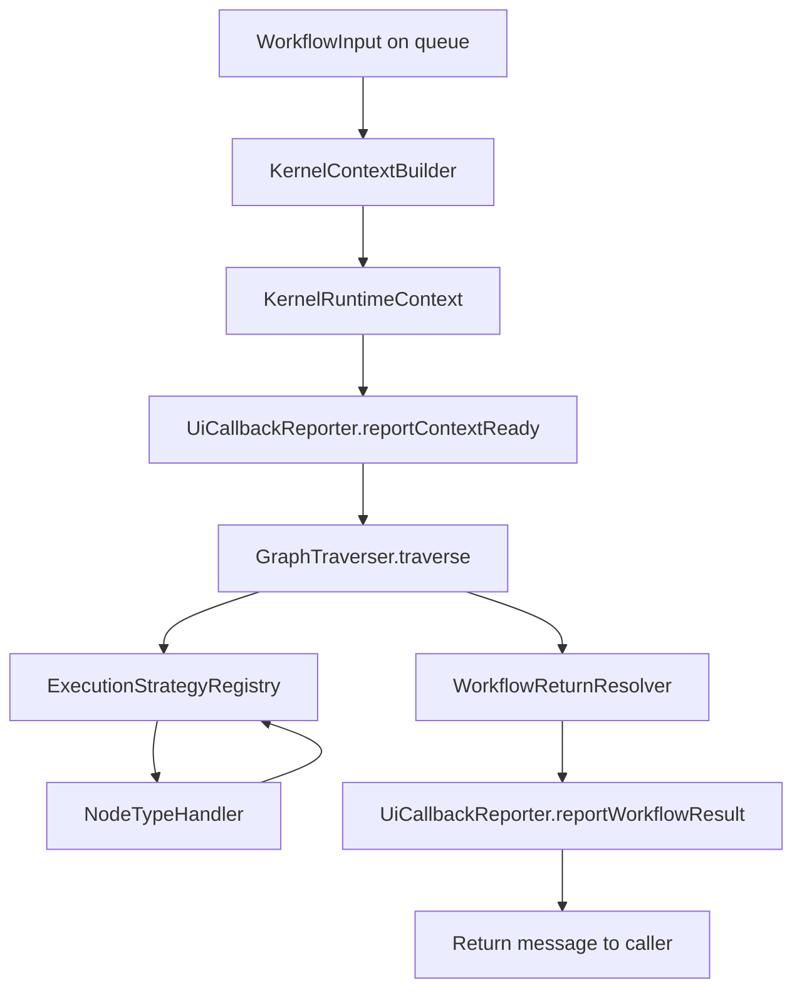
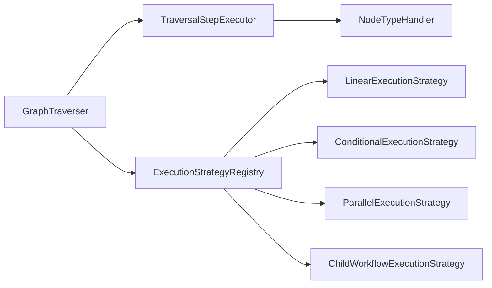
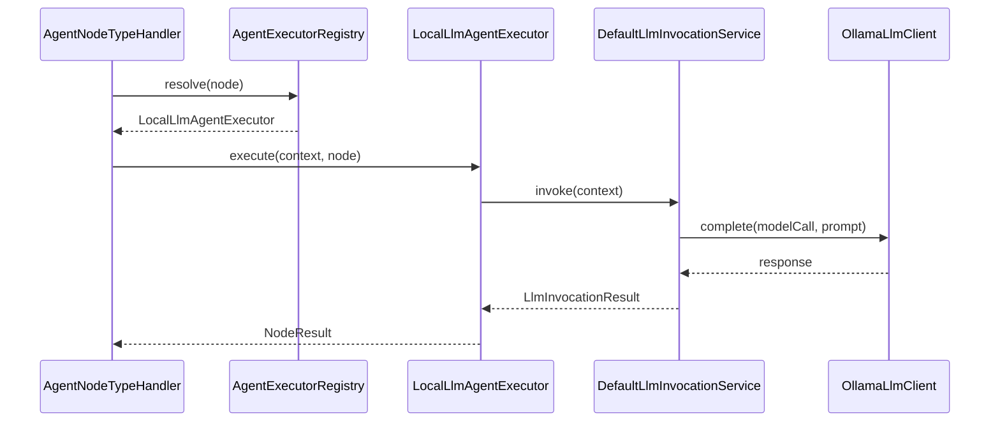

<!--
Copyright (c) 2026 Olo Labs
SPDX-License-Identifier: Apache-2.0
-->
# Graph Traversal — Implementation Contract

This document describes **what olo-kernel implements today** for graph traversal: queue input through node execution to the return variable, queue response, and UI callback.

For the broader kernel entry flow (Temporal, bootstrap, callbacks), see [../README.md](../README.md).

**Target architecture and planned work** (do not assume these are implemented):

| Document | Scope |
|----------|--------|
| [orchestration-roadmap.md](./orchestration-roadmap.md) | Agent backends, child workflows, `ChildWorkflowCoordinator` |
| [parallelism-roadmap.md](./parallelism-roadmap.md) | Fan-out/join, `JoinNode`, `BarrierNode`, concurrent branches |
| [runtime-roadmap.md](./runtime-roadmap.md) | `WorkflowStatus` enum, scope enforcement, `WAITING` resume |
| [runtime-model.md](./runtime-model.md) | Normative lifecycle and variable scope model |

---

## Overview

Traversal is the synchronous execution of a workflow canvas inside a `KernelRuntimeContext`. The kernel walks the graph from the **START** node along outgoing edges until there is no next node (typically after **END**).

Each step:

1. Resolves the current node from the graph index.
2. **Executes** the node via `TraversalStepExecutor` → `NodeTypeHandler` (what the node *does*).
3. Applies node output to workflow variables (notably the return variable).
4. **Orchestrates** next steps via `ExecutionStrategyRegistry` (where the graph walk goes next).

Execution and orchestration are intentionally separate so linear pipelines, conditional branches, parallel fan-out/join, and child-workflow resume can evolve independently.

Traversal runs inside `KernelEntryPoint.finish()` **after** context construction and **before** `WorkflowReturnResolver` and `UiCallbackReporter`.



---

## Entry point integration

`KernelEntryPoint` owns the default traverser:

```java
private static final GraphTraverser GRAPH_TRAVERSER = GraphTraverserFactory.withDefaults();
```

`finish()` sequence:

| Step | Component | Purpose |
|------|-----------|---------|
| 1 | `context.isGraphReady()` | Fail fast if graph failed readiness during context build |
| 2 | `TraversalDiagnostics.logContextReady` | Log queue, workflow id, input message, variables |
| 3 | `UiCallbackReporter.reportContextReady` | Notify UI that execution started |
| 4 | `GRAPH_TRAVERSER.traverse(context)` | Run START → … → END |
| 5 | `WorkflowReturnResolver.resolveDetails` | Read `metadata.returnVariable` / `ReturnValue` |
| 6 | `UiCallbackReporter.reportWorkflowResult` | Send final message to callback URL |
| 7 | Return `resolution.message()` | Temporal activity / queue caller result |

If traversal returns `completed == false`, `KernelEntryPoint` throws `KernelException` with the failing node id and message.

---

## Package layout

Traversal is split into small, replaceable packages under `org.olo.kernel`:

```
org.olo.kernel
├── graph/                    # Graph structure (index, start, visit, validate)
│   ├── index/                # GraphIndex — nodes and outgoing edges by id
│   ├── start/                # StartNodeResolver — find START node
│   ├── visit/                # GraphEdgeNavigator — shared edge helpers
│   └── validate/             # GraphReadinessValidator — pre-traversal checks
├── traversal/                # Walk loop and per-step execution
│   ├── impl/                 # DefaultGraphTraverser
│   ├── strategy/             # ExecutionStrategy — orchestration after each node
│   ├── step/                 # TraversalStepExecutor, NodeTypeHandler
│   ├── input/                # WorkflowInputBinder (START input)
│   ├── output/               # NodeOutputApplier (return variable)
│   ├── request/              # SPI NodeRequest factory
│   ├── context/              # olo-core ExecutionContext bridge
│   ├── spi/                  # Node type resolution for olo-core nodes
│   ├── factory/              # GraphTraverserFactory — wires defaults
│   └── log/                  # TraversalDiagnostics
├── agent/                    # Agent execution: prompt, model, client (local today; remote/child/human later)
└── input/                    # WorkflowReturnResolver (post-traversal)
```

Interfaces live in the parent package; default implementations live in `impl` subpackages.

---

## Graph layer

### GraphIndex (`DefaultGraphIndex`)

Built once per traversal from `context.getGraph()`:

- **Nodes** indexed by `node.id` (insertion order preserved).
- **Outgoing edges** grouped by `sourceNodeId`, sorted by target id for deterministic ordering.

API:

- `findNode(nodeId)` — lookup node definition.
- `outgoingEdges(nodeId)` — edges leaving the current node.
- `nodes()` — all nodes in the graph.

### StartNodeResolver (`TypeStartNodeResolver`)

Finds the first node whose `type` is `START`. Throws `KernelException` if none exists when traversal begins.

### GraphEdgeNavigator

Shared edge helpers used by execution strategies:

- `firstTarget` — first outgoing edge (stable sort by target id)
- `targetBySourcePort` — follow edge from a named output port
- `allTargets` — all parallel branch entry nodes
- `findCommonJoinNode` — closest node reachable from every branch

`SingleEdgeNextNodeResolver` is deprecated; prefer `LinearExecutionStrategy`.

### GraphReadinessValidator (`DefaultGraphReadinessValidator`)

Graph is ready when:

- At least one node exists, and
- A START node can be resolved.

This is also checked earlier via `context.isGraphReady()` during context build; traversal repeats the check against a fresh index.

---

## Traversal loop (`DefaultGraphTraverser`)

The traverser owns the walk loop but delegates **orchestration** to strategies and **execution** to handlers.



Pseudocode:

```
index = new DefaultGraphIndex(graph)
assert readinessValidator.isReady(index)
current = startNodeResolver.resolve(index)
step = 0
while current != null:
    step++
    node = index.findNode(current)
    log step enter
    result = stepExecutor.execute(context, node, step)   // NodeHandler
    if result.status in (FAILED, WAITING):
        return TraversalResult.failed(...)
    decision = executionStrategyRegistry.decide(context, index, node, result, step)
    log execution decision
    if decision.kind == PARALLEL_FORK:
        run each branch until join, then continue from join node
        return TraversalResult.completed(...)
    if decision.kind == END:
        current = null
    else:
        current = decision.nextNodeId
    log step exit
return TraversalResult.completed(lastNodeId, lastResult.message)
```

---

## Execution strategies (`org.olo.kernel.traversal.strategy`)

| Strategy | When selected | Decision |
|----------|---------------|----------|
| `ParallelExecutionStrategy` | Completed node type is `PARALLEL` | `PARALLEL_FORK` with branch targets + join node |
| `ConditionalExecutionStrategy` | `CONDITION` or `ROUTER` | Linear next via output port / router target |
| `ChildWorkflowExecutionStrategy` | `CHILD_WORKFLOW` on `AGENT` / `WORKFLOW_REF` | First outgoing edge (same as linear for single-successor graphs) |
| `LinearExecutionStrategy` | Fallback (always last in registry) | First outgoing edge or `END` |

Registry order in `GraphTraverserFactory` matters: specific strategies first, `LinearExecutionStrategy` last.

### LinearExecutionStrategy

Handles multi-step pipelines such as:

```text
START → PLANNER → TOOL → AGENT → REVIEWER → END
```

Each node executes via its handler; linear strategy follows the single successor edge.

### ConditionalExecutionStrategy

Reads `NodeResult.output` keys (`selectedPort`, `route`, `port`, `branch`) or declarative `routers[]` on the node, then resolves the matching outgoing edge.

### ParallelExecutionStrategy

After a `PARALLEL` node completes, fans out to all outgoing branch targets. Branches run sequentially until the closest common join node, then traversal resumes from the join node. Nested parallel forks are rejected.

### ChildWorkflowExecutionStrategy

Selected when `executionModel == CHILD_WORKFLOW` on `AGENT` or `WORKFLOW_REF`. **Current behavior:** returns the first outgoing edge via `GraphEdgeNavigator.firstTarget` (equivalent to linear navigation for single-successor graphs). Child workflow dispatch is not implemented — see [orchestration-roadmap.md](./orchestration-roadmap.md#child-workflow-coordination).

`TraversalResult` fields:

| Field | Meaning |
|-------|---------|
| `completed` | `true` if every step finished with `COMPLETED` |
| `lastNodeId` | Last visited node id |
| `lastStatus` | Final `NodeStatus` |
| `message` | Last node result message (may be null) |

---

## Runtime state and variables (summary)

Traversal documents **node execution** and **graph orchestration**. Two cross-cutting models live in [runtime-model.md](./runtime-model.md):

| Topic | Traversal doc | Runtime model doc |
|-------|---------------|-------------------|
| Step outcome | `NodeStatus` (`COMPLETED`, `WAITING`, `FAILED`) | — |
| Run lifecycle | `TraversalResult.completed` | `WorkflowStatus` (`CREATED` … `CANCELLED`) |
| `message` / `ReturnValue` | Input bind + output applier | Scope: `SESSION` → `WORKFLOW` |
| Catalog `variables[].scope` | Declared on graph; flat WORKFLOW map at runtime | See [runtime-model.md](./runtime-model.md) |

---

## Step execution (`DefaultTraversalStepExecutor`)

Each step is handler execution followed by output application:

```
result = handlerRegistry.resolve(node.type).execute(context, node)
TraversalDiagnostics.logNodeResult(...)
outputApplier.apply(context, node, result)
return result
```

### NodeTypeHandlerRegistry

Handlers are tried **in registration order**; the first handler whose `supports(nodeType)` is true wins.

Default order (from `GraphTraverserFactory`):

| Order | Handler | Node types |
|-------|---------|------------|
| 1 | `StartNodeTypeHandler` | `START` |
| 2 | `AgentNodeTypeHandler` | `AGENT` |
| 3 | `EndNodeTypeHandler` | `END` |
| 4 | `SpiNodeTypeHandler` | Any type registered in olo-core `ExecutionEngine` |

`AGENT` is handled by the kernel agent executor registry **before** the olo-core `AgentNode` stub can run.

---

## Node handlers in detail

### START — `StartNodeTypeHandler`

Delegates to `WorkflowInputBinder` (default: `MessageVariableInputBinder`).

**`MessageVariableInputBinder`:**

1. Extracts the primary user message from `WorkflowInput` via `WorkflowInputMessages.primaryMessage`.
2. If the message is blank → bind skipped (logged).
3. If the graph does not declare a `message` variable → bind skipped (logged).
4. Otherwise sets `context.variables["message"]` to the inbound text.

The START node returns `NodeResult.completed` with an empty output map.

### AGENT — `AgentNodeTypeHandler`

Delegates to **`AgentExecutorRegistry`**. For current presets, resolution selects **`LocalLlmAgentExecutor`** (`local-llm`). Additional executors are registered but inactive — see [orchestration-roadmap.md](./orchestration-roadmap.md).

**Implemented flow (`LocalLlmAgentExecutor`):**

1. `LlmInvocationService.invoke(context)`
2. Log via `TraversalDiagnostics.logLlmInvocation`
3. `NodeResult.completed` with `response`, `renderedPrompt`, `model`, `agentExecutor`

#### Agent package (`org.olo.kernel.agent`)

| Area | Types | Role |
|------|-------|------|
| `agent.executor` | `AgentExecutor`, `AgentExecutorRegistry` | Orchestration backends |
| `agent.executor.impl` | `LocalLlmAgentExecutor`, … | Per-backend execution |
| `agent.prompt` | `PromptRenderer` | Template render (local LLM) |
| `agent.model` | `ModelProviderResolver` | Model routing (local LLM) |
| `agent.client` | `LlmClient` | HTTP client (local LLM) |



**Prompt rendering (`WorkflowPromptRenderer`):**

- Reads `graph.defaultPromptId`.
- Finds matching entry in `graph.prompts`.
- Substitutes `{variableName}` placeholders using `variables.toMap()` (simple string replace; null values skipped).

Example from the `agent` preset:

```text
You are a research planner.

Investigate {message}.

Use available capabilities when needed.
Delegate work when another agent is more suitable.
```

**Model resolution (`WorkflowModelProviderResolver`):**

- Uses first `modelRouting` entry’s `defaultProviderId`.
- Looks up matching `modelProviders` entry.
- Reads `configuration.baseUrl` (default `http://localhost:51435`).
- Reads `parameters.temperature.defaultValue` (default `0.2`).

**HTTP client (`OllamaLlmClient`):**

- POST `{baseUrl}/api/chat`
- Body: Ollama chat format (`model`, `stream: false`, `messages`, `options.temperature`)
- Parses `message.content` from JSON response
- 5-minute request timeout; throws `KernelException` on HTTP or parse errors

Production wiring: `GraphTraverserFactory.withDefaults()` → `OllamaLlmClient`.

Tests: `GraphTraverserFactory.withLlmClient(new FakeLlmClient())`.

### END — `EndNodeTypeHandler`

No-op completion. Caller-facing output is expected in `context.getOutputs()` and/or the mirrored return variable from an earlier step (typically AGENT).

### SPI — `SpiNodeTypeHandler`

Fallback for node types implemented in **olo-core** via the SPI `ExecutionEngine`:

1. Build `ExecutionContext` via `KernelExecutionContextFactory`.
2. Build `NodeRequest` via `DefaultNodeRequestFactory`.
3. Resolve SPI type via `CoreNodeTypeResolver`.
4. `executionEngine.executeNode(request, executionContext)`.
5. Copy variables back from olo-core context via `VariableScopeBridge`.

Used for custom/tool nodes not covered by kernel built-in handlers.

---

## Output application (`ExecutionOutputApplier`)

After every successful step, the applier records an **`ExecutionOutput`** in `context.getOutputs()` under the node's output slot (`node.id` or `configuration.outputKey`). See [runtime-model.md — Execution outputs](./runtime-model.md#execution-outputs-multi-agent-return-model).

The legacy **return variable** (`ReturnValue`) is mirrored only when `metadata.returnOutputKey` matches this node or when `returnOutputKey` is unset (single-agent presets).

 Preconditions (all must pass):

1. `NodeResult.status == COMPLETED`
2. Inbound `message` variable is non-blank (ensures a real user query was bound at START)
3. Graph designates a return variable via `WorkflowReturnVariable.resolveName`

Write priority:

| Priority | Source | Action logged |
|----------|--------|---------------|
| 1 | `result.output["response"]` | `set-from-output.response` |
| 2 | `result.message()` | `set-from-result.message` |
| 3 | Return variable already set | `unchanged` |
| — | None of the above | skip |

Return variable resolution order (`WorkflowReturnVariable`):

1. `metadata.returnVariable` on the workflow (e.g. `"ReturnValue"`)
2. Exactly one variable with `metadata.role = "return"`
3. Legacy name `ReturnValue` if declared on the graph
4. `null` — applier skips; resolver falls back to input message

---

## Return resolution (`WorkflowReturnResolver`)

Runs **after** traversal completes. Produces `WorkflowReturnResolution`:

- `returnVariableName`
- `returnVariableValue` (raw object)
- `message` (string returned to caller and callback)
- `usedAdminFallback` — `true` when configured return variable is missing or blank

Resolution paths:

| Path | When | Result |
|------|------|--------|
| `metadata.returnVariable` | Key set on workflow metadata | Variable value required; blank → admin fallback message |
| `return-variable-value` | Resolved name, non-blank value | Use variable string |
| `populate-return-variable-from-input` | Variable declared but empty | Populate from input, may be missing-message fallback |
| `input-fallback-no-return-variable` | No return variable configured | Use `WorkflowInputMessages.workflowResult(input)` |
| `admin-fallback` | Configured variable missing/blank | `MISSING_MESSAGE_RESPONSE` constant |

The same `message` is passed to `UiCallbackReporter.reportWorkflowResult` and returned from `KernelEntryPoint.execute`.

---

## Workflow configuration reference

For the standard **agent** / **fast** presets (`olo-definition/olo-configuration/default/`):

### Canvas

```text
START ──► AGENT ──► END
```

### Required graph fields for LLM traversal

| Field | Example | Used by |
|-------|---------|---------|
| `variables[].name = "message"` | User input binding | START binder, prompt `{message}` |
| `variables[].name = "ReturnValue"` + `metadata.role: return` | Return slot | Output applier, resolver |
| `metadata.returnVariable` | `"ReturnValue"` | Output applier, resolver |
| `defaultPromptId` | `"default-prompt"` | Prompt renderer |
| `prompts[].promptTemplate` | `Investigate {message}.` | Prompt renderer |
| `modelRouting[].defaultProviderId` | `"model-provider"` | Model resolver |
| `modelProviders[]` | `local`, model, `baseUrl` | Model resolver, HTTP client |
| `parameters.temperature` | `0.2` | Model resolver |

### START node configuration

```json
"configuration": {
  "inputVariableMappings": ["message"]
}
```

Maps queue input into the `message` variable when the graph declares it.

## Diagnostics (`TraversalDiagnostics`)

Structured `INFO` / `WARN` / `ERROR` logs under logger `org.olo.kernel.traversal.log.TraversalDiagnostics`.

Key log prefixes for tracing a single request:

| Log prefix | When |
|------------|------|
| `Traversal context ready` | Before traversal |
| `Traversal start` | Node/edge counts, start node id |
| `Traversal step N enter` | Before handler |
| `Traversal step input bind` | START message binding |
| `Traversal step LLM invoke` | AGENT prompt, model, response |
| `Traversal step node result` | Handler result status/message/output |
| `Traversal step output apply` | Return variable write |
| `Traversal step N exit` | Next node id, variables snapshot |
| `Traversal complete` | Last node, `ReturnValue` snapshot |
| `Return resolve` | Final message selection |
| `Traversal failed` | FAILED or WAITING status |

Values longer than 200 characters are truncated in logs.

**Stub detection:** If a result still contains `"child workflow dispatch pending"`, a `WARN` is emitted — that indicates the olo-core `AgentNode` stub ran instead of `AgentNodeTypeHandler`.

---

## Factory and extension points

### Creating a traverser

```java
// Production — real Ollama HTTP client
GraphTraverser traverser = GraphTraverserFactory.withDefaults();

// Tests — inject fake LLM
GraphTraverser traverser = GraphTraverserFactory.withLlmClient(new FakeLlmClient());
```

### Swappable interfaces

| Interface | Default impl | Purpose |
|-----------|--------------|---------|
| `GraphTraverser` | `DefaultGraphTraverser` | Main loop |
| `StartNodeResolver` | `TypeStartNodeResolver` | Find START |
| `ExecutionStrategyRegistry` | Parallel → Conditional → ChildWorkflow → Linear | Post-node orchestration |
| `GraphReadinessValidator` | `DefaultGraphReadinessValidator` | Pre-flight |
| `TraversalStepExecutor` | `DefaultTraversalStepExecutor` | Handler + output |
| `NodeTypeHandler` | (list) | Per-type execution |
| `WorkflowInputBinder` | `MessageVariableInputBinder` | START input |
| `NodeOutputApplier` | `ExecutionOutputApplier` | Execution outputs + optional return mirror |
| `PromptRenderer` | `WorkflowPromptRenderer` | Template render |
| `ModelProviderResolver` | `WorkflowModelProviderResolver` | Provider routing |
| `LlmClient` | `OllamaLlmClient` | HTTP completion |

To add a new built-in node type: implement `NodeTypeHandler`, register it in `GraphTraverserFactory.build()` **before** `SpiNodeTypeHandler` if it should take precedence over olo-core.

To support new orchestration patterns: implement `ExecutionStrategy` and register it in `GraphTraverserFactory` before `LinearExecutionStrategy`.

---

## Testing

| Test class | Focus |
|------------|-------|
| `GraphTraverserTest` | Full preset traversal with `FakeLlmClient`; `ReturnValue` population |
| `ExecutionStrategyRegistryTest` | Linear chain + parallel fork decisions |
| `WorkflowPromptRendererTest` | `{variable}` template substitution |
| `WorkflowReturnResolverTest` | Post-traversal message resolution |
| `DefaultGraphIndexTest` | Index and edge ordering |
| `KernelEntryPointTest` | End-to-end entry (may hit real Ollama with `withDefaults`) |

Run kernel tests:

```bash
cd olo-mono/olo-kernel
./gradlew test
```

---

## Runtime requirements

When using `GraphTraverserFactory.withDefaults()`:

1. **Ollama-compatible API** reachable at the workflow’s `modelProviders[].configuration.baseUrl`.
2. **Model** named in `modelProviders[].model` must be available on that server.
3. **User message** must be present in `WorkflowInput` and bound to `message` at START for `ReturnValue` to be set.

If the LLM endpoint is down, traversal fails at the AGENT step with `KernelException` from `OllamaLlmClient`.

---

## Quick trace: one user message

Example queue `fast`, message `"quick question"`:

1. **Context build** — graph copy for queue, variables initialized (`message`, `ReturnValue`).
2. **START** — `message = "quick question"`.
3. **AGENT** — render prompt with `{message}` → call `http://localhost:51435/api/chat` → `response = "<llm text>"`.
4. **Output applier** — `ReturnValue = "<llm text>"`.
5. **END** — no change to `ReturnValue` (`unchanged` log).
6. **Resolver** — `message = ReturnValue`.
7. **Callback** — same string sent to `execution.callbackUrl` / context callback base URL.
8. **Caller** — `KernelEntryPoint.execute` returns that string.
