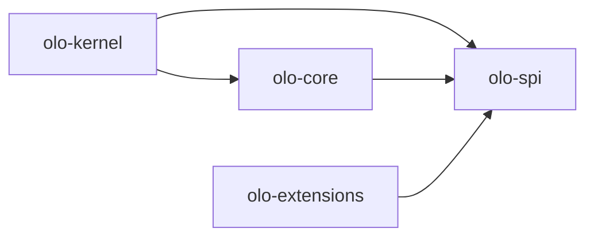

<!--
Copyright (c) 2026 Olo Labs
SPDX-License-Identifier: Apache-2.0
-->
# olo-spi architecture

## Purpose

`olo-spi` defines the **runtime boundary** between the workflow engine and pluggable executors. Workflow **shape** stays in `olo-definition`; **behavior** is supplied by classes implementing these interfaces.

## What belongs here

| In scope | Out of scope |
|----------|--------------|
| `Node`, `Tool`, `Hook` interfaces | Graph traversal |
| Request/response records | JSON/YAML parsing |
| `ExecutionContext` | Temporal worker bootstrap |
| Provider extension points | Concrete LLM or HTTP clients |
| Discovery annotations | Spring configuration |

## Contract map



### ExecutionContext

Shared mutable context for one workflow run:

- Identity: `workflowId`, `runId`, `queue`, optional `nodeId`, `correlationId`
- Variables: same conceptual model as `WorkflowRuntimeVariables` in `olo-kernel-context`, exposed for node/tool/hook code

### Node

Maps to `NodeDefinition` at runtime. `NodeRequest` carries port-mapped `input` and node `configuration`. `NodeResult` reports `COMPLETED`, `WAITING` (human approval), or `FAILED`.

### Tool

Maps to `ToolDefinition` / runtime binding `implementationId`. `ToolRequest` carries arguments and configuration. `ToolResult` reports `SUCCESS` or `FAILURE`.

### Hook

Maps to `HookActionDefinition.implementationId`. `HookRequest` includes `HookPhase` (`PRE`, `ON_ERROR`, `FINALLY`) and optional node outcome summary.

### Extension points

| Interface | Lookup key |
|-----------|------------|
| `NodeProvider` | `nodeType()` |
| `ToolProvider` | `toolId()` |
| `HookProvider` | `implementationId()` |

Runtime registries live in **`olo-core`** (`NodeRegistry`, `ToolRegistry`, `HookRegistry`). `olo-kernel` uses them via `ExecutionEngine` and traversal handlers.

### Annotations

Runtime-retained markers for discovery and documentation:

- `@NodeType` — on `Node` implementations
- `@ToolId` / `@ImplementationId` — on `Tool` and `Hook` implementations
- `@OloExtension` — general extension marker

Compile-time registration may later use `olo-annotation-processor`.

## Dependency rule

```
olo-definition  (declarative, serialization)
olo-spi         (runtime contracts)  ← no dependency on olo-definition
olo-core        → olo-spi  (default implementations + registries)
olo-kernel      → olo-spi, olo-core, olo-definition  (graph traversal)
olo-extensions  → olo-spi  (planned — additional providers)
```

Keeping `olo-spi` independent allows extension JARs to stay small and avoids pulling Jackson or graph POJOs into provider code that only needs execution contracts.
