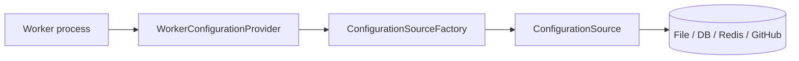

<!--
Copyright (c) 2026 Olo Labs
SPDX-License-Identifier: Apache-2.0
-->
# olo-worker-configuration Architecture

## 1. Core principle

**All worker runtime configuration routes through this module.**

Worker processes, `olo-runtime`, and worker-facing services must not read deployment settings from environment variables, Spring `application.properties`, or hard-coded constants. They call `WorkerConfigurationProvider` instead.

This isolates storage concerns: swap file → database → Redis → GitHub by changing `ConfigurationSource` implementations and bootstrap variables, not worker code.



## 2. Bootstrap vs runtime configuration

| Layer | Examples | Where it lives |
|-------|----------|----------------|
| **Bootstrap** | Which backend, file path | `OLO_WORKER_CONFIG_SOURCE`, `OLO_WORKER_CONFIG_PATH` |
| **Runtime** | Port, scan folder, Redis host, input limits | `WorkerConfiguration` document |

Bootstrap variables are read only in `ConfigurationSourceFactory`.

## 3. Entry points

| Type | Use |
|------|-----|
| `WorkerConfigurationProvider.load()` | Load on first call; cached thereafter |
| `WorkerConfigurationProvider.load(true)` | Refresh from storage at runtime |
| `WorkerConfigurationProvider.configurationBaseDirectory()` | Resolve relative `scanFolder` paths |
| `WorkerConfigurationProvider.configure(source)` | Tests / explicit bootstrap |

## 4. Configuration document

| Section | Type | Purpose |
|---------|------|---------|
| `id`, `name` | string | Worker identity |
| `server` | `ServerSettings` | Host, port |
| `workflowDefinitions` | `WorkflowDefinitionsSettings` | `scanFolder`, `recursive` |
| `temporal` | `TemporalSettings` | Namespace, gRPC target |
| `cache` | `CacheSettings` | Redis / cache connection |
| `input` | `InputSettings` | `maxLocalMessageSize` |
| `metadata` | map | Extension bucket |

Workflow **graphs** are not embedded here. They are loaded from `workflowDefinitions.scanFolder` via `olo-definition`.

## 5. Storage backends

| `ConfigurationSource` | Status |
|-----------------------|--------|
| `FileConfigurationSource` | Implemented |
| Database | Planned — implement `ConfigurationSource`, register in factory |
| Redis | Planned |
| GitHub | Planned |

## 6. Package layout

```
org.olo.worker.config
├── WorkerConfigurationProvider    ← workers start here
├── WorkerSettings                 ← typed accessors
├── bootstrap/                     ← bootstrap env var names only
├── model/                         ← configuration document POJOs
├── source/                        ← ConfigurationSource + factory
├── loader/                        ← load + validate
├── reader/                        ← JSON/YAML serde
├── serializer/
├── validation/
└── exception/
```

## 7. Dependency rule

```
olo-worker-configuration  ←  worker apps / olo-runtime
olo-definition            ←  (separate) workflow graphs from scanFolder
olo-workflow-input        ←  receives maxLocalMessageSize from worker via provider
```

`olo-workflow-input` may keep `MaxLocalMessageSize.fromEnvironment()` for standalone use, but **worker apps** must pass `WorkerSettings.maxLocalMessageSize()` to `WorkflowInputProducer.create(...)`.

## 8. Non-goals

- Deserializing `WorkflowDefinition` graphs (use `olo-definition` + `scanFolder`)
- Workflow execution
- Secret resolution
