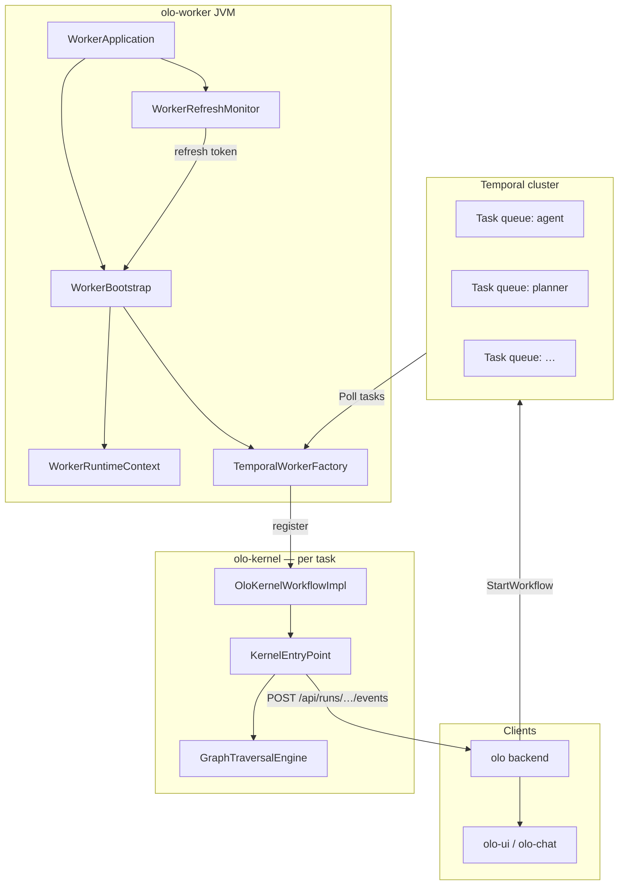
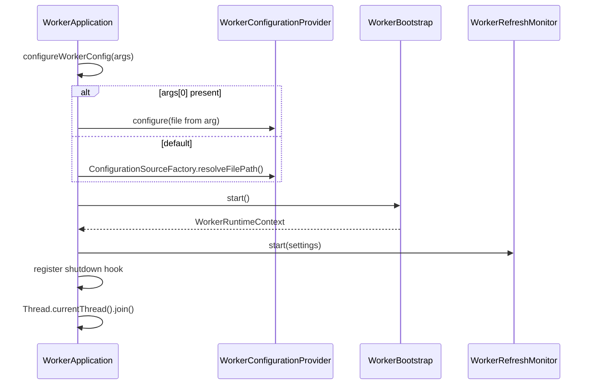
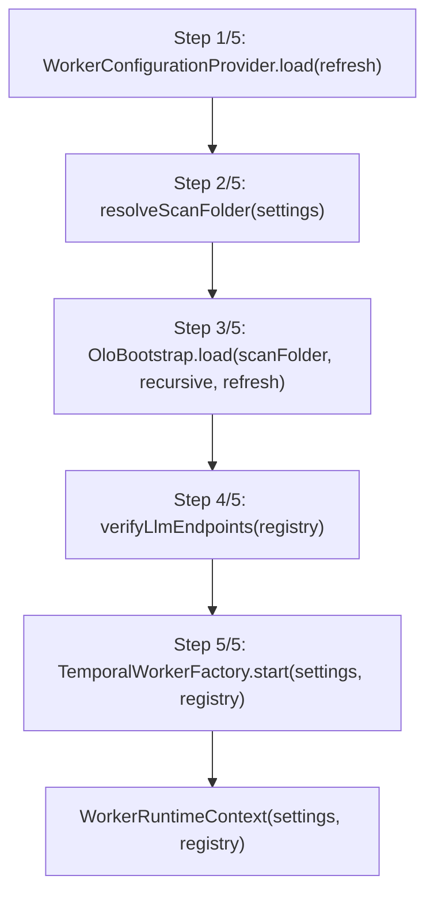
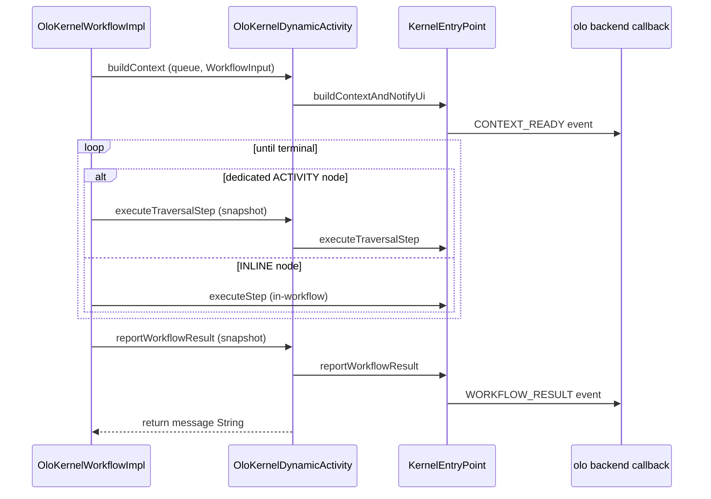

<!--
Copyright (c) 2026 Olo Labs
SPDX-License-Identifier: Apache-2.0
-->
# olo-worker Architecture

`olo-worker` is the **long-lived Temporal worker process** for the **Open LLM Orchestrator (OLO)**. It loads deployment settings and workflow definitions from disk, starts one Temporal poller per task queue, and delegates every workflow task to **olo-kernel** for graph execution, UI callbacks, and return-message resolution.

The worker itself is intentionally thin: it owns **process lifecycle**, **configuration bootstrap**, **definition indexing**, and **Temporal registration**. It does not traverse graphs, call LLMs, or deserialize chat payloads beyond what the kernel needs.

---

## 1. Role in the OLO stack

OLO separates three concerns that meet in this process:

| Concern | Artifact | Owned by |
|---------|----------|----------|
| **What** a workflow is | `WorkflowDefinition` JSON under `olo-configuration/` | `olo-definition` |
| **How** the worker is deployed | YAML/JSON worker config | `olo-worker-configuration` |
| **What** a single run carries | `WorkflowInput` (user message, routing, callback URL) | `olo-workflow-input` |



**Typical chat path**

1. User sends a message in olo-chat.
2. olo backend builds a `WorkflowInput`, picks the task queue from the selected workflow preset (e.g. `agent`), and starts a Temporal workflow on that queue.
3. `olo-worker` polls the queue, receives the task, and runs `OloKernelWorkflowImpl`.
4. The kernel builds runtime context, traverses the workflow graph, posts run events to the backend callback URL, and returns the final string message.
5. Temporal completes the workflow; the backend pushes the result to the UI (SSE/WebSocket).

See also [olo-mono/docs/ARCHITECTURE.md](../../docs/ARCHITECTURE.md) for the full monorepo layer model.

---

## 2. Module layout

`olo-worker` is a standalone Gradle application module (`org.olo:olo-worker:0.1.0-SNAPSHOT`).

```
olo-worker/
├── src/main/java/org/olo/worker/
│   ├── WorkerApplication.java       ← JVM entry point (main)
│   ├── WorkerBootstrap.java         ← 5-step bootstrap + cache
│   ├── WorkerBootstrapStep.java     ← failure messages for operators
│   ├── WorkerRuntimeContext.java    ← settings + registry snapshot
│   ├── WorkerRefreshMonitor.java    ← Redis poll → hot reload
│   └── temporal/
│       └── TemporalWorkerFactory.java  ← Temporal client + workers
├── src/test/java/…                  ← bootstrap tests (Temporal skipped)
├── docs/ARCHITECTURE.md             ← this document
├── build.gradle
├── settings.gradle                  ← composite builds for kernel stack
├── start.bat / stop.bat             ← Windows helpers
└── README.md                        ← runbook (quick start)
```

### Dependencies

| Dependency | Role in worker |
|------------|----------------|
| **olo-worker-configuration** | Load/cache `WorkerSettings` (Temporal target, scan folder, Redis, input limits) |
| **olo-bootstrap** | Scan `scanFolder` → `WorkflowDefinitionRegistry` |
| **olo-kernel** | `OloKernelWorkflow`, activities, `KernelEntryPoint`, graph traversal |
| **olo-definition** | Workflow graph types (transitive via bootstrap/kernel) |
| **temporal-sdk** | `WorkerFactory`, pollers, workflow/activity execution |
| **jedis** | Redis client for refresh monitor |
| **slf4j-simple** | Logging (runtime) |

### Gradle composite builds

`settings.gradle` uses `includeBuild` for modules that change frequently during kernel development:

- `olo-kernel-context`
- `olo-bootstrap`
- `olo-kernel`
- `olo-worker-configuration`

Shared libraries (`olo-definition`, `olo-workflow-input`, `olo-spi`, etc.) are consumed from **`olo-mono/build/repo`** after `publish-libs.bat` to avoid Windows JAR lock conflicts when the worker and olo backend build in parallel.

---

## 3. Process lifecycle

### 3.1 Startup (`WorkerApplication.main`)



1. **Resolve config file** — First CLI argument wins; otherwise bootstrap defaults (`OLO_WORKER_CONFIG_PATH`, monorepo sample fallback).
2. **Bootstrap** — `WorkerBootstrap.start()` (see §4).
3. **Refresh monitor** — Background Redis polling when `cache.enabled: true`.
4. **Block** — Main thread joins until interrupt; Temporal pollers run on SDK thread pools.
5. **Shutdown hook** — Stops monitor, shuts down Temporal factory, clears caches.

On fatal bootstrap errors the process logs the failing step and exits with code `1`.

### 3.2 Shutdown (`WorkerBootstrap.shutdown`)

Shutdown is cooperative and idempotent (used by tests and the JVM hook):

1. Stop `WorkerRefreshMonitor` daemon thread.
2. `WorkerFactory.shutdown()` — drain in-flight Temporal tasks.
3. Clear `WorkerRuntimeContext`.
4. Reset `WorkerConfigurationProvider` and `OloBootstrap` caches.

---

## 4. Bootstrap sequence

`WorkerBootstrap.start(boolean refresh)` is the core orchestration API. It is **synchronized** and **cached**: repeated `start()` calls return the same `WorkerRuntimeContext` unless `refresh=true`.



| Step | Class | Output | Failure hint (`WorkerBootstrapStep`) |
|------|-------|--------|-------------------------------------|
| 1 | `WorkerConfigurationProvider` | `WorkerSettings` | Check `OLO_WORKER_CONFIG_PATH` or pass config as first arg |
| 2 | `WorkerSettings.resolvedWorkflowDefinitionsScanFolder` | Absolute `Path` to workflow JSON | `scanFolder` must exist on disk |
| 3 | `OloBootstrap` | `WorkflowDefinitionRegistry` | Valid JSON/YAML, unique ids/queues |
| 4 | `WorkerLlmHealthCheck` | Verified model endpoints | Check LLM provider URLs in workflow presets |
| 5 | `TemporalWorkerFactory` | Running `WorkerFactory` | Temporal reachable at configured target |

After step 3, bootstrap logs each loaded workflow with **node activity names** (`id:label` format from `NodeActivityNaming`) — useful when verifying Temporal activity registration.

### Skipping Temporal in tests

Set system property `-Dolo.worker.skipTemporal=true` (Gradle test task sets this automatically). Steps 1–4 still run; step 5 is skipped with a warning. Tests assert configuration and registry loading without a live Temporal server.

---

## 5. Runtime context

`WorkerRuntimeContext` is an immutable snapshot after successful bootstrap:

```java
WorkerRuntimeContext context = WorkerBootstrap.start();
WorkerSettings settings = context.settings();
WorkflowDefinitionRegistry registry = context.workflowRegistry();
```

| Accessor | Contents |
|----------|----------|
| `settings()` | Typed view of worker YAML/JSON (Temporal, scan folder, Redis, input limits, metadata) |
| `workflowRegistry()` | In-memory index: by workflow id, by task queue, workflow type resolution |

The registry is also stored in `KernelRuntimeHolder` when Temporal workers register, so kernel activities can resolve graphs at execution time without passing the registry through every Temporal payload.

---

## 6. Temporal integration

### 6.1 One worker per task queue

`TemporalWorkerFactory.start`:

1. Creates `WorkflowServiceStubs` → `WorkflowClient` for the configured namespace.
2. Collects **distinct task queue names** from all loaded `WorkflowDefinition` entries.
3. For each queue:
   - `factory.newWorker(queue)`
   - `KernelWorkflowRegistrar.register(worker, registry)`
4. Calls `factory.start()` to begin polling.

Default Temporal target: `localhost:7233`, namespace: `default`. Local olo-docker dev maps host port **47233** (see `worker-config.local-debug.yaml`).

### 6.2 What gets registered on each worker

`KernelWorkflowRegistrar` (in **olo-kernel**):

| Registration | Purpose |
|--------------|---------|
| `OloKernelWorkflowImpl` | Temporal workflow type **`olo`** — orchestrates context build, per-node steps, result reporting |
| `OloKernelDynamicActivity` | Dynamic activities named `{nodeId}:{label}` plus queue context-build and result activities |

The workflow interface declares `@WorkflowMethod(name = "olo")`. The backend must start workflows with a type compatible with this registration (queue-specific binding comes from preset JSON `queue` fields).

### 6.3 Execution flow inside Temporal



Key design points:

- **WorkflowInput is a JSON object** on the wire, not a string field.
- **One Temporal activity per graph node** by default (`execution.executionModel` / `executionKind` on nodes can force INLINE execution inside the workflow loop).
- Activity names are **dynamic** (`agent:Agent`, `start:Start`, …) so Temporal history reflects node-level steps.
- All kernel logic lives in **olo-kernel**; the worker only ensures workers exist and hold the registry.

For traversal internals see [olo-kernel/docs/traversal.md](../olo-kernel/docs/traversal.md).

---

## 7. Configuration

Worker deployment settings are **never** read from ad-hoc environment variables in worker code. Everything routes through **olo-worker-configuration**.

### 7.1 Config file resolution

| Priority | Source |
|----------|--------|
| 1 | First program argument to `WorkerApplication` |
| 2 | `OLO_WORKER_CONFIG_PATH` |
| 3 | `worker-config.yaml` in working directory |
| 4 | Monorepo sample fallback (`ConfigurationSourceFactory`) |

Gradle `run` defaults to:

```text
../olo-worker-configuration/samples/worker-config.local-debug.yaml
```

### 7.2 Important settings

Example (`worker-config.local-debug.yaml`):

```yaml
id: "local-debug-worker"
workflowDefinitions:
  scanFolder: "../../olo-definition/olo-configuration/current-active"
  recursive: true
temporal:
  namespace: "default"
  target: "localhost:47233"
cache:
  enabled: true
  host: "localhost"
  port: 46379
input:
  maxLocalMessageSize: 50
metadata:
  oloApiBaseUrl: "http://localhost:47080"
```

| Section | Worker usage |
|---------|--------------|
| `workflowDefinitions.scanFolder` | Passed to `OloBootstrap.load` — must align with olo backend `OLO_CONFIGURATION_DIR` and studio **current-active** pipeline |
| `workflowDefinitions.recursive` | Whether to scan subdirectories |
| `temporal.target` / `namespace` | gRPC endpoint for pollers |
| `cache.*` | Enables `WorkerRefreshMonitor` (Redis) |
| `input.maxLocalMessageSize` | Payload limit (passed to workflow input handling via kernel) |
| `server.port` | Reserved in config; process today blocks on Temporal (no embedded HTTP server in `WorkerApplication`) |

Bootstrap env vars (`OLO_WORKER_CONFIG_SOURCE`, `OLO_WORKER_CONFIG_PATH`) locate **where** config is stored, not runtime values. See [olo-worker-configuration/docs/ARCHITECTURE.md](../olo-worker-configuration/docs/ARCHITECTURE.md).

### 7.3 Environment variables used at runtime

| Variable | Purpose |
|----------|---------|
| `OLO_WORKER_CONFIG_PATH` | Override config file path |
| `OLO_WORKER_REFRESH_KEY` | Redis key for hot reload (default `olo:worker:refresh`) |
| `OLO_WORKER_REFRESH_POLL_MS` | Poll interval (default `2000`) |
| `OLO_LLM_BASE_URL` | Ollama/OpenAI-compatible endpoint for AGENT nodes (Gradle `run` sets `http://localhost:11435`) |
| `OLO_DEMO_DATA_ROOT` | Demo data for tools (log-reader, cpu-usage, etc.) |
| `OLO_LOG_DIRECTORY` | Runtime graph injection logs (kernel) |
| `-Dolo.worker.skipTemporal=true` | Skip Temporal startup (tests) |

---

## 8. Workflow definition loading

The worker does **not** embed workflow graphs in its config file.

1. `WorkerBootstrap` resolves `scanFolder` relative to the config file directory.
2. `OloBootstrap.load` delegates to `DirectoryWorkflowDefinitionLoader`.
3. Each JSON/YAML file becomes a `CachedWorkflowDefinition` entry in `WorkflowDefinitionRegistry`.

The registry supports:

- Lookup by workflow **id** (`findById("agent")`)
- Lookup by Temporal **queue** (`resolve(queue, workflowIdFromInput)`)
- **`resolveWorkflowTypeForQueue(queue)`** — used when registering Temporal workers

Presets in `olo-definition/olo-configuration/current-active/` typically map one workflow id to one task queue (e.g. `agent` → queue `agent`). After studio save/promote, run **Refresh** in olo-ui or restart the worker so the registry matches disk.

---

## 9. Hot reload (Redis refresh monitor)

When `cache.enabled: true`, `WorkerRefreshMonitor` runs a daemon thread that:

1. Connects to Redis (`cache.host` / `cache.port`).
2. Reads key `olo:worker:refresh` (or `OLO_WORKER_REFRESH_KEY`).
3. Every 2s (or `OLO_WORKER_REFRESH_POLL_MS`), compares the value to the last seen token.
4. On change (after the initial baseline read), calls `WorkerBootstrap.start(true)`.

**Refresh rebuilds everything:**

- Reload worker configuration from storage
- Rescan workflow definitions
- Shut down and recreate Temporal `WorkerFactory` with updated queues

Studio flow: olo-ui **Refresh** → `POST /api/v1/worker/refresh` on olo-be → Redis `INCR`/new token → worker picks it up.

Requirements:

- Same Redis instance reachable from **olo-be** and **olo-worker**
- Matching refresh key on both sides
- `cache.enabled: true` in worker config

Poll failures are logged as warnings; the monitor keeps running.

---

## 10. Local development

### 10.1 Recommended layout (host worker + Docker stack)

| Service | Host URL (olo-docker dev) |
|---------|---------------------------|
| OLO API | http://localhost:47080 |
| OLO Chat | http://localhost:43000 |
| Temporal | localhost:47233 |
| Redis | localhost:46379 |
| Ollama (host) | http://localhost:11435 |

```bash
cd olo-mono/olo-worker
./gradlew run
# or Windows: start.bat
```

**Callback URL:** olo backend must embed a host-reachable `callbackBaseUrl` in `WorkflowInput` (e.g. `http://localhost:47080` when the worker runs on the host). The kernel POSTs run events to:

```text
{callbackBaseUrl}/api/runs/{runId}/events
```

**After kernel edits:** restart the worker (composite build picks up sources, but the JVM must reload).

### 10.2 IDE debugging

Open `olo-mono/olo-worker` as the Gradle root. VS Code launch config **olo-worker (local debug, olo-docker)** passes the local-debug YAML and `OLO_LLM_BASE_URL`.

### 10.3 Windows build locks

If Gradle fails with “Unable to delete … jar”:

1. `stop.bat` (worker) and olo backend stop scripts
2. `unlock-build.bat` — stops Gradle daemons
3. `../publish-libs.bat` — refresh `olo-mono/build/repo`
4. Retry build/run

---

## 11. Testing

| Test | Scope |
|------|-------|
| `WorkerBootstrapTest` | Loads sample config, asserts 12 presets, cache vs refresh behavior |
| Gradle test task | Sets `olo.worker.skipTemporal=true` automatically |

Tests call `WorkerConfigurationProvider.configure(...)` with an explicit file source, then `WorkerBootstrap.start()` / `shutdown()` in `@AfterEach`.

---

## 12. Logging and operations

Logging uses SLF4J with `simplelogger.properties`:

- Default level: `info`
- Worker packages: `org.olo.worker=info`

Bootstrap emits structured **Step 1/5 … Step 5/5** lines. On failure, `WorkerBootstrapStep` appends operator remediation text (config path, scan folder, Temporal target, LLM endpoints).

For deeper kernel traversal logs, set:

```properties
org.slf4j.simpleLogger.defaultLogLevel=debug
```

---

## 13. Design boundaries

| In scope (`olo-worker`) | Out of scope (other modules) |
|-------------------------|------------------------------|
| JVM entry, shutdown hooks | Graph traversal, node handlers |
| Load worker config | Workflow JSON schema (`olo-definition`) |
| Scan definitions into registry | Building `WorkflowInput` (backend) |
| Create Temporal pollers | UI event payload shapes (kernel-context) |
| Redis refresh loop | Starting Temporal workflows (backend) |
| Caching bootstrap context | LLM/tool execution (`olo-kernel`, `olo-core`) |

This separation keeps the worker deployable as a single process while the kernel evolves independently (INLINE vs ACTIVITY scheduling, dynamic subgraph injection, tool-call expansion, etc.).

---

## 14. Related documentation

| Document | Topic |
|----------|-------|
| [README.md](../README.md) | Quick start, Windows scripts, refresh behavior |
| [olo-mono/docs/ARCHITECTURE.md](../../docs/ARCHITECTURE.md) | Monorepo layers and chat sequence |
| [olo-worker-configuration/docs/ARCHITECTURE.md](../olo-worker-configuration/docs/ARCHITECTURE.md) | Config provider and storage backends |
| [olo-kernel/README.md](../olo-kernel/README.md) | Temporal workflow/activity contract |
| [olo-kernel/docs/traversal.md](../olo-kernel/docs/traversal.md) | Graph execution engine |
| [olo-bootstrap/README.md](../olo-bootstrap/README.md) | Definition registry loading |

---

## 15. Extension points

| Change | Touch |
|--------|-------|
| New config field | `olo-worker-configuration` model + `WorkerSettings`; worker reads via provider only |
| New storage backend for config | Implement `ConfigurationSource` — worker unchanged |
| New task queue / preset | Add JSON under `olo-configuration`; refresh worker registry |
| Execution semantics | `olo-kernel` — worker re-registers on refresh |
| Health/metrics HTTP endpoint | Would extend `WorkerApplication` (port already in config schema) |
| Multiple worker instances | Distinct worker `id`, same Temporal target; queues must not overlap per queue name |

The Temporal contract remains stable: **`WorkflowInput` in, `String` user-visible message out**, with run events posted asynchronously to the backend during execution.
