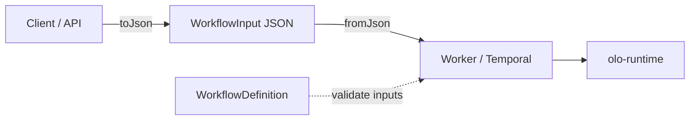

# olo-workflow-input Architecture

This document describes **olo-workflow-input**: a standalone Java library that serializes and deserializes the **workflow invocation payload** sent when a workflow execution is requested (e.g. Temporal `StartWorkflowExecution` argument).

It is **not** part of the `olo-definition` Gradle build. It depends on the published artifact `org.olo:olo-definition` for validating payloads against declared workflow inputs.

## 1. Role in OLO

| Layer | Artifact | When |
|-------|----------|------|
| **Definition** | `WorkflowDefinition` (`olo-definition`) | Stored in Git; describes graph, `inputs`, state, nodes |
| **Invocation** | `WorkflowInput` (`olo-workflow-input`) | On the wire when a client **starts** a workflow run |
| **Runtime** | `olo-runtime` (planned) | Executes graph; hydrates `input.*` → `state.*` |

**Core principle:** The workflow **definition** is long-lived configuration. The **invocation payload** is per-run data plus routing/context metadata for the worker boundary.



## 2. Module boundaries

| In scope | Out of scope |
|----------|--------------|
| JSON (de)serialization of `WorkflowInput` | Workflow graph execution |
| Producer builder with cache offload for large strings | Redis/S3 SDK implementations (callers provide `CacheWriter` / `FileReader`) |
| Consumer read-only contract (`WorkflowInputValues`) | Parsing `WorkflowDefinition` YAML/JSON (use `olo-definition`) |
| Structural validation vs `WorkflowDefinition.inputs` | Secret resolution, auth |
| Context, routing, metadata on the payload | Node-level port wiring |

**Dependency rule:**

```
olo-definition  ←  olo-workflow-input  ←  olo-runtime / worker apps
```

`olo-workflow-input` must not be referenced from `olo-definition`.

## 3. Package layout

```
org.olo.input
├── model/          Payload DTOs + JSON
├── producer/       Build payloads; write large values to cache
├── consumer/       Read-only value resolution
├── validation/     Match payload to definition inputs
└── config/         Environment-driven limits
```

| Package | Responsibility | Key types |
|---------|----------------|-----------|
| `model` | Wire format | `WorkflowInput`, `InputItem`, `Storage`, `Context`, `Routing`, `Metadata`, `Execution` |
| `producer` | Start-request side | `WorkflowInputProducer`, `CacheWriter`, `InputStorageKeys` |
| `consumer` | Worker side | `WorkflowInputValues`, `DefaultWorkflowInputValues`, `WorkflowInputMaps` |
| `validation` | Definition alignment | `WorkflowInvocationValidator` |
| `config` | Limits | `MaxLocalMessageSize` |

## 4. Payload model (`WorkflowInput`)

Root JSON object sent as the workflow start argument:

```json
{
  "version": "1.0",
  "inputs": [
    {
      "name": "symbol",
      "displayName": "symbol",
      "type": "STRING",
      "storage": { "mode": "LOCAL" },
      "value": "INFY"
    }
  ],
  "context": {
    "tenantId": "",
    "groupId": "",
    "roles": ["PUBLIC"],
    "permissions": ["STORAGE"],
    "sessionId": "<UUID>"
  },
  "routing": {
    "pipeline": "chat-queue-ollama",
    "transactionType": "QUESTION_ANSWER",
    "transactionId": "8huqpd42mizzgjOhJEH9C"
  },
  "metadata": {
    "ragTag": null,
    "timestamp": 1771740578582
  },
  "execution": {
    "callbackUrl": "https://api.example.com/callback",
    "timeoutSeconds": 300
  }
}
```

| Block | Purpose |
|-------|---------|
| `version` | Payload schema version |
| `inputs[]` | Named invocation values (`InputItem`) |
| `context` | Tenant, roles, permissions, session |
| `routing` | Pipeline, transaction type/id |
| `metadata` | Opaque tags (e.g. RAG), timestamps |
| `execution` | Callback URL and run timeout (`timeoutSeconds`) |

### 4.1 `InputItem` and storage modes

Each input declares **where its value lives**, not only the value itself:

| `StorageMode` | Meaning |
|---------------|---------|
| `LOCAL` | Inline in `value` (strings) or file reference |
| `CACHE` | Value stored externally; `storage.cache.key` points to it |
| `FILE` | `storage.file.relativeFolder` + `fileName` |

| `InputType` | Typical use |
|-------------|-------------|
| `STRING` | Text / JSON-serialized scalars |
| `FILE` | Document or blob reference |

Large string offload (producer): when `value.length() > OLO_MAX_LOCAL_MESSAGE_SIZE`, the producer writes to cache via `CacheWriter` and emits `CACHE` storage with key:

```text
olo:worker:{transactionId}:input:{inputName}
```

See `InputStorageKeys.cacheKey()`.

## 5. Producer vs consumer contract

### 5.1 Producer (workflow starter)

- Builds `WorkflowInput` via `WorkflowInputProducer` or `WorkflowInputBuilder`
- Decides LOCAL vs CACHE for each string
- Serializes with `WorkflowInput.toJson()` and sends to the workflow engine

```java
WorkflowInput input = WorkflowInputProducer
    .create(maxLocal, cacheWriter, transactionId, "1.0")
    .addStringInput("symbol", "symbol", "INFY")
    .build();
String json = input.toJson();
```

### 5.2 Consumer (worker / workflow code)

- Deserializes once: `WorkflowInput.fromJson(raw)`
- Exposes **read-only** `WorkflowInputValues` — callers never mutate the payload or know storage details
- Resolves LOCAL, CACHE, and FILE transparently

```java
WorkflowInput input = WorkflowInput.fromJson(rawInput);
WorkflowInputValues values = new DefaultWorkflowInputValues(input, cacheReader, fileReader);
Optional<String> symbol = values.getStringValue("symbol");
```

Implement `CacheReader` and `FileReader` in your worker infrastructure; the library defines the contracts only.

## 6. Serialization

| API | Use |
|-----|-----|
| `WorkflowInput.toJson()` | Compact JSON string |
| `WorkflowInput.toJsonPretty()` | Pretty-printed JSON |
| `WorkflowInput.fromJson(String)` | Parse payload |
| `WorkflowInput.fromJsonString(String)` | Jackson delegating creator for Temporal string args |
| `WorkflowInput.copy()` / `copyOf(source)` | Independent immutable copy |
| `WorkflowInput.toBuilder()` / `WorkflowInputBuilder.from(source)` | Copy-on-write before `build()` |
| `WorkflowInputMapper.jsonMapper()` | Shared Jackson configuration |
| `WorkflowInputDeserializer` | Accepts JSON object **or** JSON string wrapper |

Jackson settings: JSR-310 module, `NON_NULL` serialization, unknown properties ignored on deserialize.

## 7. Validation against `olo-definition`

Workflow **definitions** declare invocation inputs:

```yaml
inputs:
  symbol:
    schema: String
    required: true
```

After deserialize, validate the payload against the loaded definition:

```java
WorkflowInvocationValidationResult result =
    WorkflowInvocationValidator.validate(workflowDefinition, values);
```

| Rule | Behavior |
|------|----------|
| Required input missing | Error: `required workflow input missing: {name}` |
| Optional input absent | Allowed |
| Extra payload inputs not in definition | Allowed (forward-compatible) |

Map resolved values for runtime `input.*` paths:

```java
Map<String, Object> map = WorkflowInputMaps.toInputMap(values, workflowDefinition.getInputs().keySet());
```

Runtime (`olo-runtime`) copies `input.{name}` → `state.{name}` when `populateState` is true on the definition input (see `olo-definition` docs).

## 8. Configuration

| Variable | Description | Default |
|----------|-------------|---------|
| `OLO_MAX_LOCAL_MESSAGE_SIZE` | Max characters for inline LOCAL strings before cache offload | `50` |

Read via `MaxLocalMessageSize.fromEnvironment()`.

## 9. Build and consumption

Standalone Gradle project:

```text
olo-workflow-input/
  build.gradle
  settings.gradle
  src/main/java/com/olo/input/...
```

Maven coordinates: `org.olo:olo-workflow-input:0.1.0-SNAPSHOT`

Dependency:

```gradle
api 'org.olo:olo-definition:0.1.0-SNAPSHOT'
```

When developed beside `olo-definition` in **olo-mono**, `settings.gradle` may use `includeBuild('../olo-definition')` with dependency substitution — still a **separate** project, not a subproject of `olo-definition`.

## 10. Request flow (end-to-end)

```text
1. Load WorkflowDefinition (olo-definition)
2. Client builds WorkflowInput (producer)
3. WorkflowInput.toJson() → Temporal / queue
4. Worker: WorkflowInput.fromJson()
5. WorkflowInvocationValidator.validate(definition, values)
6. WorkflowInputMaps.toInputMap() → input.symbol, ...
7. Runtime hydrates state, executes graph
```

## 11. Evolution guidelines

1. **Keep storage abstraction** — workers depend on `WorkflowInputValues`, not Redis paths.
2. **Version the payload** — bump `WorkflowInput.version` for breaking JSON changes.
3. **Validate early** — run `WorkflowInvocationValidator` before scheduling work.
4. **Do not embed graph structure** in `WorkflowInput`; that belongs in `WorkflowDefinition`.
5. **Prefer adding optional blocks** (`metadata`, new `InputType` values) over breaking renames.

## 12. References

- Module README: [../README.md](../README.md)
- Workflow definitions: [olo-definition](https://github.com/olo-labs/olo-mono/tree/main/olo-definition) / `org.olo:olo-definition`
- Monorepo architecture: `olo-definition/doc/ARCHITECTURE.md`
